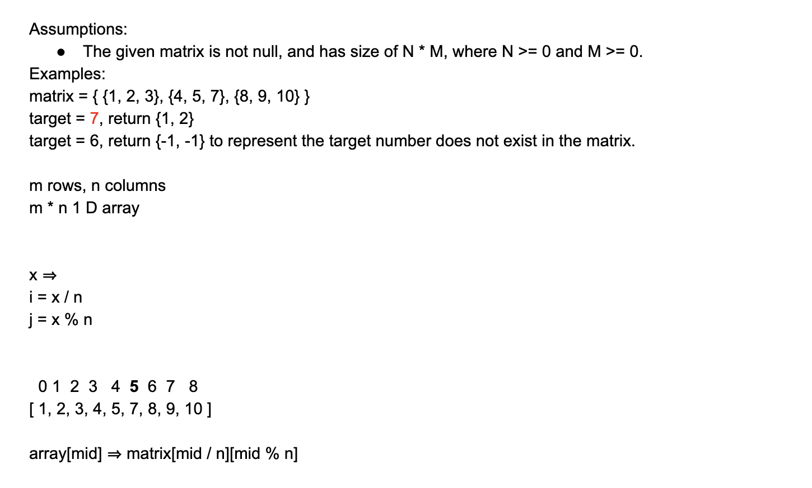
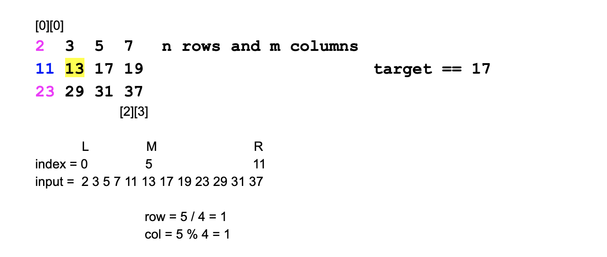

# Search In sorted matrix

```java
Given a 2D matrix that contains integers only, which each row is sorted in an ascending order.
The first element of next row is larger than (or equal to) the last element of previous row.
Given a target number, returning the position that the target locates within the martix. 
If the target number doesn't exit in the matrix, return {-1, -1}
```



### `matrix.length` is rows' length

### `matrix[0].length` is column's length

```java
public class searhInMatrix {

    public static void main(String[] args) {
        int[][] table = {{1, 2, 3}, 
                         {4, 5, 6}, 
                         {7, 8, 9}};
        System.out.println(table.length); //output 3
        System.out.println(table[0].length);//output 3
    }
}
```




## Analysis:

```java
matrix = {1, 2, 3}, 
         {4, 5, 7}, 
         {8, 9, 10}

target = 7 => return {1, 2}
target = 6 => return {-1, -1} to represent the target number does not exist in the matrix

m rows * n columns

m * n  => 1D array

x =>
i = x / n
j = x % n


    0   1   2   3   4   5   6   7   8
   [1,  2,  3,  4,  5,  6,  7,  8,  9]

   array[mid] => matrix[mid / n][mid % n] 


Key points:
    * Just do standard binary search, except the value is not array[mid], but
    matrix[mid/n][mid%n]
        col0:   col1:   col2:
row0:   1       2       3
row1:   4       5       7
row2:   8       9       10


m X n
array[i] === martirx[i / n][i % n]

-> 摊开成一个一纬 array
    1,  2,  3,      4,  5,  7,        8,  9,  10
    0   1   2       3   4   5         6   7    8
    i = 0               m                      r = m * n - 1


mid
row = mid / NUM_OF_COLUMNS
col = mid % NUM_OF_COLUMNS
```


```java
public class Solution {
  public int[] search(int[][] matrix, int target) {
    // Write your solution here
    int left = 0;
    int row = matrix.length;
    int col = matrix[0].length;
    int right = row * col - 1;
    while(left <= right){
      int mid = (left + right) / 2;
      int r = mid / col;
      int c = mid % col;
      if(matrix[r][c] == target){
        return new int[]{r, c};
      }else if(matrix[r][c] > target){
        right = mid - 1;
      }else{
        left = mid + 1;
      }
    }
    return new int[]{-1, -1};
  }
}

```

```java
array: m * n

Time: log(number of elements) -> log(m * n)
Space: O(1)
```


```java
/**
 * searhInMatrix
 */
public class searhInMatrix {

    public static boolean searchMatrix(int[][] matrix, int target) {
        if(matrix.length == 0 || matrix[0].length == 0){
            return false;
        }
        
        int row = matrix.length;
        int column = matrix[0].length;
        int left = 0;
        int right = row * column - 1;
        while(left <= right){
            int mid = (left + right) / 2;
            int r = mid / column; //don't  => mid/row   !
            int c = mid % column;

            if(matrix[r][c] == target){
                return true;
            }else if(matrix[r][c] > target){
                right = mid - 1;    
            }else{
                left = mid + 1;
            }
        }
        return false;
    }

    public static void main(String[] args) {
        int[][] matrix = {{1, 3, 5, 7}, 
                            {10, 11, 16, 20}, 
                            {23, 30, 34, 50}};
        
        System.out.println(searchMatrix(matrix, 13)); //output: false
    }
}

```


