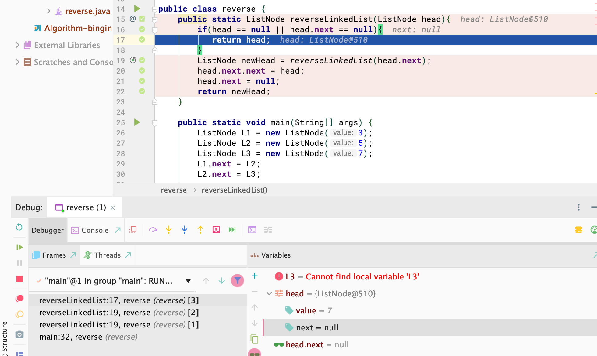
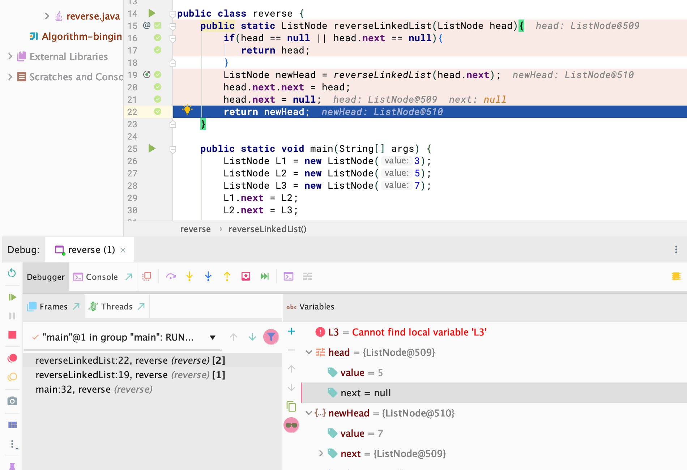
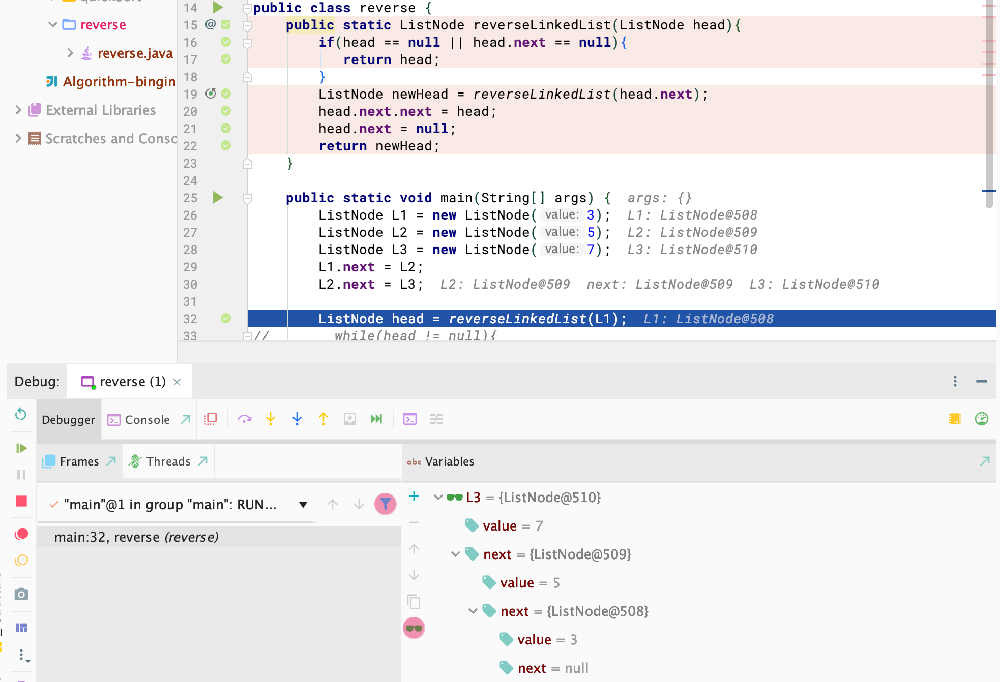

# 653. Reverse LinkedList

```java
Reverse a singly-linked list recursively.

L = null, return null

L = 1 -> null, return 1 -> null

L = 1 -> 2 -> 3 -> null, return 3 -> 2 -> 1 -> null
```


### Analysis:

- call `reverseLinkedList(ListNode head)`

- (1): pass L1 into `reverseLinkedList(ListNode head)`

- head = L1, head = head.next => Stack[L1, L2, L3] 

- since L3.next is null, so => `return head`



- (2): `newHead = reverseLinkedList(head.next)` => newHead = L3, since L3 is at the top of Stack[L1, L2, L3] , L3 pop from stack.  => [L1 L2]

- at this moment, L2 is at the top of Stack[L1, L2], head = L2, head.value is 5

- head.next -> L3,  `head.next.next = head` => L3 -> L2, L3.next == L2

- `head.next = null`, that means L2 won't point to L3, only L3 -> L2

- at the same time, [L1], L2 is pop from stack



- newHead == L3

- (3): L1 is at the top of Stack[1], so head == L1

- `head.next.next = head` => L2.next == L1, `head.next = null` => L1 won't point to L2, 
   only L2 -> L1



- Done!


```java
class ListNode {
   public int value;
   public ListNode next;
   public ListNode(int value) {
     this.value = value;
      next = null;
   }
 }


public class reverse {
    public static ListNode reverseLinkedList(ListNode head){
        if(head == null || head.next == null){
           return head;
        }
        ListNode newHead = reverseLinkedList(head.next);
        head.next.next = head;
        head.next = null;
        return newHead;
    }

    public static void main(String[] args) {
        ListNode L1 = new ListNode(3);
        ListNode L2 = new ListNode(5);
        ListNode L3 = new ListNode(7);
        L1.next = L2;
        L2.next = L3;

        ListNode head = reverseLinkedList(L1);
        while(head != null){
            System.out.println(head.value);
            head = head.next;
        }
    }
}
```


