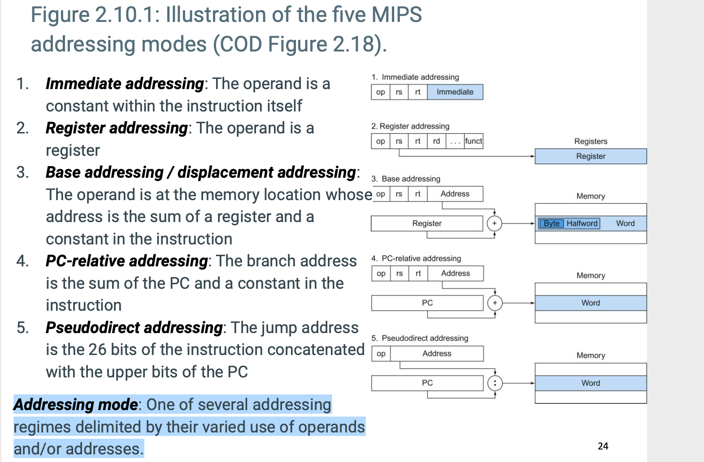

## MIPS addressing for 32-bit immediates and addresses

### 32-bit immediate operands

- Although constants are frequently short and fit into the 16-bit field, sometimes they are bigger. 
  The MIPS instruction set includes the instruction load upper immediate (lui) specifically to set 
  the upper 16 bits of a constant in a register, allowing a subsequent instruction to specify the 
  lower 16 bits of the constant. The figure below shows the operation of lui.

- Elaboration:
  - Creating 32-bit constants needs care. The instruction `addi` copies the left-most bit of the 
    16-bit immediate field of the instruction into the upper 16 bits of a word. The instruction 
    `ori` (Logical or immediate, from COD Section 2.6 (Logical operations)) loads 0s into the upper 
    16 bits and hence is used by the assembler in conjunction with `lui` to create 32-bit constants.

---

### MIPS addressing mode summary

- **Addressing mode**: One of several addressing regimes delimited by their varied use of operands 
  and/or addresses

---

### Decoding machine language

- Sometimes you are forced to reverse-engineer machine language to create the original assembly 
  language. One example is when looking at "core dump". The figure below shows the MIPS encoding of 
  the fields for the MIPS machine language. This figure helps when translating by hand between 
  assembly language and machine language.

- then we search on `MIPS_Green_Sheet`

