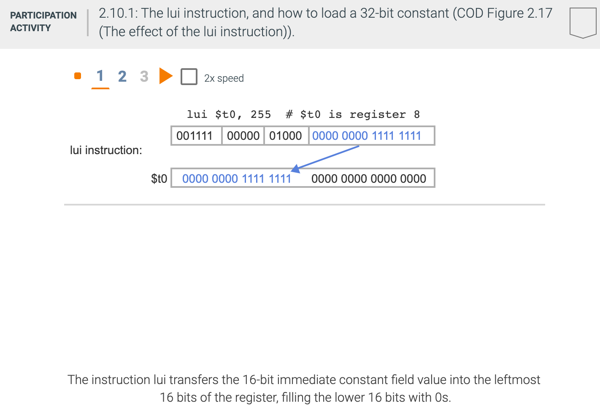

## MIPS addressing for 32-bit immediates and addresses

### 32-bit immediate operands

- Although constants are frequently short and fit into the 16-bit field, sometimes they are bigger. 
  The MIPS instruction set includes the instruction load upper immediate (lui) specifically to set 
  the upper 16 bits of a constant in a register, allowing a subsequent instruction to specify the 
  lower 16 bits of the constant. The figure below shows the operation of lui.

- Elaboration:
  - Creating 32-bit constants needs care. The instruction `addi` copies the left-most bit of the 
    16-bit immediate field of the instruction into the upper 16 bits of a word. The instruction 
    `ori` (Logical or immediate, from COD Section 2.6 (Logical operations)) loads 0s into the upper 
    16 bits and hence is used by the assembler in conjunction with `lui` to create 32-bit constants.

