## 3.2 Addition and subtraction

- **Arithmetic Logic Unit (ALU)**: Hardware that performs addition, subtraction, and usually 
  logical operations such as AND and OR.

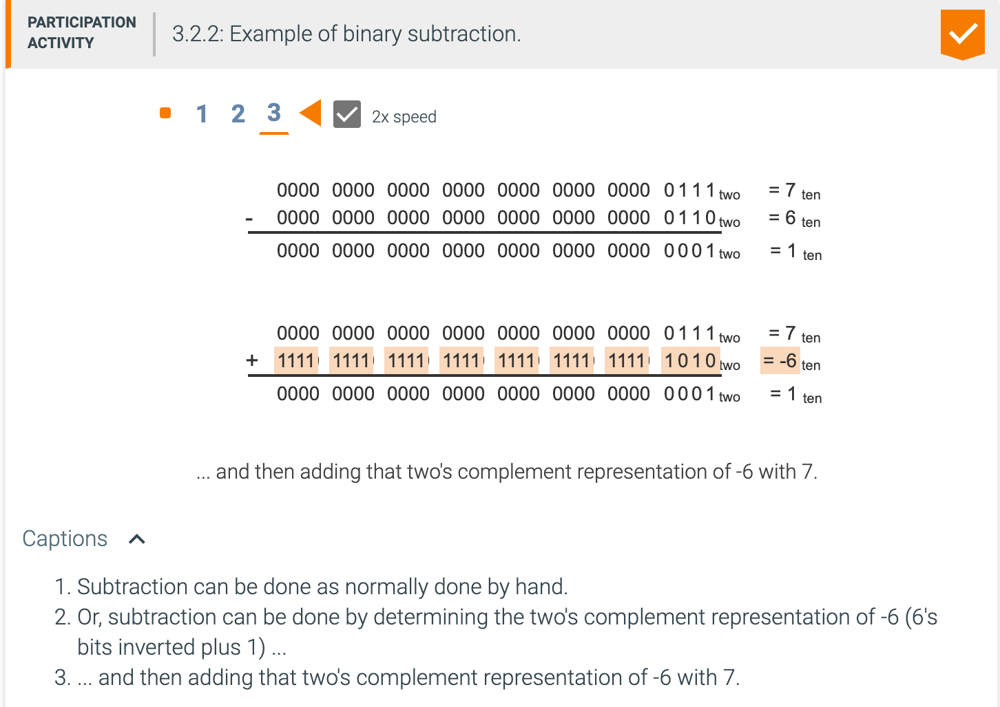

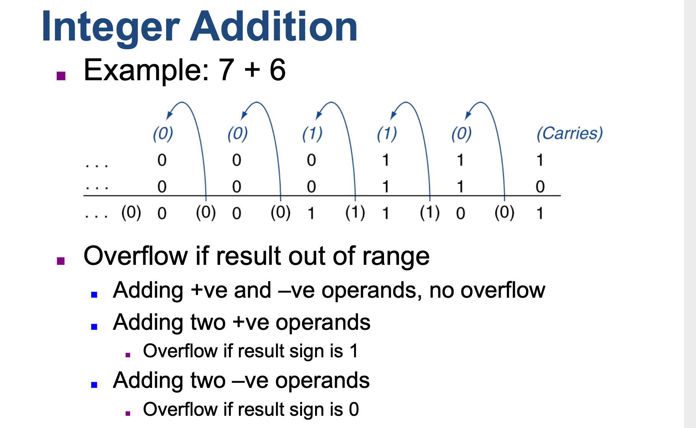

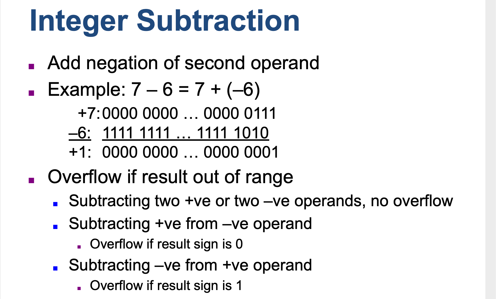

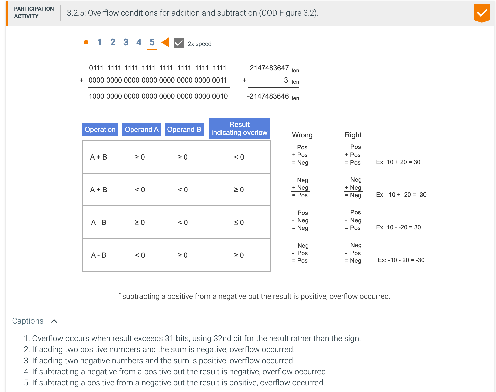

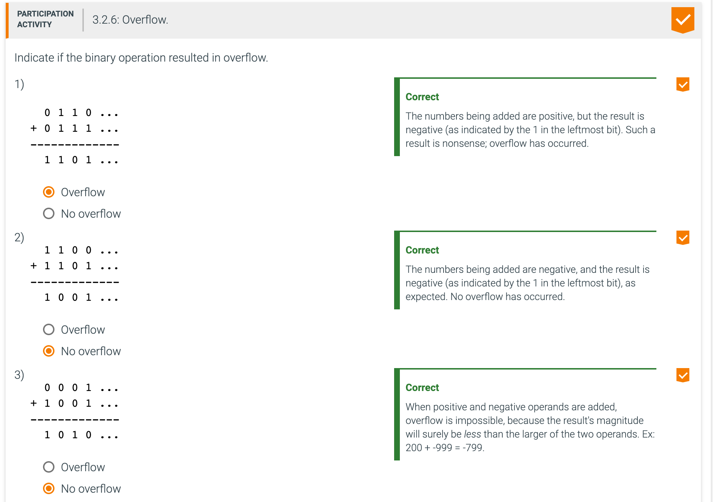

---

- We have just seen how to detect overflow for two's complement numbers in a computer. What about 
  overflow with **unsigned integers**? Unsigned integers are commonly used for **memory addresses** 
  where overflows are ignored.

- The computer designer must therefore provide a way to ignore overflow in some cases and to recognize 
  it in others. The MIPS solution is to have two kinds of arithmetic instructions to recognize the two 
  choices:
  - Add (add), add immediate (addi), and subtract (sub) cause exceptions on overflow.
  - Add unsigned (addu), add immediate unsigned (addiu), and subtract unsigned (subu) **do not cause** 
    exceptions on overflow.

- Because C ignores overflows, the **MIPS C** compilers will always generate the unsigned versions of 
  the arithmetic instructions addu, addiu, and subu, no matter what the type of the variables. The MIPS 
  Fortran compilers, however, pick the appropriate arithmetic instructions, depending on the type of 
  the operands.

- A constant source of confusion for **addiu** is its name and what happens to its immediate field. The 
  **u** stands for unsigned, which means addition cannot cause an overflow exception. However, the 
  16-bit immediate field is sign extended to 32 bits, just like **addi, slti, and sltiu**. Thus, the 
  immediate field is signed, even if the operation is "unsigned."

---

- The computer designer must decide how to handle arithmetic overflows. Although some languages like C 
  and Java ignore integer overflow, languages like Ada and Fortran require that the program be 
  notified. The programmer or the programming environment must then decide what to do when overflow 
  occurs.

- MIPS detects **overflow** with an **exception**, also called an interrupt on many computers. An 
  exception or interrupt is essentially an unscheduled procedure call. The address of the instruction 
  that overflowed is saved in a register, and the computer jumps to a predefined address to invoke the 
  appropriate routine for that exception. The interrupted address is saved so that in some situations 
  the program can continue after corrective code is executed.

- MIPS includes a register called the exception program counter (EPC) to contain the address of the 
  instruction that caused the exception. The instruction move from system control (mfc0) is used to 
  copy EPC into a general-purpose register so that MIPS software has the option of returning to the 
  offending instruction via a jump register instruction.

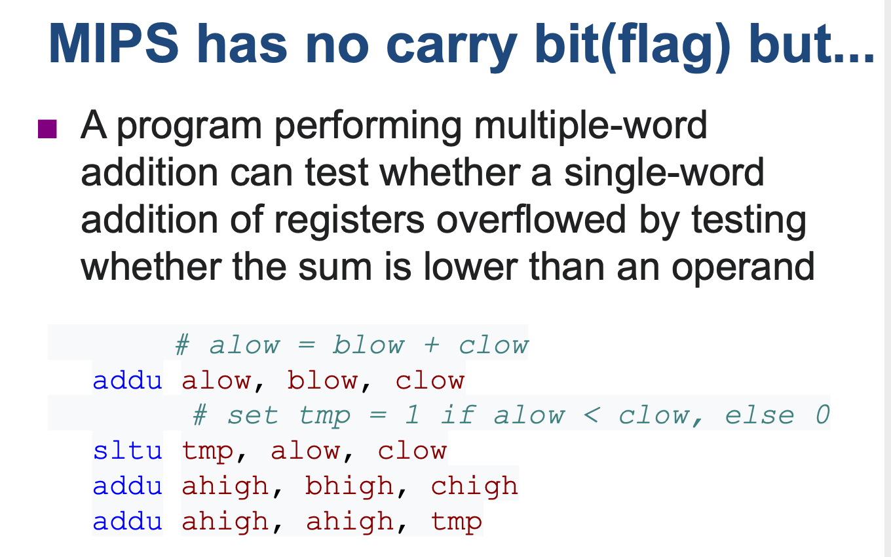

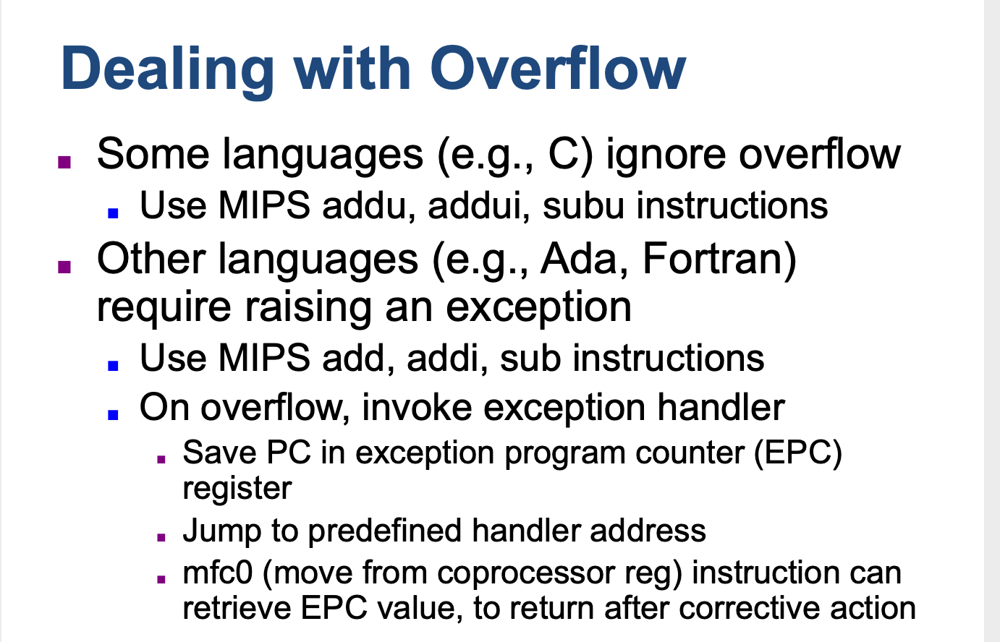

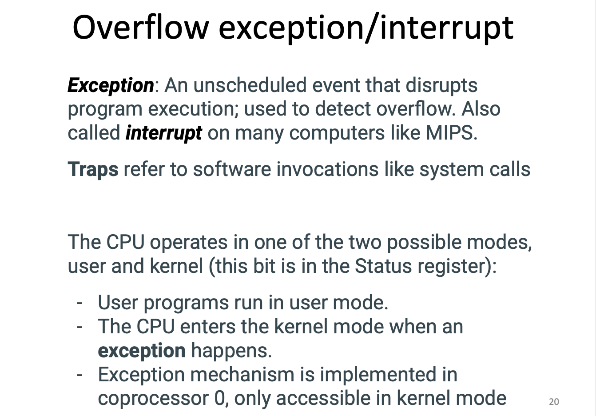

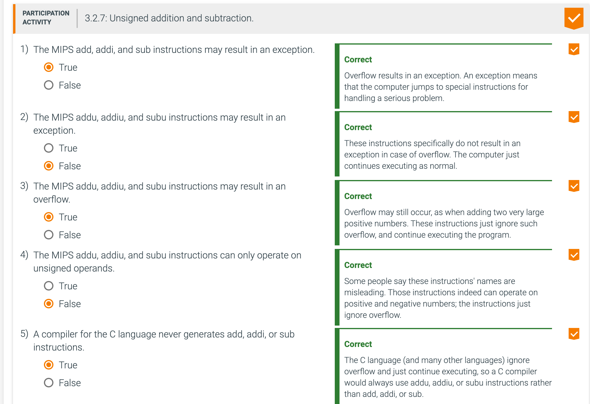

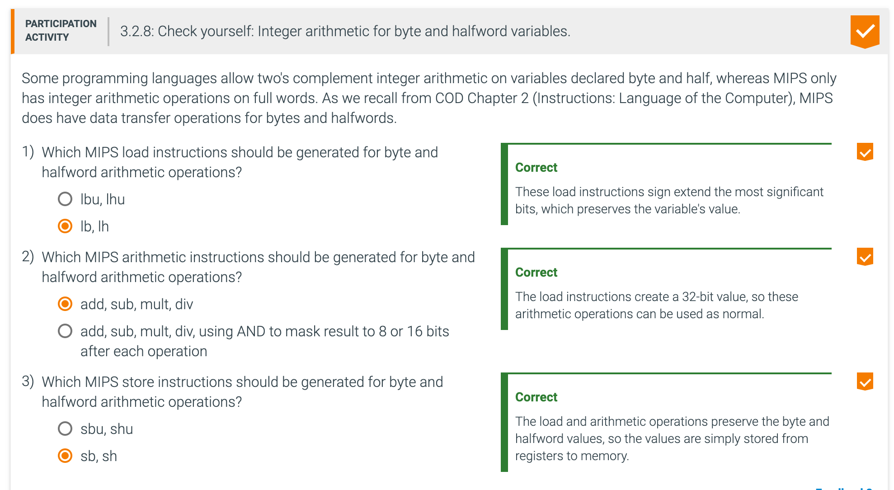

---

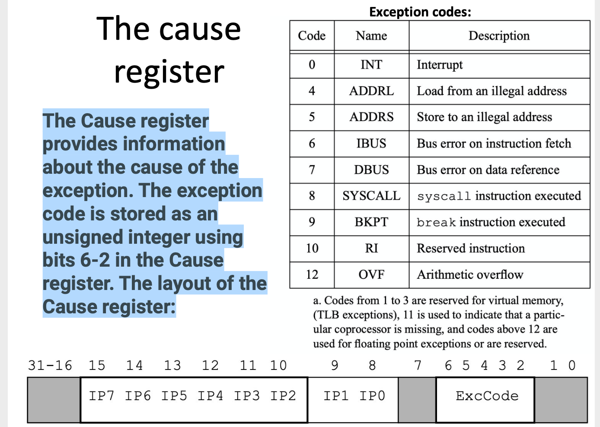

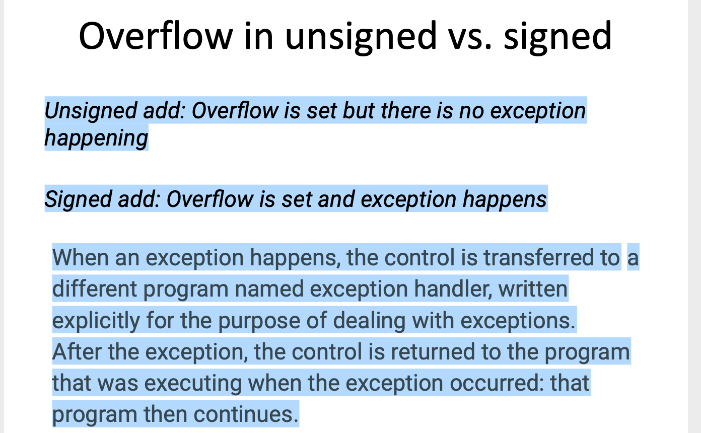

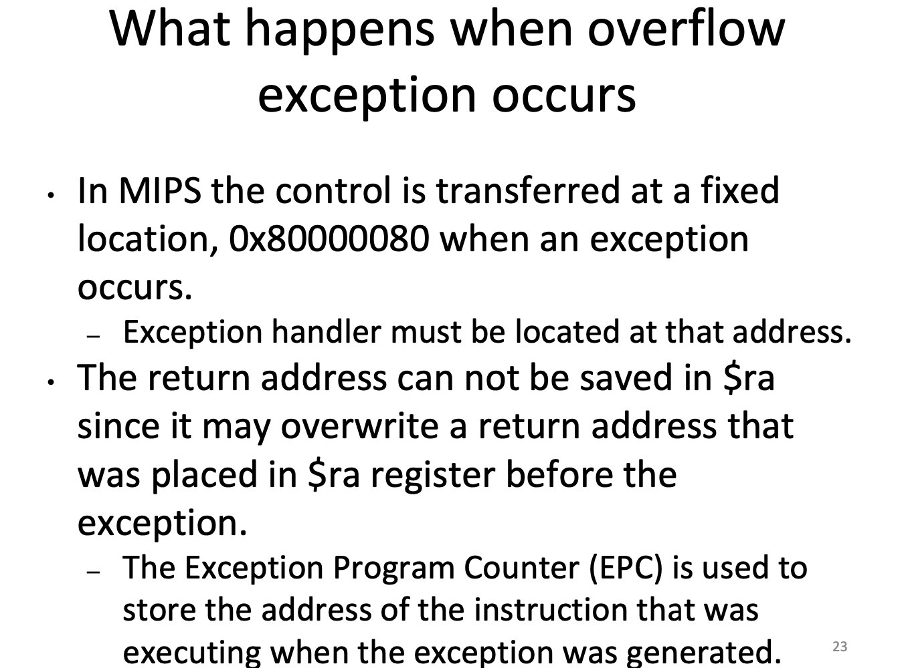

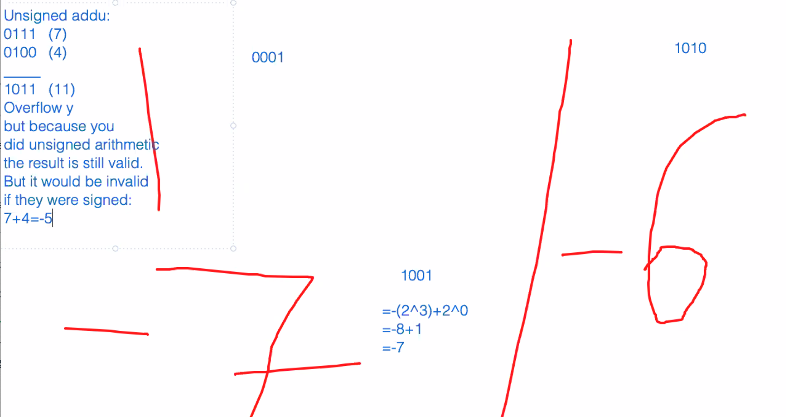

