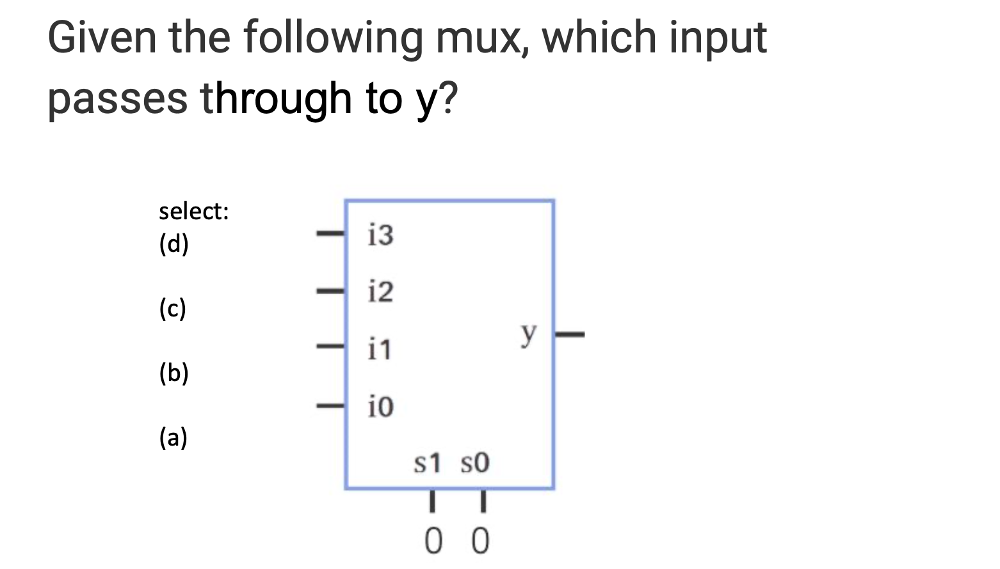
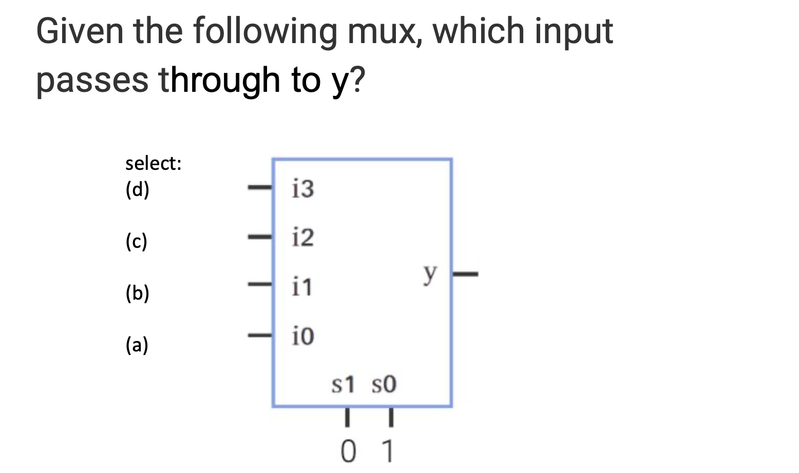
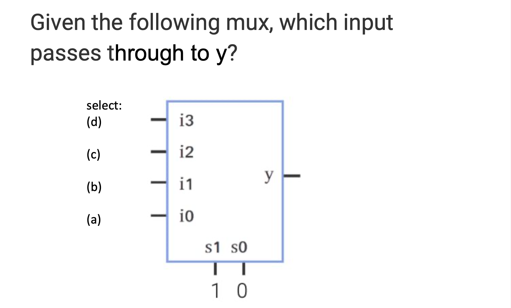
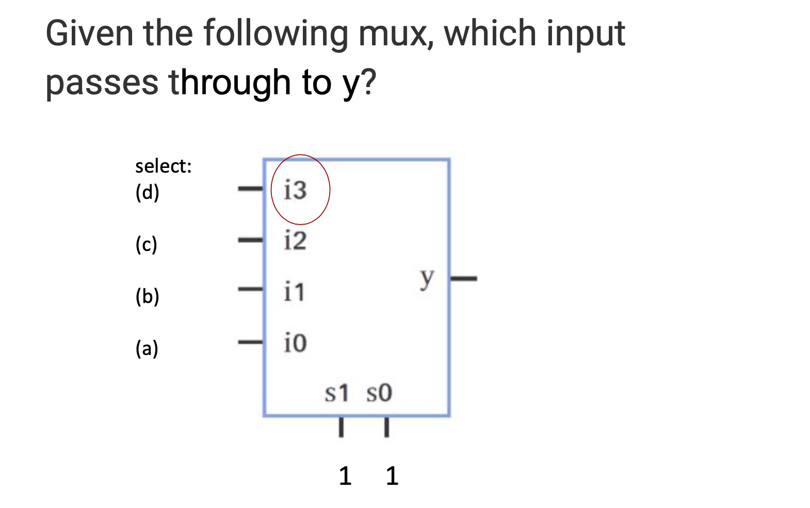

## 8.3 Combinational logic

- A **circuit** is a connection of electrical components

- A **digital circuit** has components that transform digital signals, which are signals that take on only one of a few 
  specific values, like 0 and 1.

- A **combinational circuit** is a digital circuit whose output values depend solely on the present combination of 
  input values (past input values do not matter).

- A combinational circuit can be built from components like AND, OR, and NOT gates, known as **logic gates**.

- (a), since, 00 is 0 => i0

- (b), since 01 is 1 => i1

- (c), since 10 is 2 => i2

- (d), since 11 is 3 => i3

