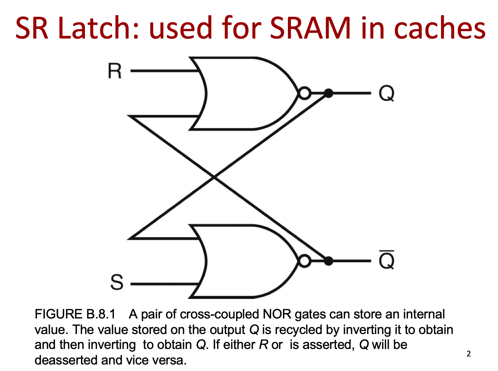
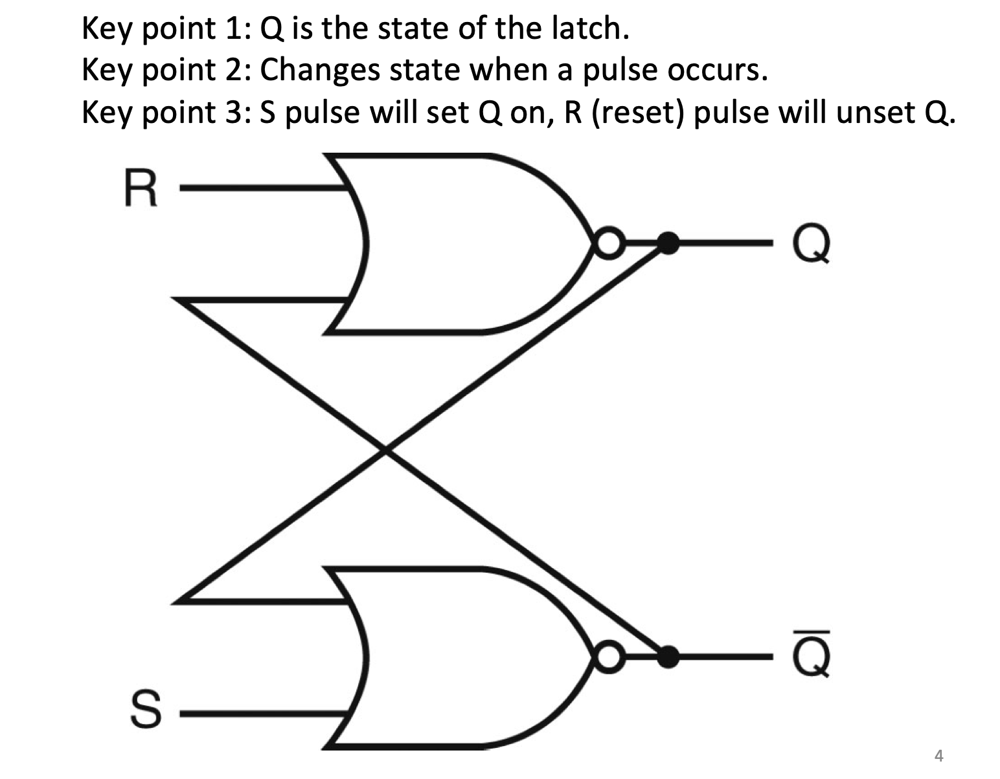
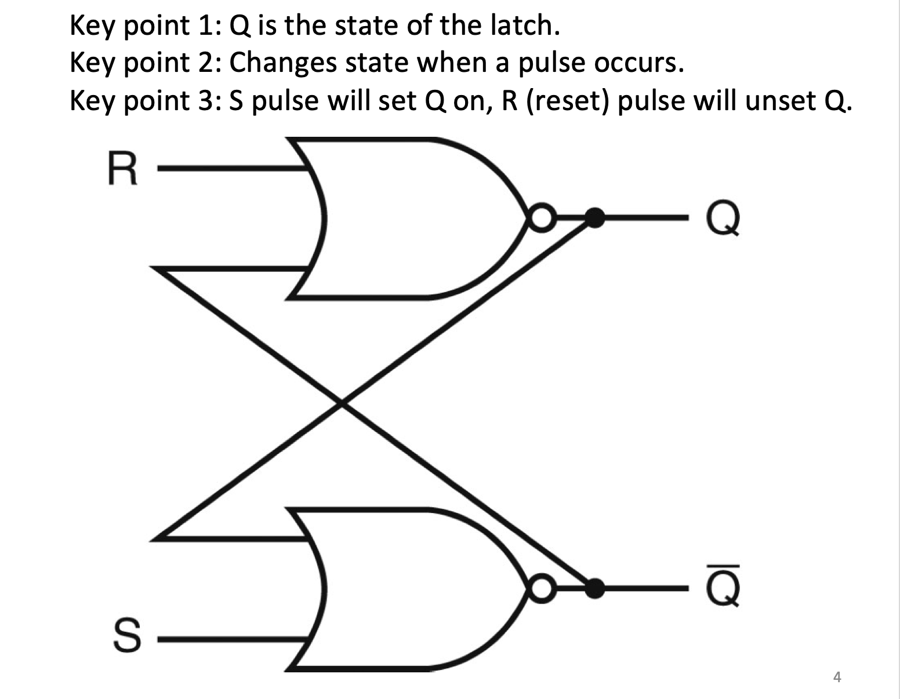

## Memory elements: Flip-flops(人字拖), latches, and registers

- **Latch**门闩: A memory element for which output is equal to the value of the stored state inside the element and for 
  which the internal state is changed whenever the appropriate inputs change.

- **Flip-flop**: A memory element for which output is equal to the value of the stored state inside the element and for 
  which the internal state is changed only on a clock edge.

---

- Start from steady state

