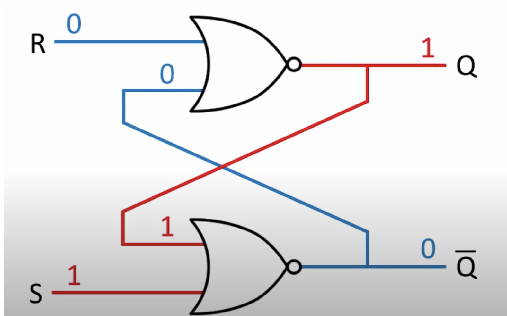

## Memory elements: Flip-flops(人字拖), latches, and registers

- **Latch**门闩: A memory element for which output is equal to the value of the stored state inside the element and for 
  which the internal state is changed whenever the appropriate inputs change.

- **Flip-flop**: A memory element for which output is equal to the value of the stored state inside the element and for 
  which the internal state is changed only on a clock edge.

---

- Start from steady state

- intput of R is 0, output from R is 1, output 1 send back to the bottom
- output from S is 0

---

- R(reset) pulses ON

- oupt of R is 0, sned back to the bottom

---

- S pulses ON

- s set Q to be 1, and then 1 sent back to bottom

