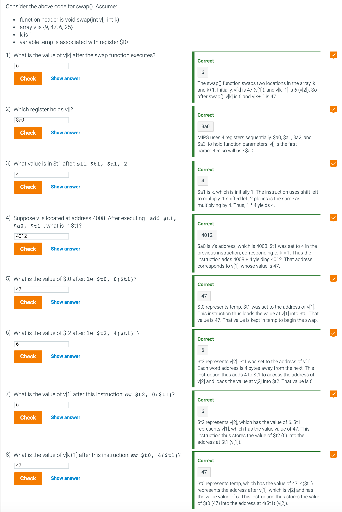

## 2.13 A C sort example to put it all together

```c
void swap(int v[], int k)
{
    int temp;
    temp = v[k];
    v[k] = v[k+1];
    v[k+1] = temp;
}
```


---




---

#### The procedure sort (bubble)

```c
void sort (int v[], int n)
{
    int i, j;
    for (i = 0; i < n; i += 1) {
        for (j = i - 1; j >= 0 && v[j] > v[j + 1]; j -= 1) {
            swap(v, j); 
        }
    } 
}
```


