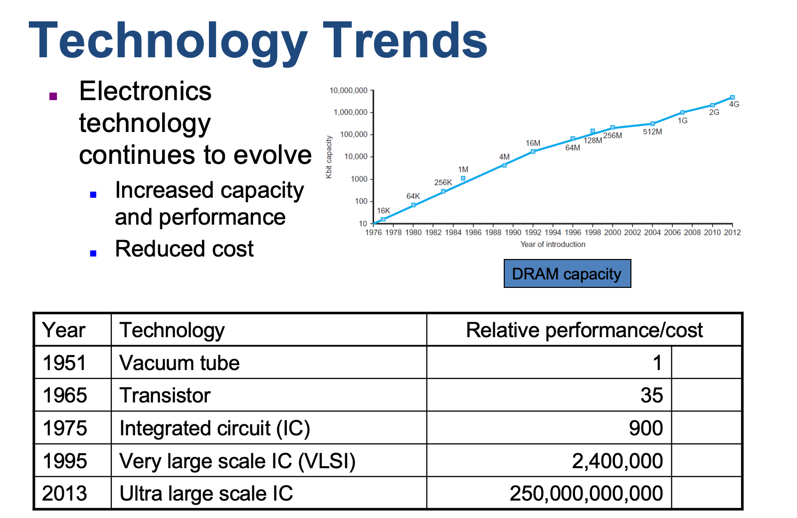
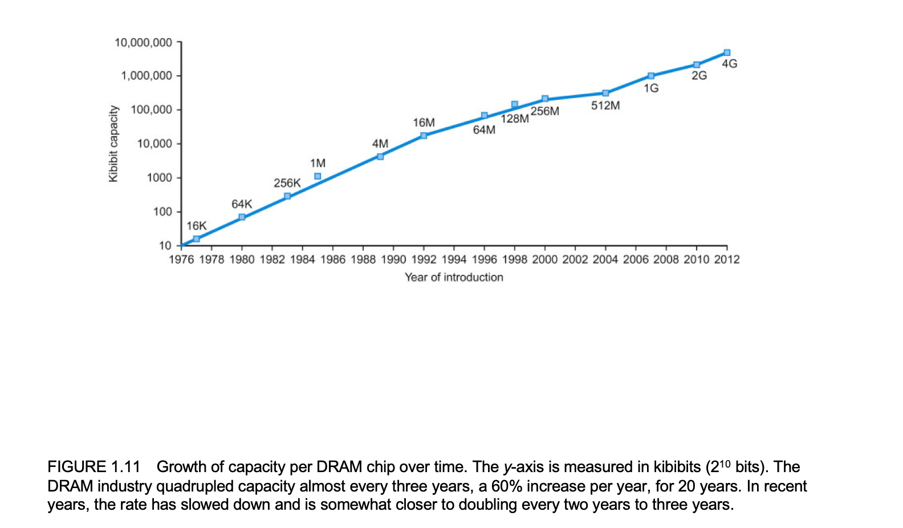
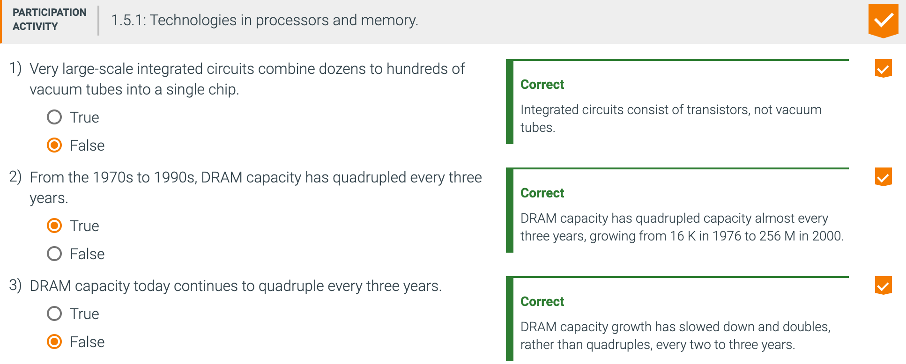
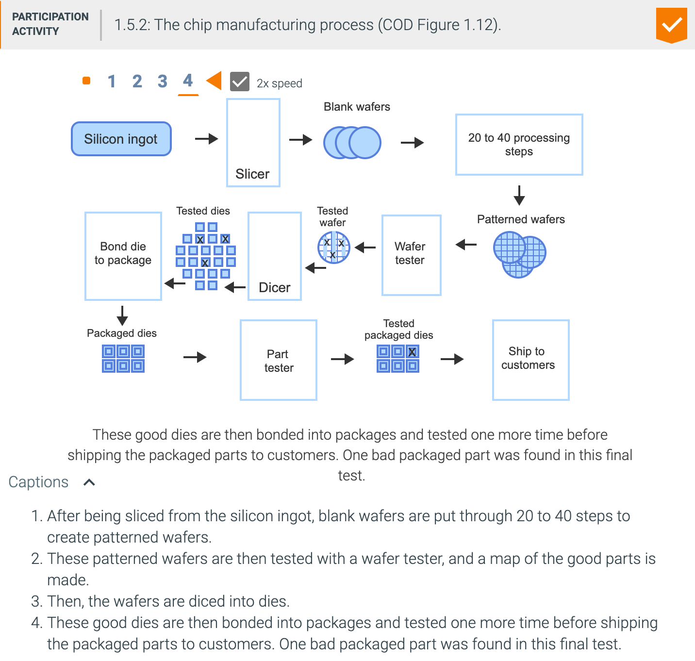

## 1.5 Technologies for building processors and memory

---

- To understand how to manufacture integrated circuits, we start at the beginning. The 
  manufacture of a chip begins with silicon, a substance found in sand. Because silicon 
  does not conduct electricity well, it is called a semiconductor. With a special chemical 
  process, it is possible to add materials to silicon that allow tiny areas to transform 
  into one of three devices:
  为了了解如何制造集成电路，我们从头开始。 芯片的制造始于硅（一种存在于沙子中的物质）。 
  由于硅不能很好地导电，因此被称为半导体。 通过特殊的化学过程，可以在硅中添加材料，
  从而使微小区域转化为以下三种设备之一：  
  - Excellent conductors of electricity (using either microscopic copper or aluminum wire)
  - Excellent insulators from electricity (like plastic sheathing or glass)
  - Areas that can conduct or insulate under special conditions (as a switch)

- Silicon: A natural element that is a semiconductor. 硅：一种天然元素，是半导体。
- Semiconductor: A substance that does not conduct electricity well. 半导体：不能很好导电的物质。
- Silicon crystal ingot: A rod composed of a silicon crystal that is between 8 and 12 
  inches in diameter and about 12 to 24 inches long.
  硅锭：由直径为8到12英寸，长约12到24英寸的硅晶体组成的棒。
- Wafer: A slice from a silicon ingot no more than 0.1 inches thick, used to create chips.
  晶圆：来自硅锭的切片，厚度不超过0.1英寸，用于制造芯片。  

