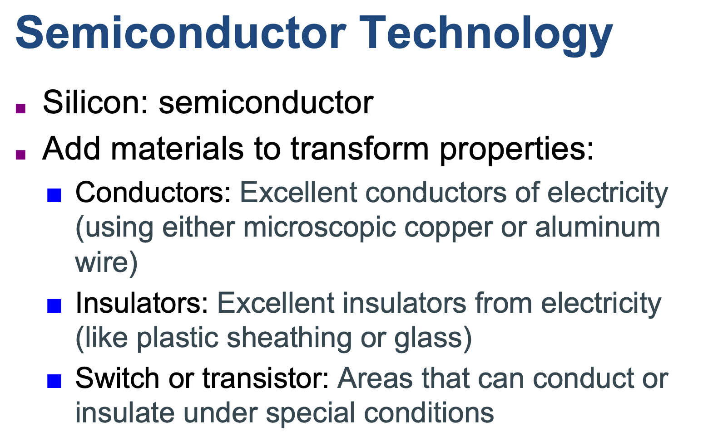
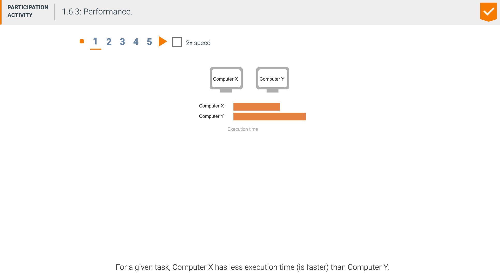
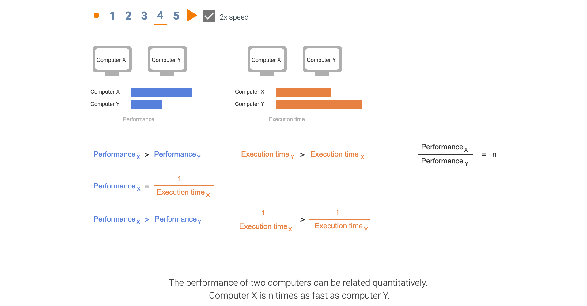

## 1.5 Technologies for building processors and memory


---



- To understand how to manufacture integrated circuits, we start at the beginning. The 
  manufacture of a chip begins with silicon, a substance found in sand. Because silicon 
  does not conduct electricity well, it is called a semiconductor. With a special chemical 
  process, it is possible to add materials to silicon that allow tiny areas to transform 
  into one of three devices:
  为了了解如何制造集成电路，我们从头开始。 芯片的制造始于硅（一种存在于沙子中的物质）。 
  由于硅不能很好地导电，因此被称为半导体。 通过特殊的化学过程，可以在硅中添加材料，
  从而使微小区域转化为以下三种设备之一：  
  - Excellent conductors of electricity (using either microscopic copper or aluminum wire)
  - Excellent insulators from electricity (like plastic sheathing or glass)
  - Areas that can conduct or insulate under special conditions (as a switch)


- Silicon: A natural element that is a semiconductor. 硅：一种天然元素，是半导体。
- Semiconductor: A substance that does not conduct electricity well. 半导体：不能很好导电的物质。
- Silicon crystal ingot: A rod composed of a silicon crystal that is between 8 and 12 
  inches in diameter and about 12 to 24 inches long.
  硅锭：由直径为8到12英寸，长约12到24英寸的硅晶体组成的棒。
- Wafer: A slice from a silicon ingot no more than 0.1 inches thick, used to create chips.
  晶圆：来自硅锭的切片，厚度不超过0.1英寸，用于制造芯片。  


- **Yield: proportion of working dies per wafer** 产量：每片晶圆的裸片比例


- Integrated Circuit Cost 集成电路成本


- Dicing enables you to discard only those dies that were unlucky enough to contain the 
  flaws, rather than the whole wafer(晶片). This concept is quantified by the yield of a process, which is defined as the percentage of good dies from the total number of dies on the wafer.
  切块使您仅丢弃那些倒霉到足以包含缺陷的管芯，而不是整个晶圆。 这个概念通过工艺的成品率来量化，
  该成品率定义为良芯片在晶圆上芯片总数中所占的百分比。  

- The cost of an integrated circuit rises quickly as the die size increases, due both to 
  the lower yield and the smaller number of dies that fit on a wafer. To reduce the cost, 
  using the next generation process shrinks a large die as it uses smaller sizes for both 
  transistors and wires. This improves the yield and the die count per wafer. A 
  32-nanometer (nm) process was typical in 2012, which means essentially that the smallest 
  feature size on the die is 32 nm.
  集成电路的成本随着芯片尺寸的增加而迅速增加，这是由于较低的成品率和安装在晶片上的管芯数量较少所致。 
  为了降低成本，使用下一代工艺会缩小大芯片的面积，因为晶体管和导线的尺寸都较小。 这提高了产量和
  每个晶片的芯片数。 2012年通常采用32纳米（nm）工艺，这实质上意味着管芯上最小的特征尺寸为32 nm。


---

## 1.6 Performance


- **Response time**: Also called **execution time**. The total time required for the 
  computer to complete a task, including disk accesses, memory accesses, I/O activities, 
  operating system overhead, CPU execution time, and so on.

- **Throughput 生产量，接待人数，吞吐量**: Also called **bandwidth**. Another measure of 
  performance, it is the number of tasks completed per unit time.


---







---


```ruby
PerfA = 1/10
PerfB = 1/5
PerfB / PerfA = (1/5)/(1/10) = 2
```

---

## Measuring performance

- **Time** is the measure of computer performance: the computer that performs the same 
  amount of work in the least time is the fastest. Program execution time is measured in 
  seconds per program. However, time can be defined in different ways, depending on 
  what we count. The most straightforward definition of time is called **wall clock time**, 
  **response time**, or **elapsed time**. These terms mean the total time to complete a 
  task, including disk accesses, memory accesses, input/output (I/O) activities, 
  operating system overhead—everything.

- **CPU execution time**: Also called **CPU time**. The actual time the CPU spends 
  computing for a specific task.

- **User CPU time**: The CPU time spent in a program itself.

- **System CPU time**: The CPU time spent in the operating system performing tasks on 
  behalf of the program


- **system performance** to refer to elapsed time on an unloaded system
- **CPU performance** to refer to user CPU time

- idle (adj. 闲置的；懒惰的；停顿的)


---

## Clock cycle

- **Clock cycle**: Also called **tick, clock tick, clock period, clock, or cycle**. The time for one 
  clock period, usually of the processor clock, which runs at a constant rate.

- **Clock period**: The length of each clock cycle


---

## CPU performance and its factors


---


---


