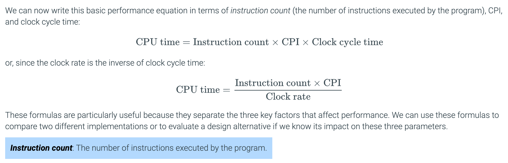
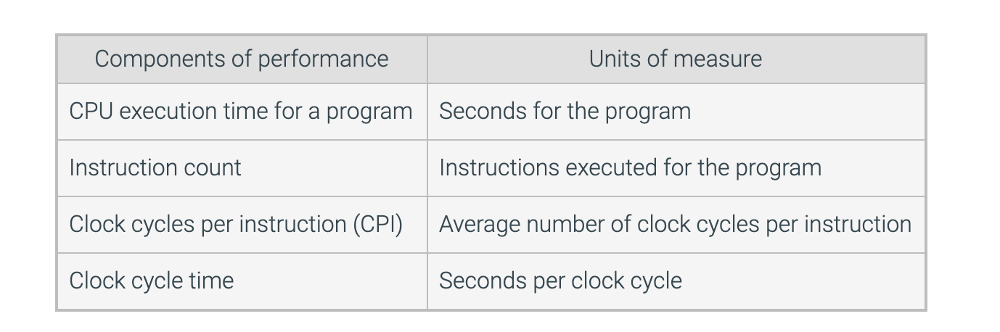

## instruction performance

- The performance equations above did not include any reference to the number of 
  instructions needed for the program. However, since the compiler clearly generated 
  instructions to execute, and the computer had to execute the instructions to run the 
  program, the execution time must depend on the number of instructions in a program. One 
  way to think about execution time is that it equals the number of instructions executed 
  multiplied by the average time per instruction. Therefore, the number of clock cycles 
  required for a program can be written as

- `CPU clock cycles = Instructions for a program * Average colock cycles per instruction`

- **Clock cycles per instruction (CPI)**: Average number of clock cycles per instruction 
  for a program or program fragment.

---

## The classic CPU performance equation

- **Instruction count**, for short is `IC`, the number of instructions executed by program

---

- agian: `CPU time = IC * CPI * Clock cycle time`

---

## Understanding program performance

- The performance of a program depends on the algorithm, the language, the compiler, 
  the architecture, and the actual hardware. The following table summarizes how these 
  components affect the factors in the CPU performance equation.

---

## The power wall

---

---
