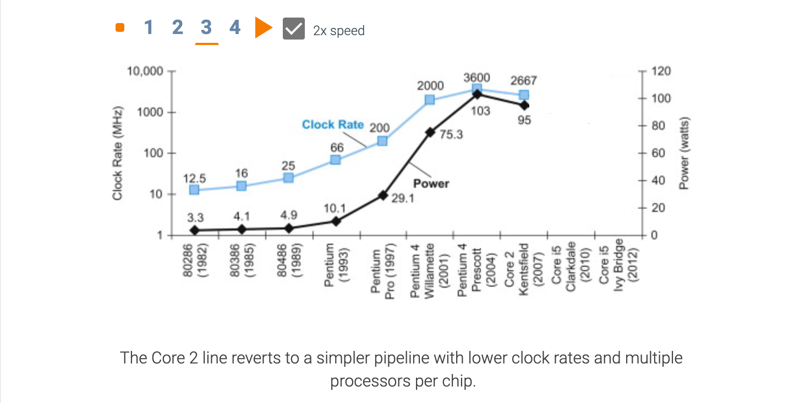
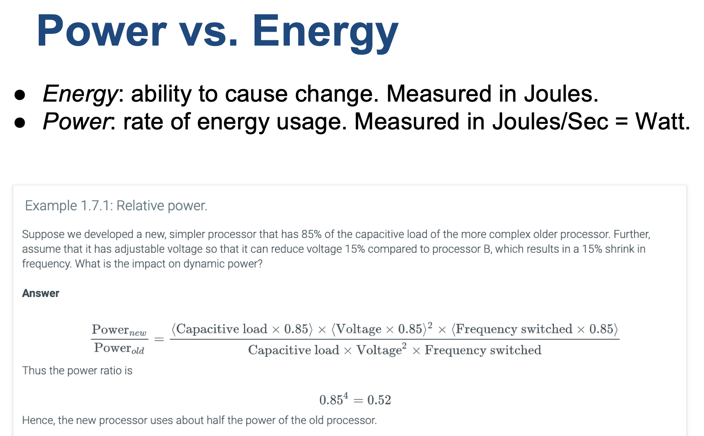
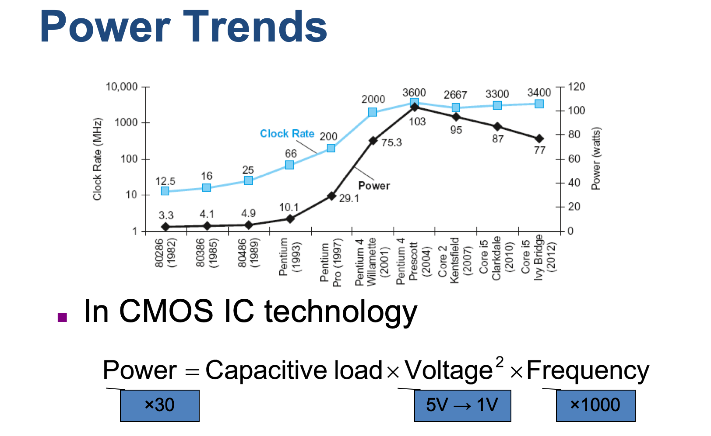
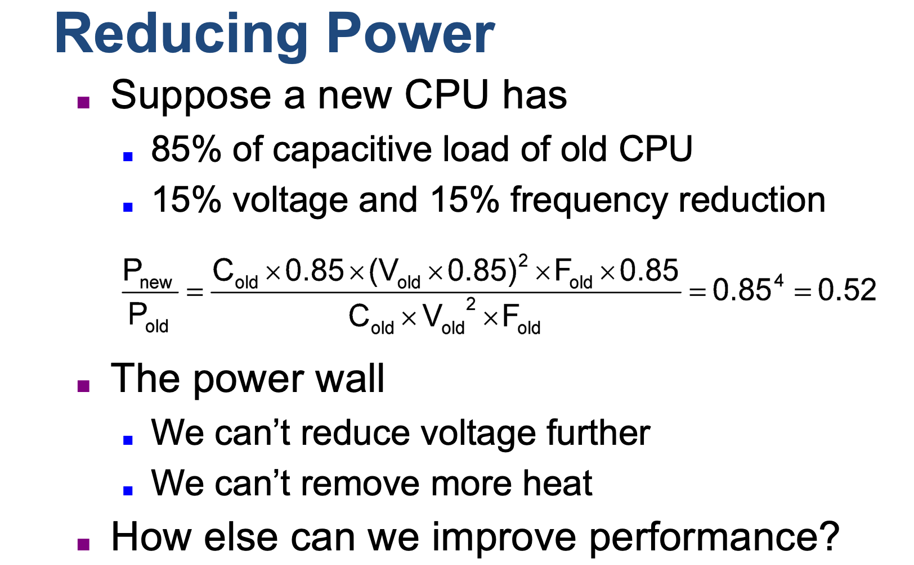
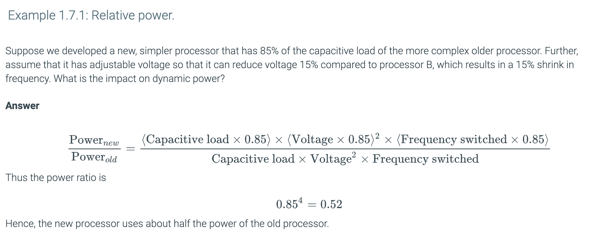
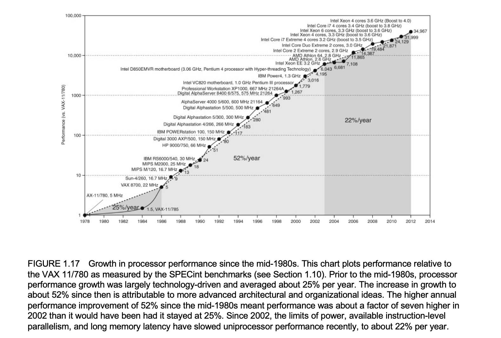
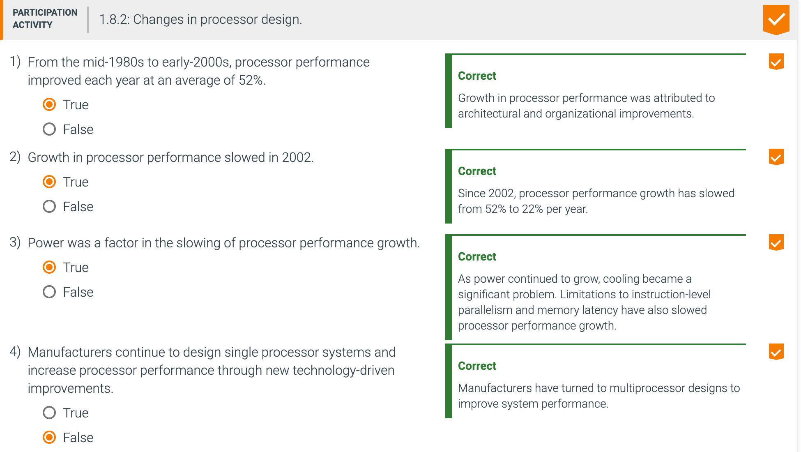

## 1.7 The power wall

---

---

---

## 1.8 The sea change: The switch from uniprocessors to multiprocessors

---

---

## Fallacies and pitfalls 谬论和陷阱

---

---

- Look back at i7 power benchmark
  - At 100% load: 258W
  - At 50% load: 170W (66%)
  - At 10% load: 121W (47%)

---

---

## 1.11 Concluding remarks

