## 1.1 Introduction

### The Computer Revolution

- Progress in computer technology
  - Underpinned by Moore’s Law 
- Makes novel applications feasible可行的
  - Computers in automobiles
  - Cell phones
  - Human genome project人类基因组计划
  - World Wide Web
  - Search Engines


---


---


### 1.1.2 Classes of computing applications and their characteristics

#### Classes of Computers

- Personal computers
  - General purpose, variety of software
  - Subject to cost/performance tradeoff权衡

- Server computers
  - Network based
  - High capacity, performance, reliability
  - Range from small servers to building sized

- Supercomputers
  - High-end scientific and engineering calculations
  - Highest capability but represent a small fraction of the overall computer market


---

### The PostPC Era

- Personal Mobile Device (PMDs)
  - Battery operated
  - Connects to the Internet
  - Hundreds of dollars
  - Smart phones, tablets, electronic glasses

- Cloud computing
  - Warehouse Scale Computers (WSC)
  - Software as a Service (SaaS)
  - Portion of software run on a PMD and a portion run in the Cloud
  - Amazon and Google


---

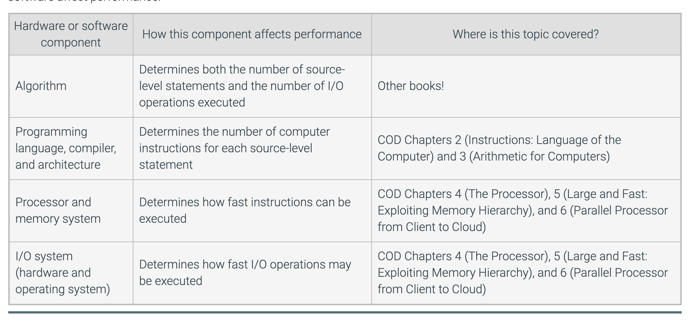


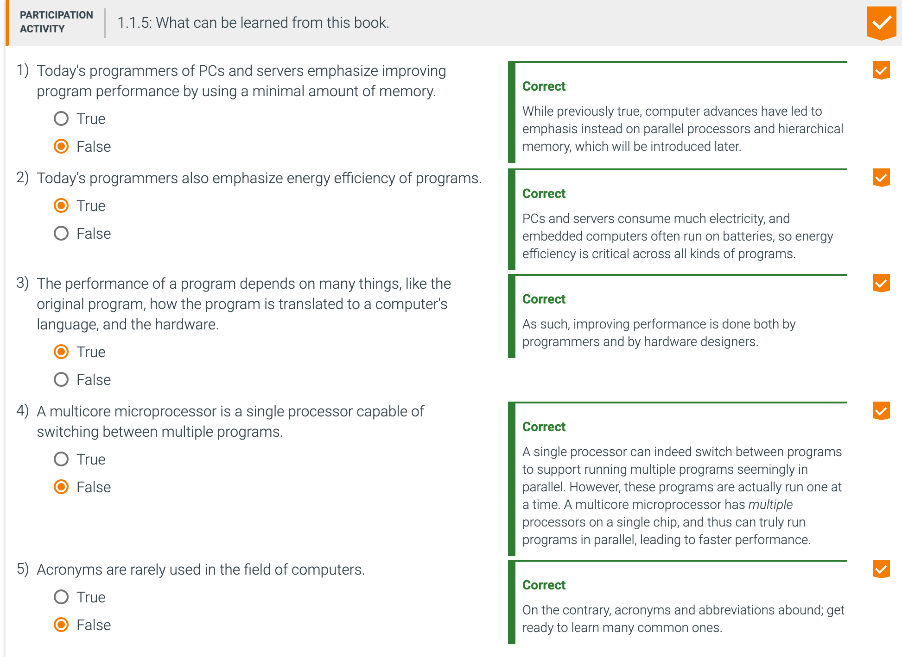

```
1)
- While previously true, computer advances have led to emphasis instead on parallel processors 
  and hierarchical memory, which will be introduced later.
- The amount of memory on computers has increased. So essentally, that what currently is 
  emphasized by programmers is using parallel processing in terms of trading. So using 
  the least amount of memory is not any more nowadays critcial for focus on performance.


4)
- false, A single processor can indeed switch between programs to support running multiple 
  programs seemingly in parallel. However, these programs are actually run one at a time. 
  A multicore microprocessor has multiple processors on a single chip, and thus can truly 
  run programs in parallel, leading to faster performance.
  - when you have multiple processor that that's not single processor. it's basically 
    equivalent having many processes.

5)
- false, 
  - Acronym(首字母缩写): A word constructed by taking the initial letters of a string of words. 
    For example: RAM is an acronym for Random Access Memory, and CPU is an acronym for 
    Central Processing Unit.
``` 

---

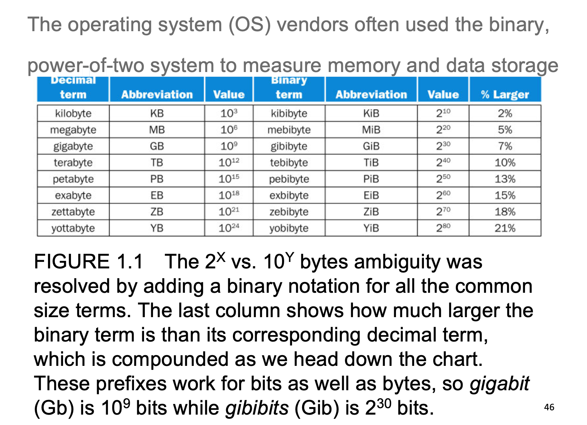


---

## 1.2 Eight great ideas in computer architecture

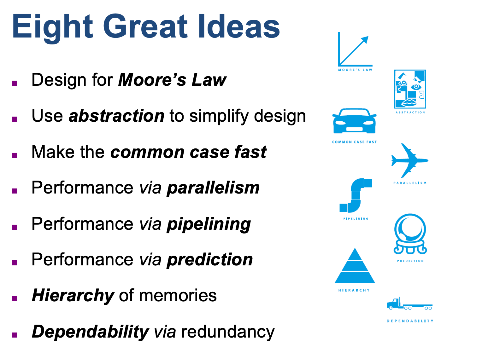


- Design for Moore's Law
  - The one constant for computer designers is rapid change, which is driven largely by 
    **Moore's Law**. Moore's Law states that integrated circuit resources double every 
    18-24 months. Moore's Law resulted from a 1965 prediction of such growth in IC capacity 
    made by Gordon Moore, one of the founders of Intel. As computer designs can take years, 
    the resources available per chip can easily double or quadruple between the start and 
    finish of the project. Like a skeet shooter, computer architects must anticipate where 
    the technology will be when the design finishes rather than design for where it starts. 
    We use an "up and to the right" Moore's Law graph to represent designing for rapid change.
  - [翻译]: 对于计算机设计师来说，一个不变的因素是快速变化，这在很大程度上是由摩尔定律驱动的。 摩尔定律指出，
    集成电路资源每18-24个月增加一倍。 摩尔定律源自1965年英特尔创始人之一戈登·摩尔（Gordon Moore）对 IC容量增长
    的预测。 由于计算机设计可能需要花费数年时间，因此每个芯片可用的资源在项目的开始和结束之间可以轻松地翻一番或
    翻两番。 就像飞碟射击游戏一样，计算机架构师必须在设计完成时就预见到技术的发展，而不是从设计的起点就开始。 
    我们使用“右上”的摩尔定律图来表示快速变化的设计。


- Use abstraction to simplify design 使用抽象简化设计
  - Both computer architects and programmers had to invent techniques to make themselves more 
    productive, for otherwise design time would lengthen as dramatically as resources grew by 
    Moore's Law. A major productivity technique for hardware and software is to use abstractions 
    to represent the design at different levels of representation; lower-level details are 
    hidden to offer a simpler model at higher levels. We'll use the abstract painting icon to 
    represent this second great idea.
  - 计算机设计师和程序员都必须发明技术来提高自己的生产力，否则设计时间将随着摩尔定律的增加而急剧增加。 
    硬件和软件的主要生产力技术是使用抽象以不同的表示级别表示设计。 隐藏了较低级别的细节，
    以便在较高级别上提供更简单的模型。 我们将使用抽象绘画图标来表示第二个好主意。
  
- Make the common case fast 快速处理常见情况
  - Making the common case fast will tend to enhance performance better than optimizing the 
    rare case. Ironically, the common case is often simpler than the rare case and hence is often easier to enhance. This common sense advice implies that you know what the 
    common case is, which is only possible with careful experimentation and measurement. 
    We use a sports car as the icon for making the common case fast, as the most common trip 
    has one or two passengers, and it's surely easier to make a fast sports car than a fast 
    minivan!
  - 快速实现普通案例比优化罕见案例倾向于更好地提高性能。 具有讽刺意味的是，通常情况下通常比罕见情况下更简单，
    因此通常更易于增强。 这种常识性建议意味着您知道什么是普通情况，只有通过仔细的试验和测量才能实现。 
    我们将跑车作为使普通情况下快速行驶的图标，因为最常见的旅行只有一两个乘客，因此，与快速的小型货车相比，
    制造快速的跑车肯定更容易！


- Performance via parallelism 通过并行性能
  - Since the dawn of computing, computer architects have offered designs that get more 
    performance by performing operations in parallel. We'll see many examples of parallelism 
    in this book. We use multiple jet engines of a plane as our icon for parallel performance.
  - 自从计算开始以来，计算机架构师就提供了通过并行执行操作获得更高性能的设计。 
    我们将在本书中看到许多并行性的例子。 我们使用飞机的多个喷气发动机作为并行性能的图标。


- Performance via pipelining 通过流水线表现
  - A particular pattern of parallelism is so prevalent in computer architecture that it merits 
    its own name: pipelining, which moves multiple operations through hardware units that each 
    do a piece of an operation, akin to water flowing through a pipeline. For example, before 
    fire engines, a "bucket brigade" would respond to a fire, which many cowboy movies show in 
    response to a dastardly act by the villain. The townsfolk form a human chain to carry a 
    water source to fire, as they could much more quickly move buckets up the chain instead of 
    individuals running back and forth. Our pipeline icon is a sequence of pipes, with each 
    section representing one stage of the pipeline.
  - 并行机制的一种特殊模式在计算机体系结构中非常普遍，以至于它有自己的名字：流水线，它通过硬件单元移动多个操作，
    每个硬件单元执行一个操作，就像流经管道的水一样。 例如，在使用消防车之前，“水桶大队”会起火，许多牛仔电影都在对
    小人的卑鄙行径做出反应后，发生了火灾。 乡亲们形成了一条人类链条，可以携带水源点火，因为他们可以更快地将水桶
    沿链条向上移动，而无需个人来回奔波。 我们的管道图标是一系列管道，每个部分代表管道的一个阶段。


- Performance via prediction 
  - Following the saying that it can be better to ask for forgiveness than to ask for 
    permission, the next great idea is prediction. The idea of prediction is that, 
    in some cases it can be faster on average to guess and start working rather than wait until 
    you know for sure, assuming that the mechanism to recover from a misprediction is not too 
    expensive and your prediction is relatively accurate. We use the fortune-teller's crystal 
    ball as our prediction icon.
  - 俗话说，寻求宽恕比寻求许可更好，下一个好主意是预测。 预测的思想是，在某些情况下，假设从错误预测中恢复的机制并不太
    昂贵，并且预测相对准确，那么猜测和开始工作而不是等到确定就可以平均更快。 我们使用算命先生的水晶球作为预测图标。


- Hierarchy of memories 记忆层次
  - Programmers want memory to be fast, large, and cheap, as memory speed often shapes 
    performance, capacity limits the size of problems that can be solved, and the cost of memory 
    today is often the majority of computer cost. Architects have found that they can address 
    conflicting demands of fast, large, and cheap memory with a hierarchy of memories, with the 
    fastest, smallest, and most expensive memory per bit at the top of the hierarchy and the 
    slowest, largest, and cheapest per bit at the bottom. As we shall see in COD Chapter 5 
    (Large and Fast: Exploiting Memory Hierarchy), caches give the programmer the illusion that 
    main memory is nearly as fast as the top of the hierarchy and nearly as big and cheap as the 
    bottom of the hierarchy. We use a layered triangle icon to represent the memory hierarchy. 
    The shape indicates speed, cost, and size: the closer to the top, the faster and more 
    expensive per bit the memory; the wider the base of the layer, the bigger the memory.
  - 程序员希望内存要快速，大而便宜，因为内存速度通常会影响性能，容量限制了可以解决的问题的大小，当今的内存成本通常是
    计算机成本的绝大部分。 架构师发现，他们可以通过层次结构的内存来满足快速，大型和廉价内存的冲突需求，在层次结构的
    顶部，每位最快，最小和最昂贵的内存，而每个层次中最慢，最大和最便宜的内存 底部。 正如我们将在COD第5章
    （大型而又快的：利用内存层次结构）中看到的那样，缓存给程序员一种幻觉，即主内存几乎与层次结构的顶部一样快，而几乎
    与层次结构的底部一样大且便宜。 我们使用分层的三角形图标表示内存层次结构。 形状表示速度，成本和大小：越靠近顶部，
    每位内存的速度越快且价格越昂贵； 层的基础越宽，内存越大。


- Dependability via redundancy 通过冗余的可靠性
  - Computers not only need to be fast; they need to be dependable. Since any physical device 
    can fail, we make systems dependable by including redundant components that can take over 
    when a failure occurs and to help detect failures. We use the tractor-trailer as our icon, 
    since the dual tires on each side of its rear axles allow the truck to continue driving even 
    when one tire fails. (Presumably, the truck driver heads immediately to a repair facility so 
    the flat tire can be fixed, thereby restoring redundancy!)
  - 计算机不仅需要快速运行，还需要快速运行。 他们需要可靠。 由于任何物理设备都可能发生故障，因此我们通过包含冗余组件
    来使系统可靠，这些冗余组件可以在发生故障时接管并帮助检测故障。 我们使用拖挂车作为图标，因为后轴两侧的双轮胎使卡车
    即使在一个轮胎出现故障时也能继续行驶。 （据推测，卡车司机会立即前往修理厂，以便可以修理flat胎，从而恢复冗余！）


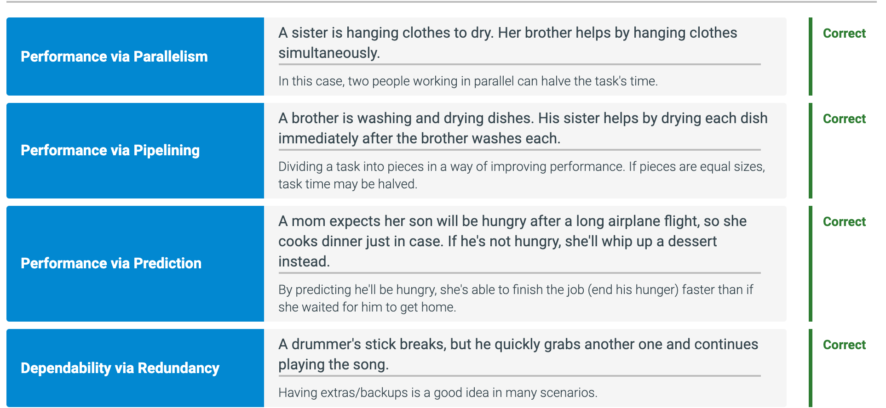

---

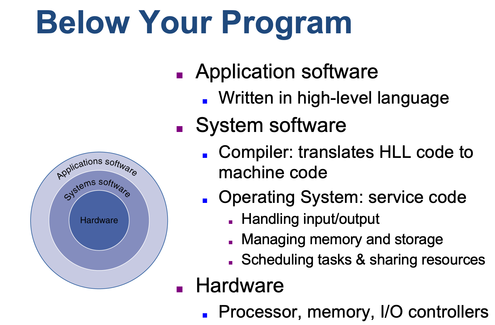


#### 1.3.1: A simplified view of hardware and software as hierarchical layers

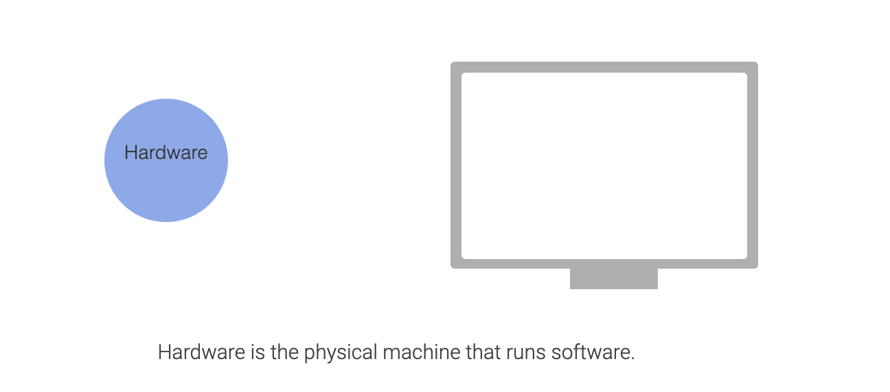

- Hardware is the physical machine that runs software. 硬件是运行软件的物理机器。


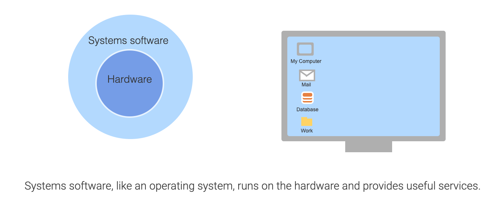

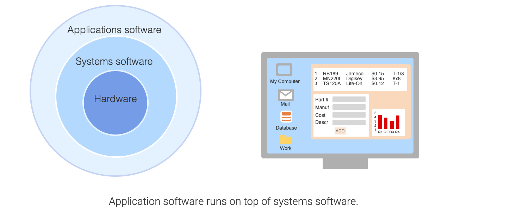

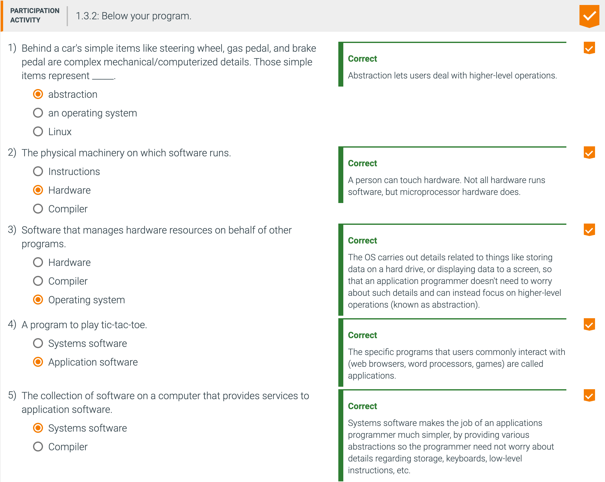

---

## From a high-level language to the language of hardware

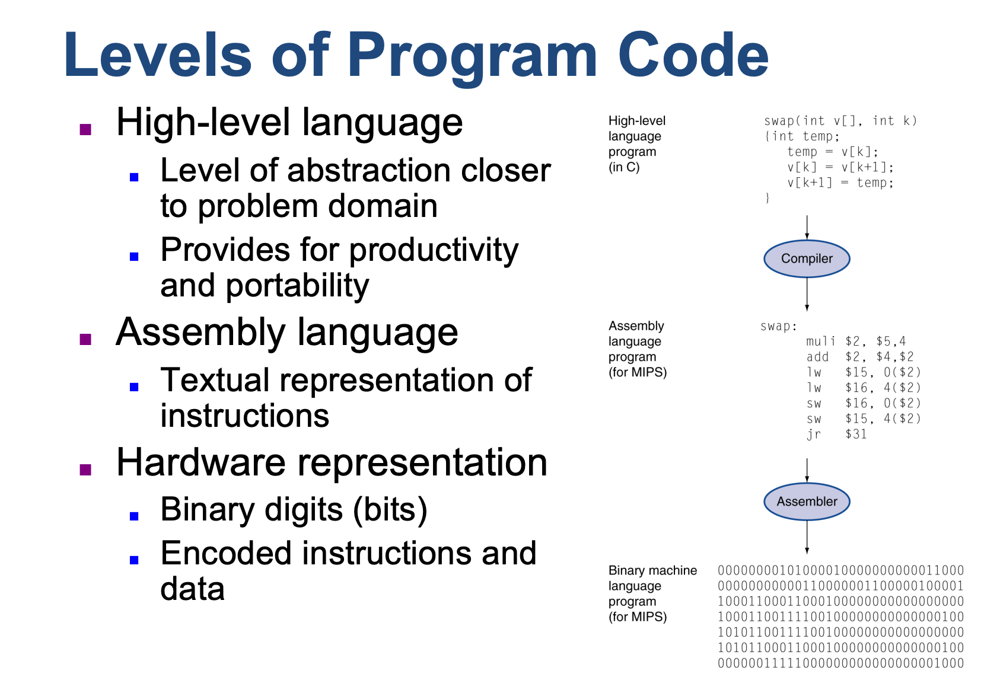


