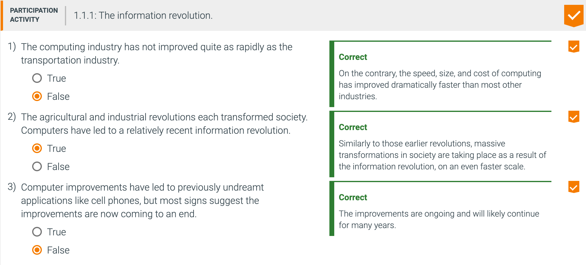
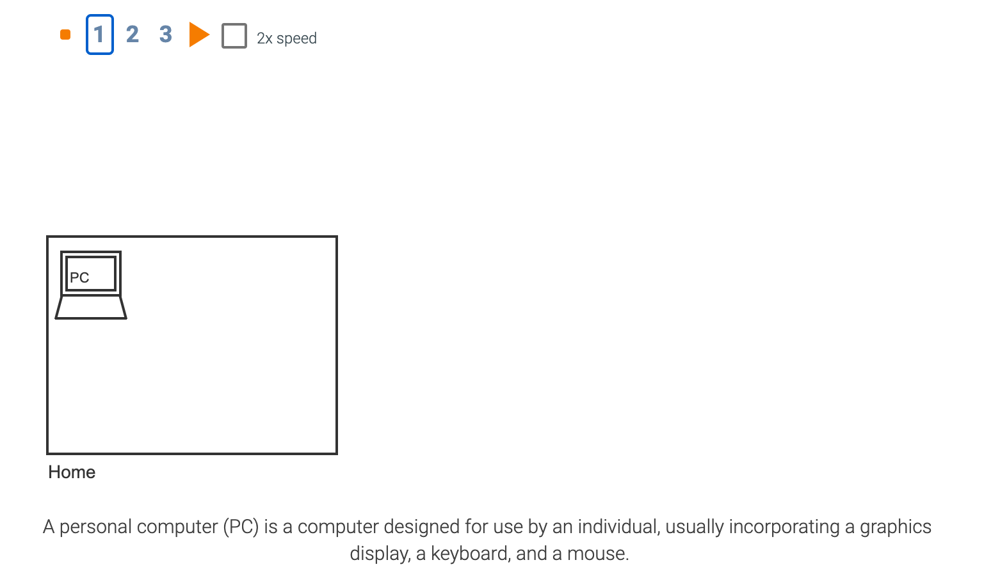
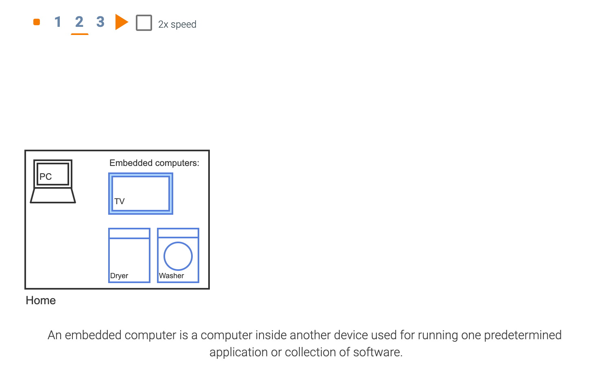
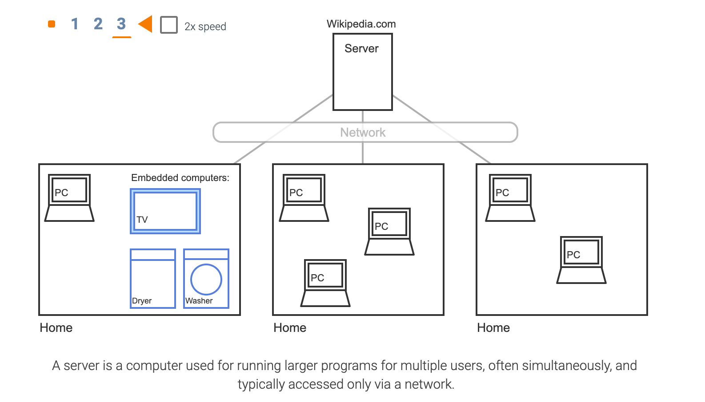
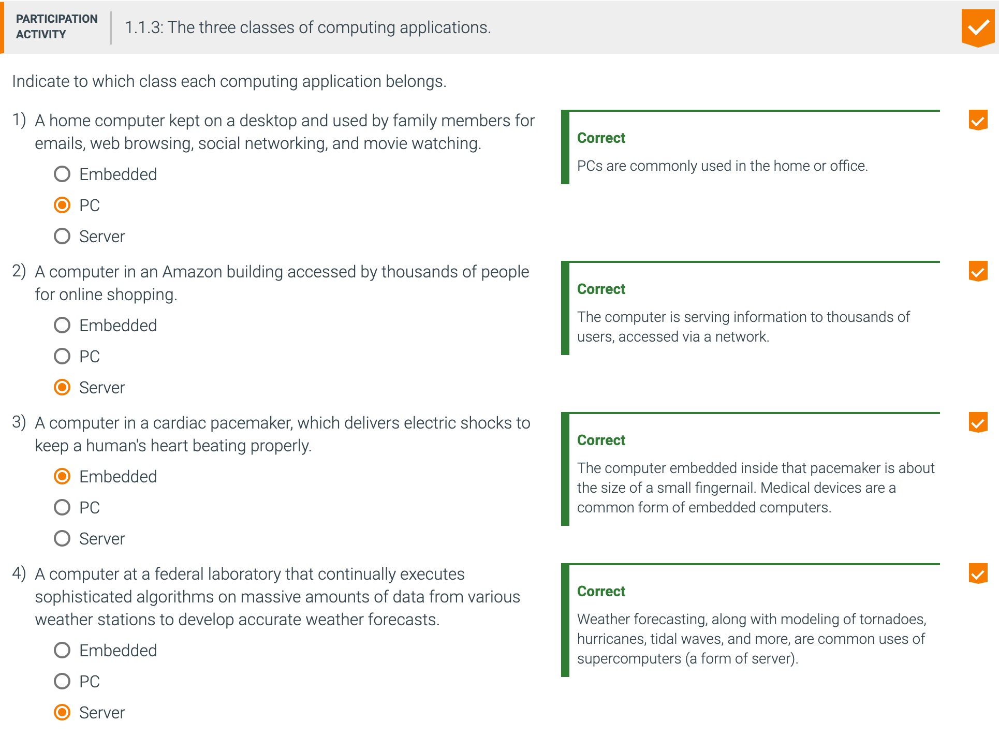

## 1.1 Introduction

### The Computer Revolution

- Progress in computer technology
  - Underpinned by Moore’s Law 
- Makes novel applications feasible可行的
  - Computers in automobiles
  - Cell phones
  - Human genome project人类基因组计划
  - World Wide Web
  - Search Engines

---

---

### 1.1.2 Classes of computing applications and their characteristics

#### Classes of Computers

- Personal computers
  - General purpose, variety of software
  - Subject to cost/performance tradeoff权衡

- Server computers
  - Network based
  - High capacity, performance, reliability
  - Range from small servers to building sized

- Supercomputers
  - High-end scientific and engineering calculations
  - Highest capability but represent a small fraction of the overall computer market

---

### The PostPC Era

- Personal Mobile Device (PMDs)
  - Battery operated
  - Connects to the Internet
  - Hundreds of dollars
  - Smart phones, tablets, electronic glasses

- Cloud computing
  - Warehouse Scale Computers (WSC)
  - Software as a Service (SaaS)
  - Portion of software run on a PMD and a portion run in the Cloud
  - Amazon and Google

