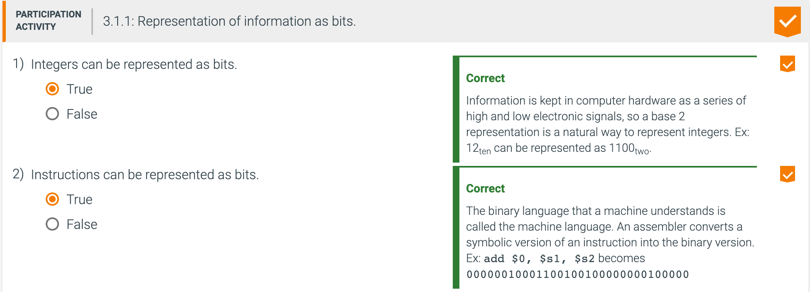

## 3.1 Introduction

- Computer words are composed of bits; thus, words can be represented as binary numbers. COD Chapter 
  2 (Instructions: Language of the Computer) shows that integers can be represented either in 
  decimal or binary form, but what about the other numbers that commonly occur? For example:
  - What about fractions and other real numbers?
  - What happens if an operation creates a number bigger than can be represented?
  - And underlying these questions is a mystery: How does hardware really multiply or divide numbers?

- The goal of this chapter is to unravel these mysteries including representation of real numbers, 
  arithmetic algorithms, hardware that follows these algorithms, and the implications of all this 
  for instruction sets. These insights may explain quirks that you have already encountered with 
  computers. Moreover, we show how to use this knowledge to make arithmetic-intensive programs go 
  much faster.

