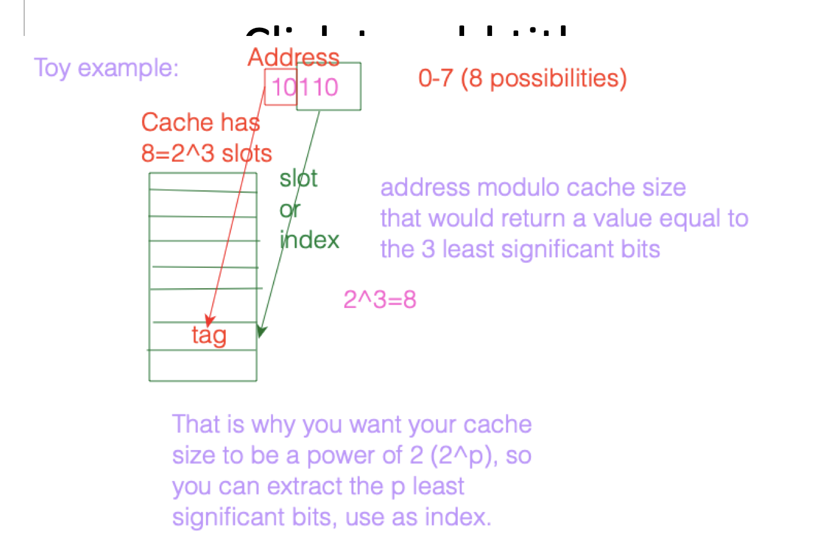
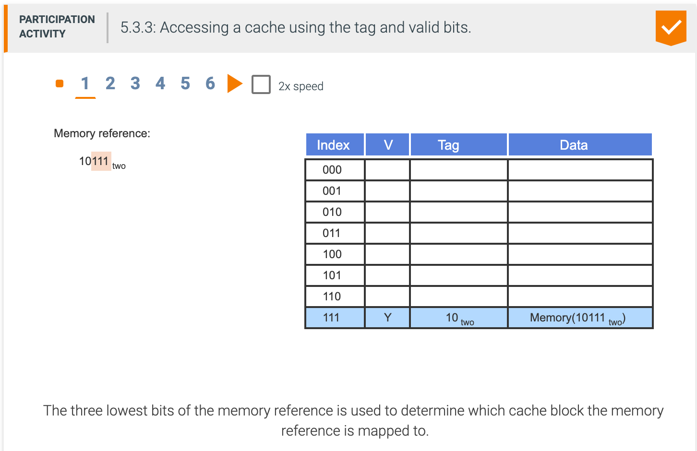
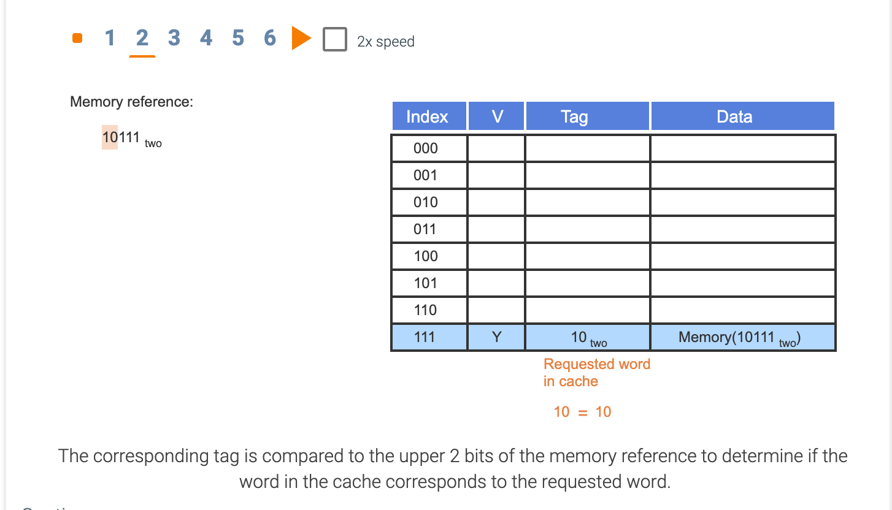
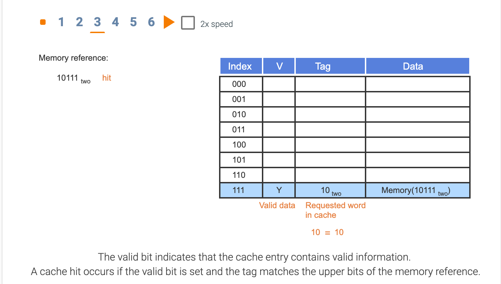
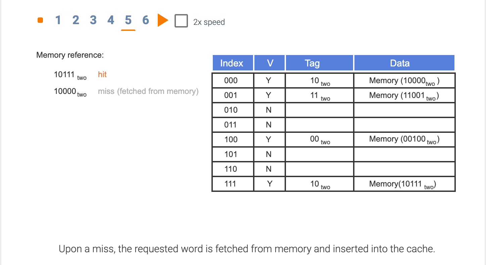
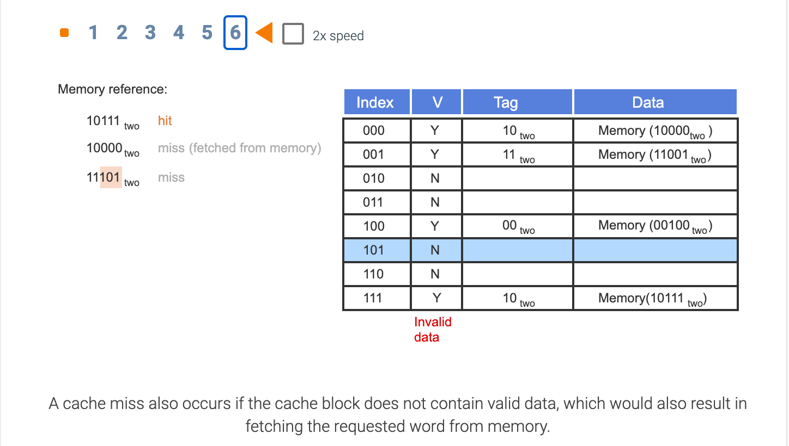
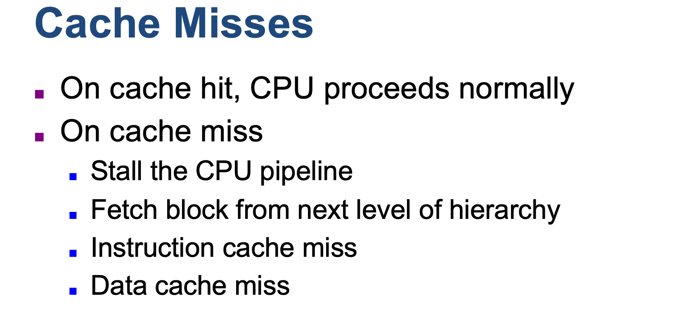
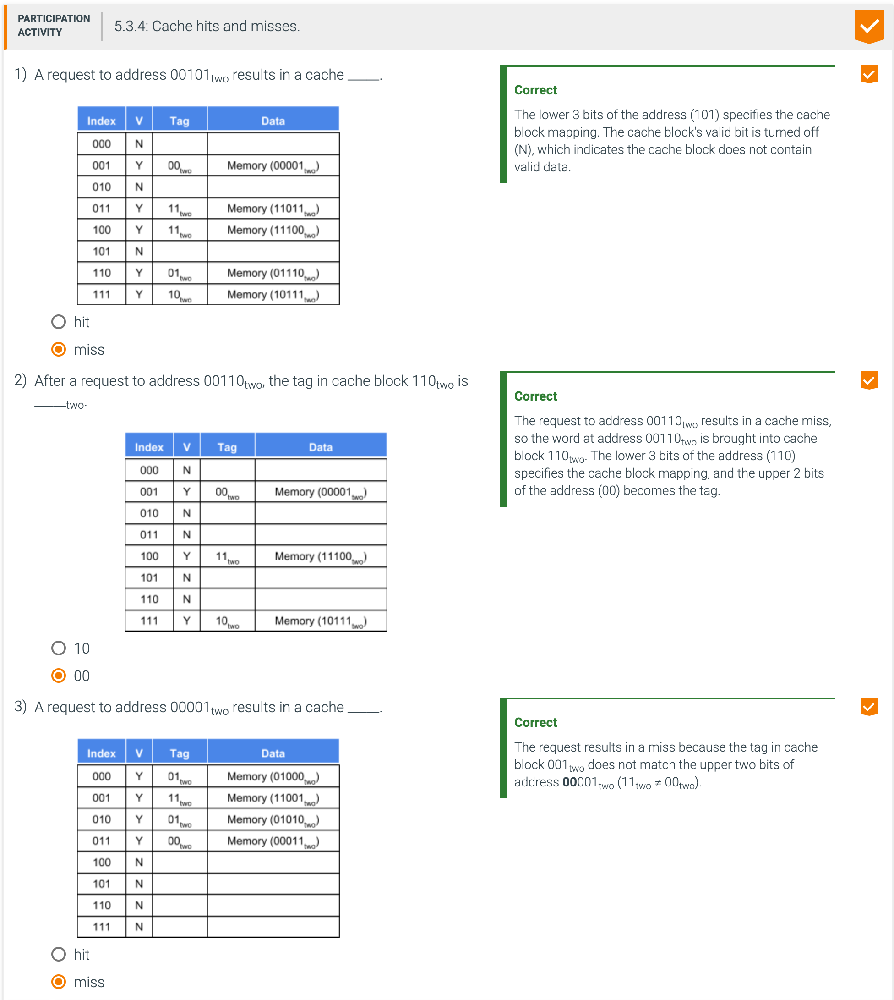
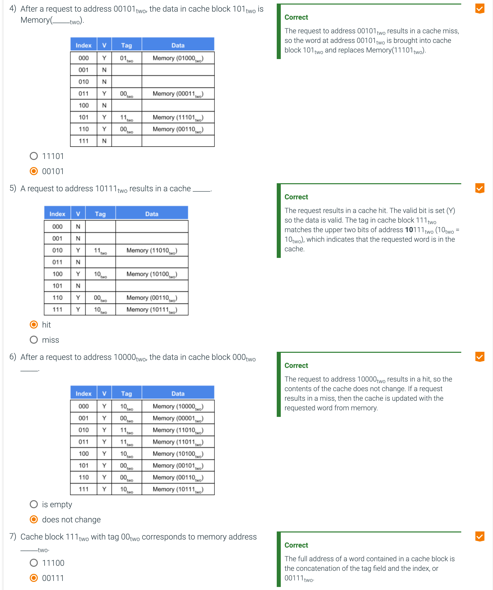
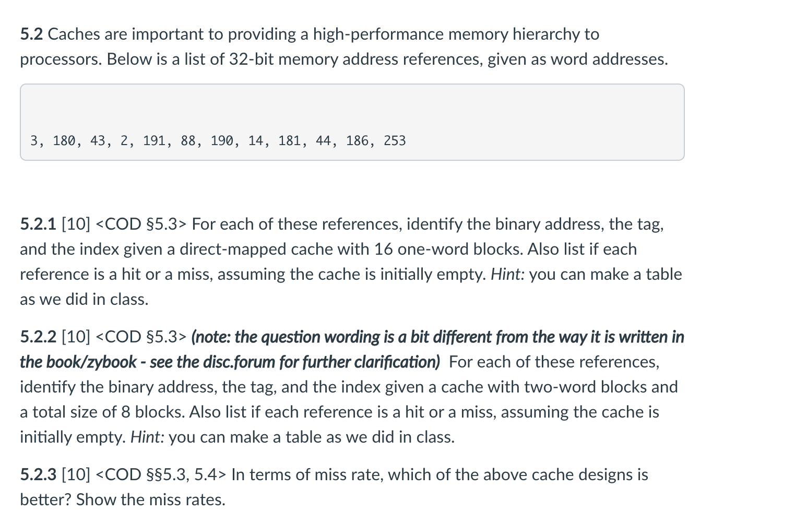

## The basics of caches

- **Direct-mapped cache** 直接映射的高速缓存: A cache structure in which each memory location is mapped to exactly one 
  location in the cache.

---

### Cache Example

- **Tag**: A field in a table used for a memory hierarchy that contains the address information required to identify 
  whether the associated block in the hierarchy corresponds to a requested word.

- **Valid bit**: A field in the tables of a memory hierarchy that indicates that the associated block in the hierarchy 
  contains valid data.

---

---

- A **tag field**, which is used to compare with the value of the tag field of the cache
- A **cache index**, which is used to select the block

---

- For a direct mapped cache the general rule is: first figure out the bits of the offset (the right-most bits of the 
  address), then figure out the bits of the index (the next-to right-most address bits), and then the tag is everything 
  left over (on the left side).

- One way to think of a direct mapped cache is as a table with rows and columns. The index tells you what row to look   
  at, then you compare the tag for that row, and if it matches, the offset tells you which column to use. (Note that 
  the order you use the parts: index/tag/offset, is different than the order in which you figure out which bits are 
  which: offset/index/tag.)

- So in part (a) The block size is 1 word, so you need 0 offset bits (because 2^0=1). You have 16 blocks, so you need 4 
  index bits to give 16 different indices (because 2^4=16). That leaves you with the remaining 28 bits for the tag. You 
  seem to have gotten this mostly right (except for the rows for "180" and "43" where you seem to have missed a few 
  bits, and the row for "181" where you interchanged some bits when converting to binary, I think). You are correct 
  that everything is a miss.

- For part (b) The block size is 2 words, so you need 1 offset bit (because 2^1=2). You have 8 blocks, so you need 3 
  index bits to give 8 different row indices (because 2^3=8). That leaves you with the remaining 28 bits for the tag. 
  Again you got it mostly right except for the rows for "180" and "43" and "181". (Which then will change some of the 
  hits and misses.)

