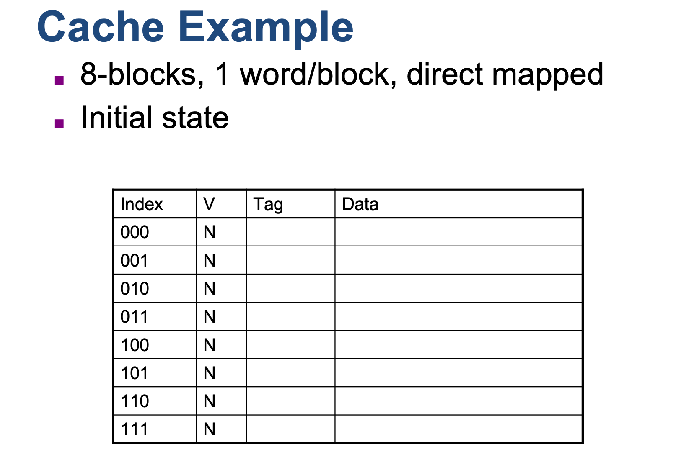
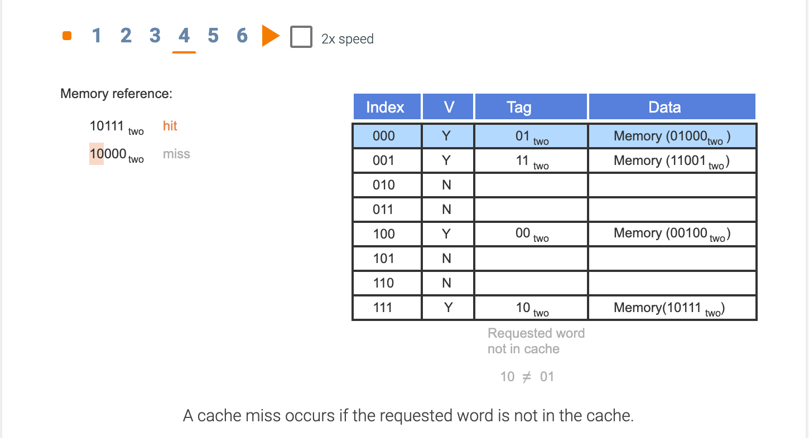

## The basics of caches

- **Direct-mapped cache** 直接映射的高速缓存: A cache structure in which each memory location is mapped to exactly one 
  location in the cache.

---

### Cache Example

- **Tag**: A field in a table used for a memory hierarchy that contains the address information required to identify 
  whether the associated block in the hierarchy corresponds to a requested word.

- **Valid bit**: A field in the tables of a memory hierarchy that indicates that the associated block in the hierarchy 
  contains valid data.

---

