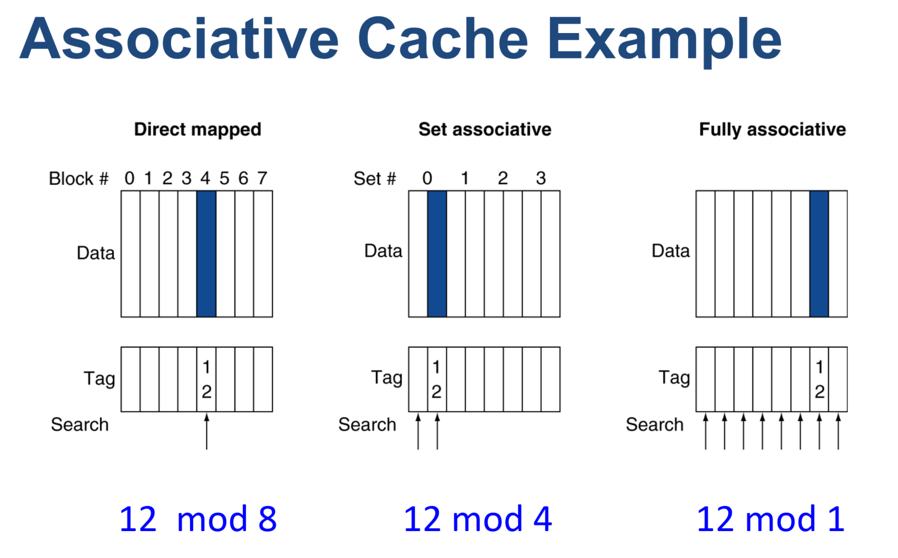

## Measuring and improving cache performance

- In this section
  - Some CPU performance metrics, briefly
  - Associative caches 关联高速缓存
  - Multi-level caches

---

- Hash table - also called an associative array 关联数组
  - A hash table uses a hash function to compute an index into an array of 
    **slots or buckets or sets or indices or blocks**.
  - From there the desired value can be found quickly 
    - Expected time O(1).

---

---

