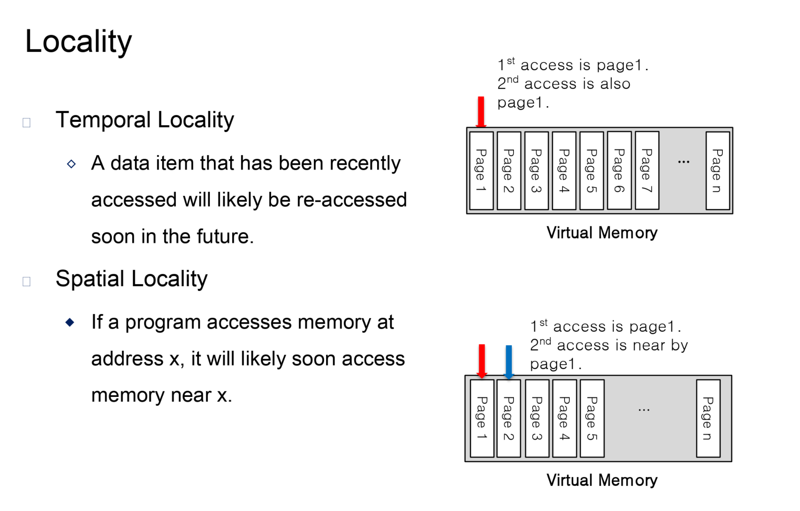
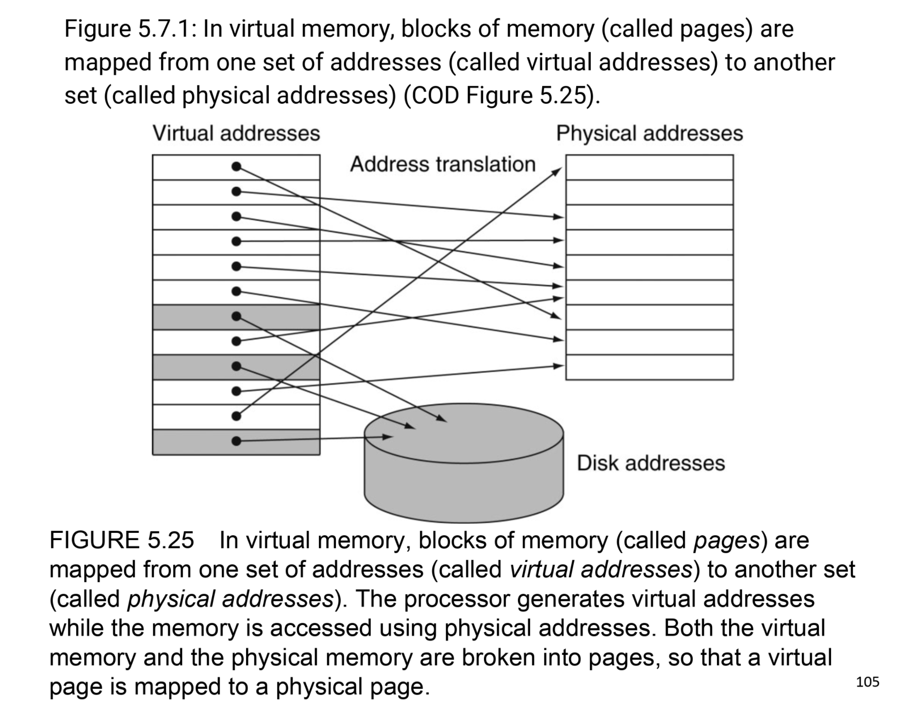
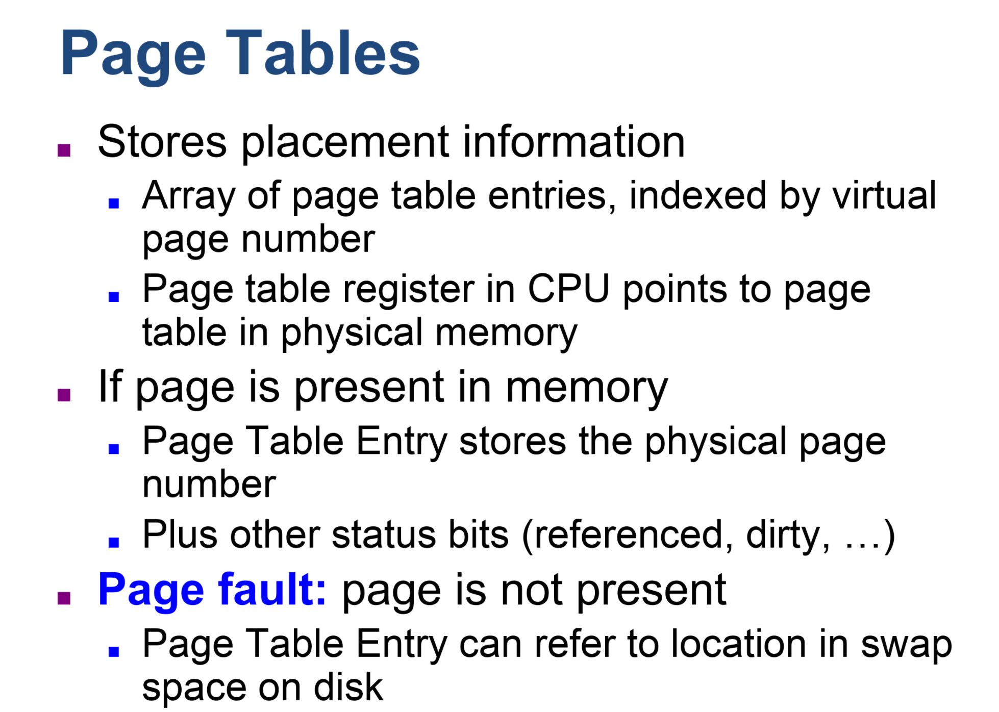

## Virtual memory

---

- **Virtual memory**: A technique that uses main memory as a "cache" for secondary storage. 

- **Physical address**: An address in main memory

- **Page fault**: An event that occurs when an accessed page is not present in main memory

- **Virtual address**: An address that corresponds to a location in virtual space and is translated by address mapping 
  to a physical address when memory is accessed.

- **Address translation**: Also called address mapping. The process by which a virtual address is mapped to an address 
  used to access memory.

---

- **Page table**: The table containing the virtual to physical address translations in a virtual memory system. The 
  table, which is stored in memory, is typically indexed by the virtual page number; each entry in the table contains 
  the physical page number for that virtual page if the page is currently in memory.

---

---

- **Translation-lookaside buffer (TLB)**: A cache that keeps track of recently used address mappings to try to avoid an 
  access to the page table.

