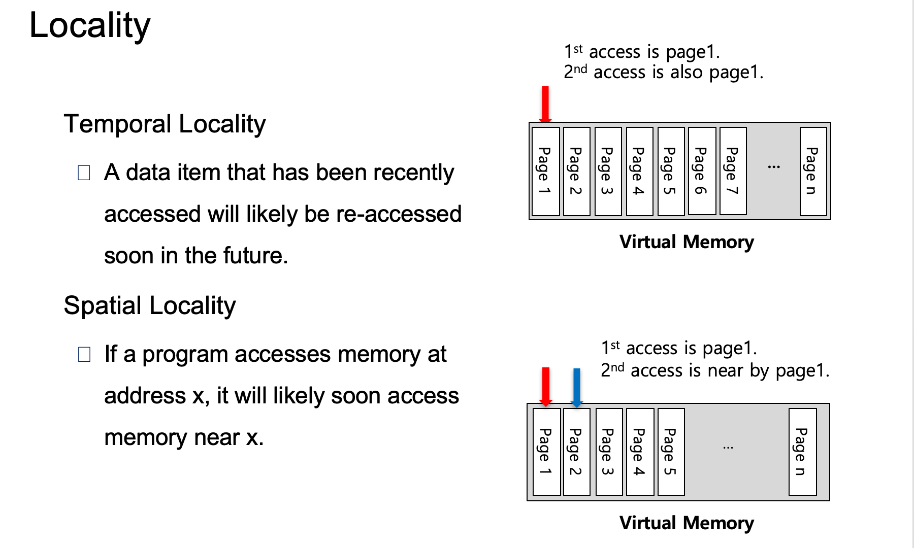

##  Introduction

- Principle of Locality (局部性原理，区域性原则)
  - Programs access a small proportion of their address space at any time 程序可随时访问其地址空间的一小部分
  - Temporal locality [计] 时间局部性
    - Items accessed recently are likely to be accessed again soon 最近访问的项目可能很快就会再次访问
    - e.g., instructions in a loop, induction variables
  - Spatial locality [计] 空间局部性
    - Items near those accessed recently are likely to be accessed soon 最近访问过的项目附近的项目可能很快就会被访问
    - E.g., sequential instruction access, array data 例如，顺序指令访问，数组数据
  

  

