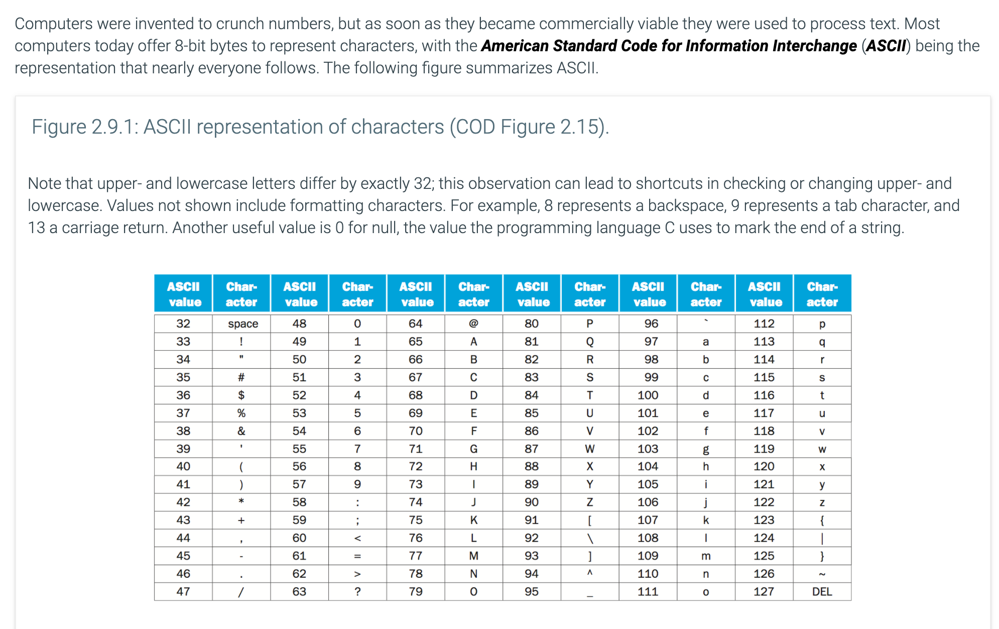
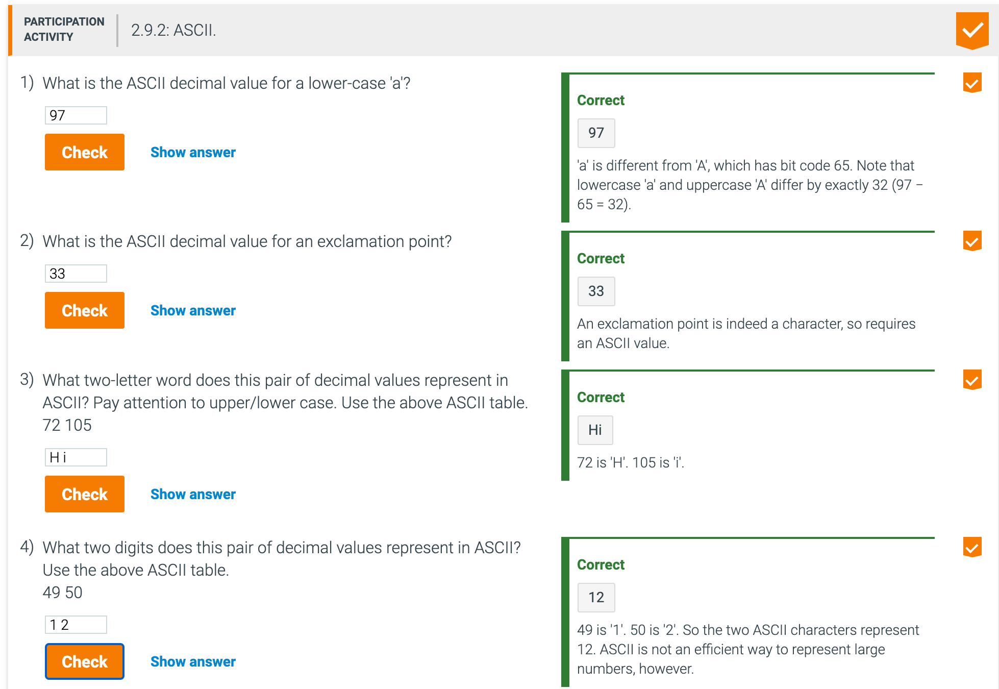
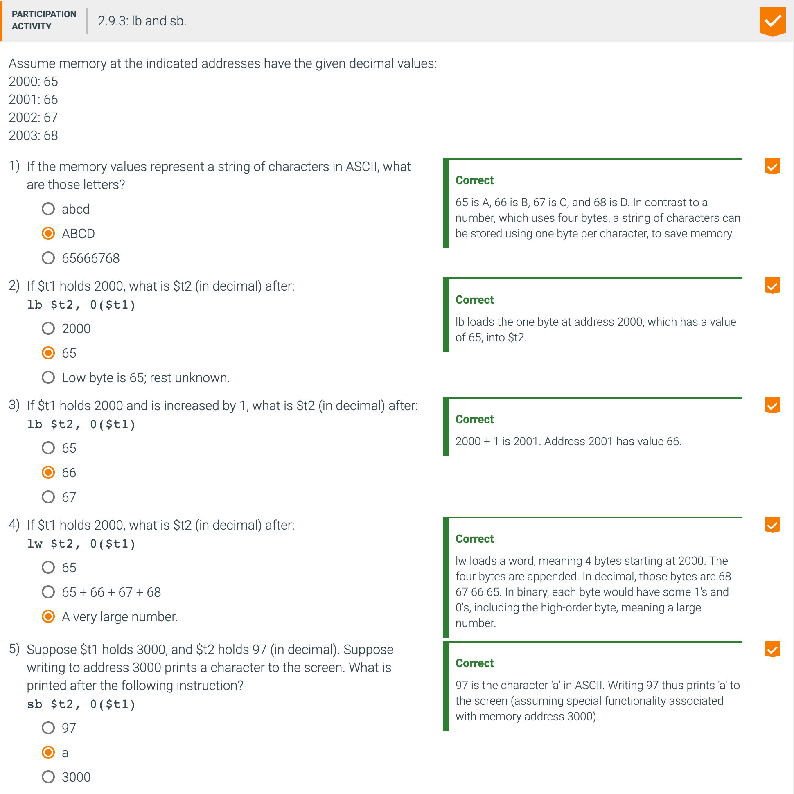
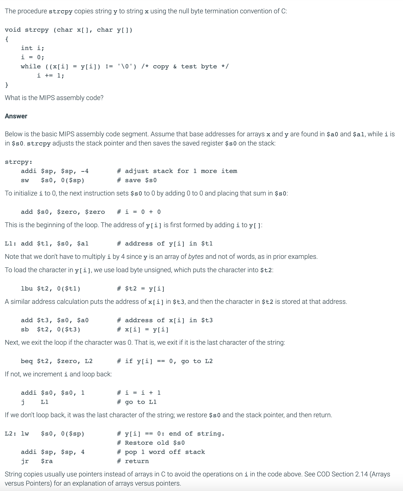
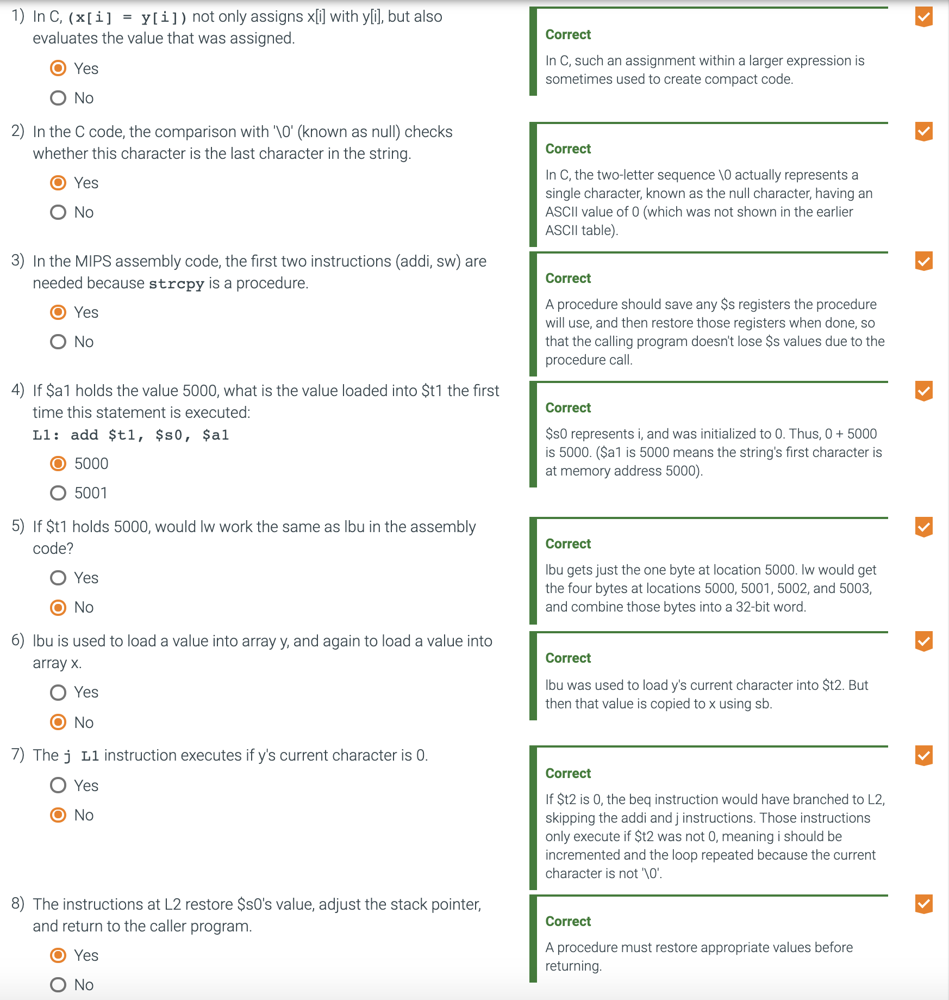
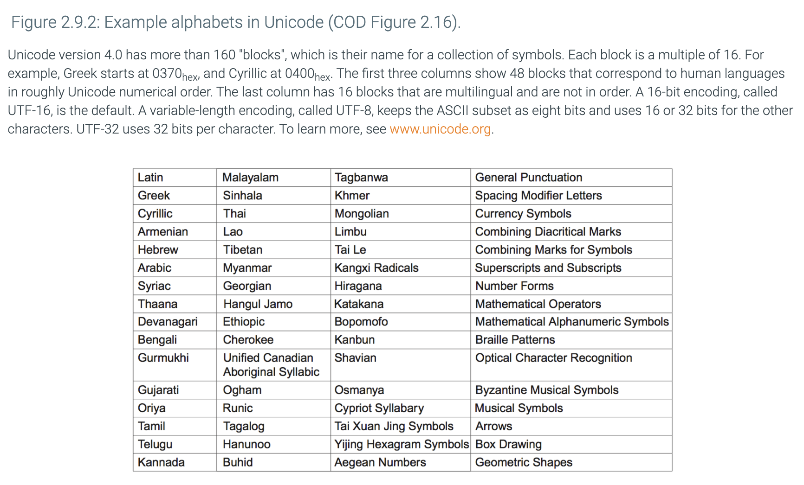
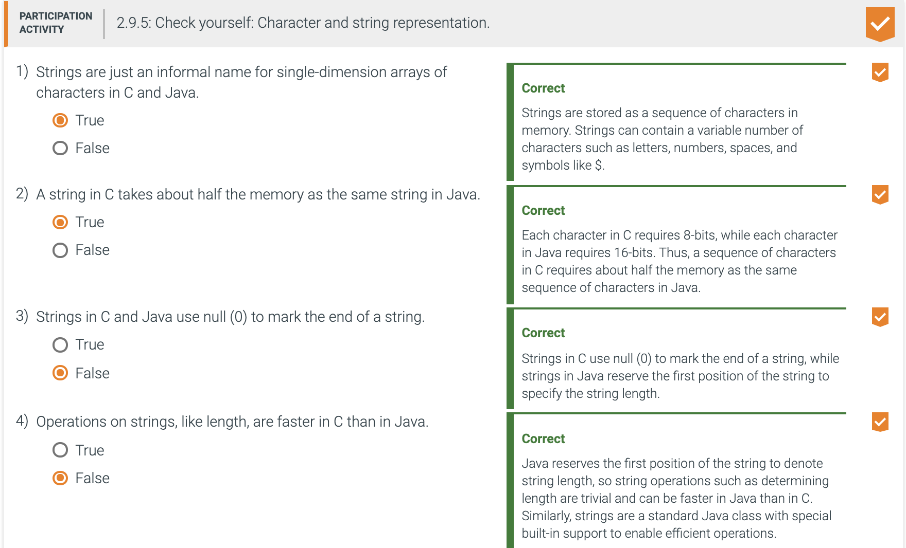
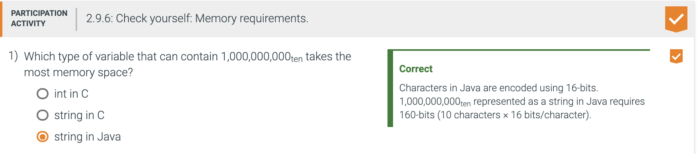

## Communicating with people





---

- A series of instructions can extract a byte from a word, so load word and store word are 
  sufficient for transferring bytes as well as words. Because of the popularity of text in some 
  programs, however, MIPS provides instructions to move bytes. 
  - **Load byte `(lb)` loads a byte from memory, placing it in the rightmost 8 bits of a register**.
  - **Store byte `(sb)` takes a byte from the rightmost 8 bits of a register and writes it to memory.** 
  - Thus, we copy a byte with the sequence


```ruby
lb $t0, 0($sp)   # Read byte from source
sb $t0, 0($gp)   # Write byte to destination
```



---

- Characters are normally combined into strings, which have a variable number of characters. There 
  are three choices for representing a string: (1) the first position of the string is reserved to 
  give the length of a string, (2) an accompanying variable has the length of the string (as in a 
  structure), or (3) the last position of a string is indicated by a character used to mark the end 
  of a string. C uses the third choice, terminating a string with a byte whose value is 0 (named 
  null in ASCII). Thus, the string "Cal" is represented in C by the following 4 bytes, shown as 
  decimal numbers: 67, 97, 108, 0. (As we shall see, Java uses the first option.)

- Example 2.9.2: Compiling a string copy procedure, showing how to use C strings.



- Since the procedure strcpy above is a leaf procedure, the compiler could allocate `i` to a 
  temporary register and avoid saving and restoring `$s0`. Hence, instead of thinking of the `$t` 
  registers as being just for temporaries, we can think of them as registers that the callee should 
  use whenever convenient. When a compiler finds a leaf procedure, it exhausts all temporary 
  registers before using registers it must save.

- 2.9.4: String copy example:



---

### Characters and strings in Java

- Unicode is a universal encoding of the alphabets of most human languages. The figure below gives a 
  list of Unicode alphabets; there are almost as many alphabets in Unicode as there are useful symbols 
  in ASCII. To be more inclusive, Java uses Unicode for characters. By default, it uses 16 bits to 
  represent a character.




- The MIPS instruction set has explicit instructions to load and store such 16- bit quantities, called 
  halfwords. Load half `(lh)` loads a halfword from memory, placing it in the rightmost 16 bits of a 
  register. Like load byte, load half `(lh)` treats the halfword as a signed number and thus 
  sign-extends to fill the 16 leftmost bits of the register, while load halfword unsigned `(lhu)` works 
  with unsigned integers. Thus, lhu is the more popular of the two. Store half `(sh)` takes a halfword 
  from the rightmost 16 bits of a register and writes it to memory. We copy a halfword with the sequence


```ruby
lhu $t0, 0($sp)   # Read halfword (16 bits) from source
sh  $t0, 0($gp)   # Write halfword (16 bits) to destination
```






