## Building a datapath

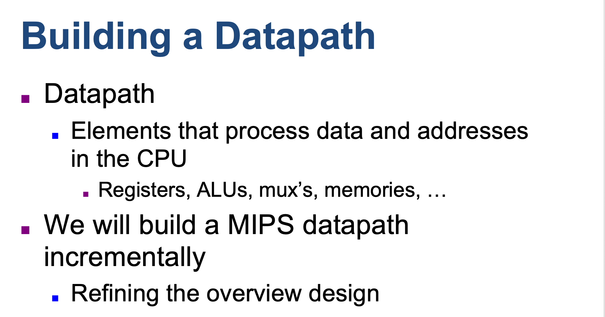

- **Datapath element**: A unit used to operate on or hold data within a processor. In the MIPS implementation, the 
  datapath elements include the instruction and data memories, the register file, the ALU, and adders.

- **Program counter (PC)**: The register containing the address of the next instruction in the program to be executed.

---

### This datapath can execute the basic instructions (load-store word, ALU operations, and branches) in a single clock cycle

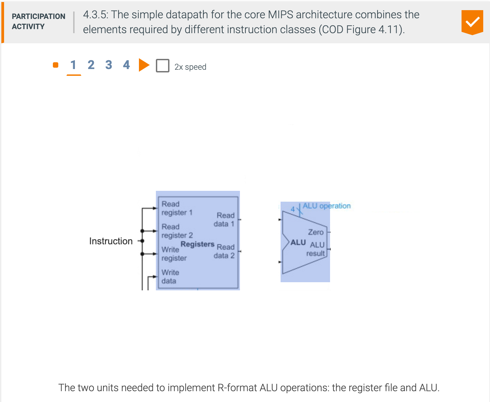

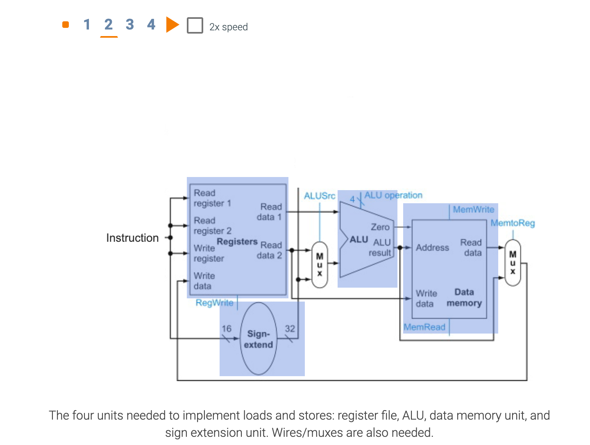

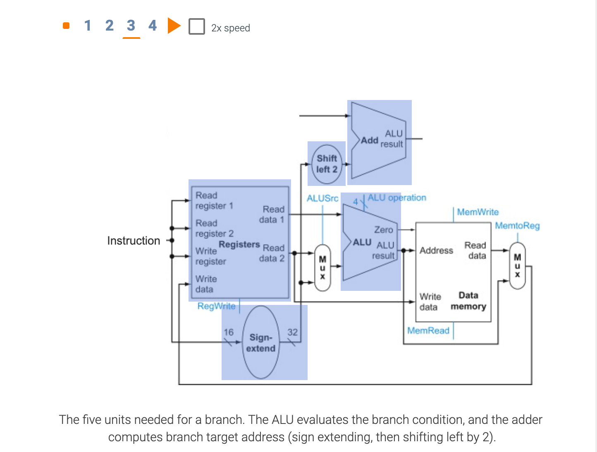

---

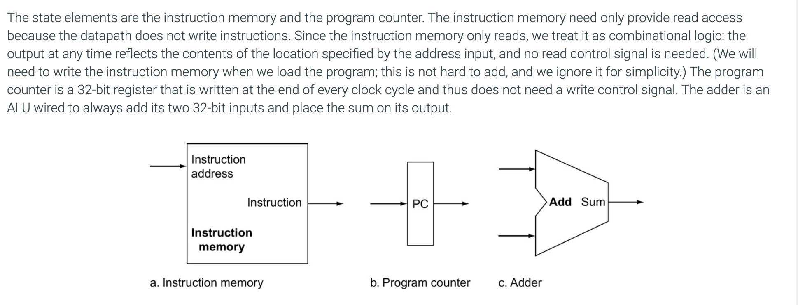

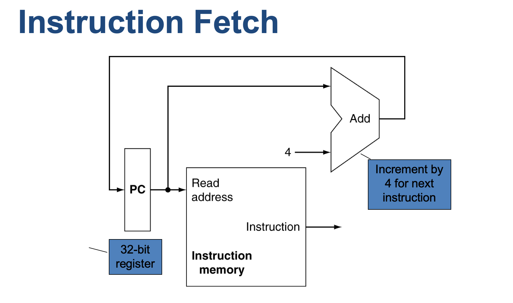

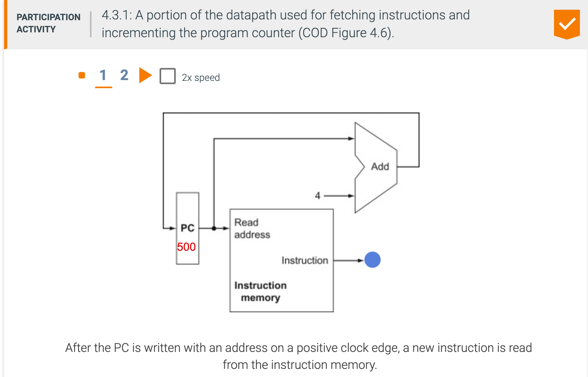

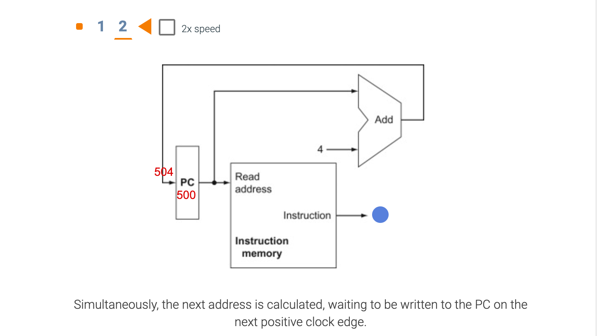

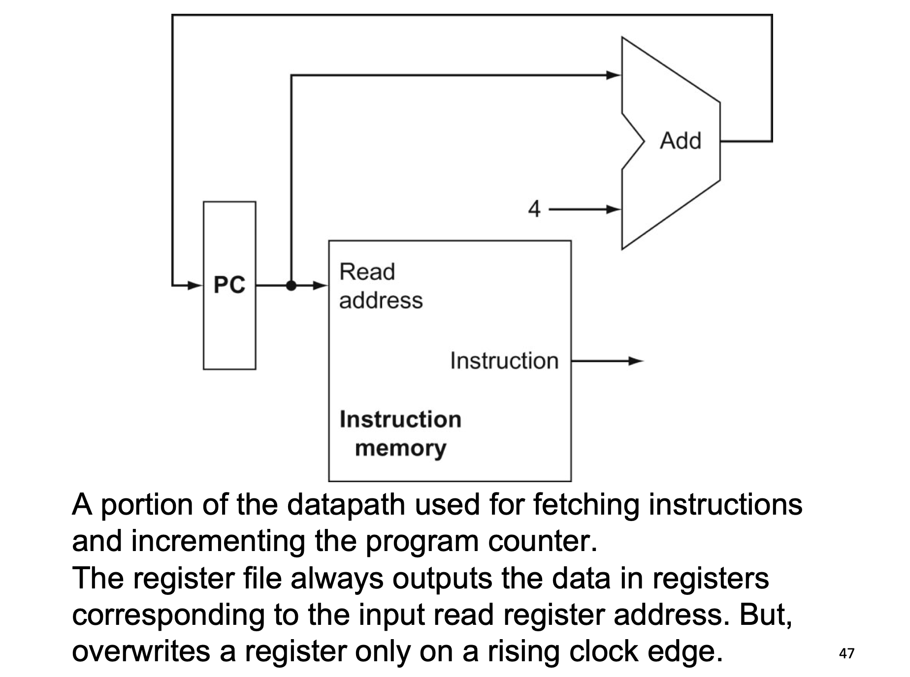

- **Register file**: A state element that consists of a set of registers that can be read and written by supplying a 
  register number to be accessed.

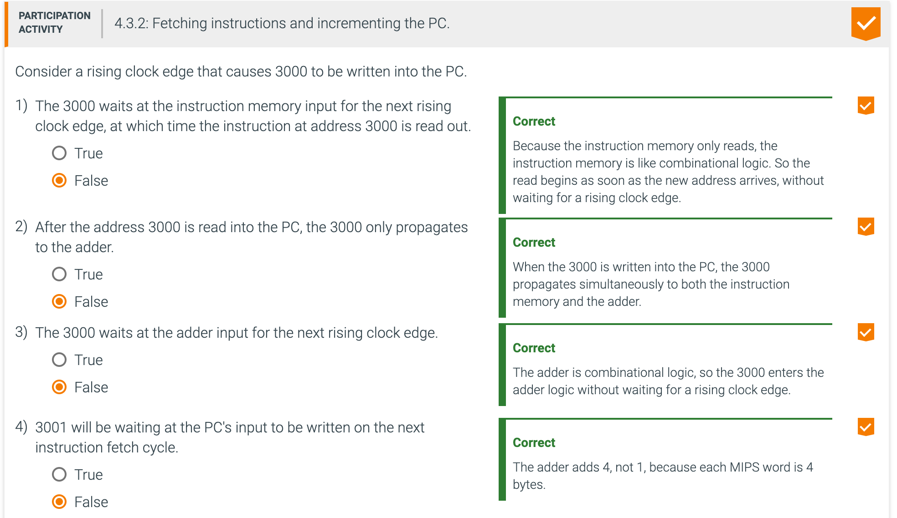

---

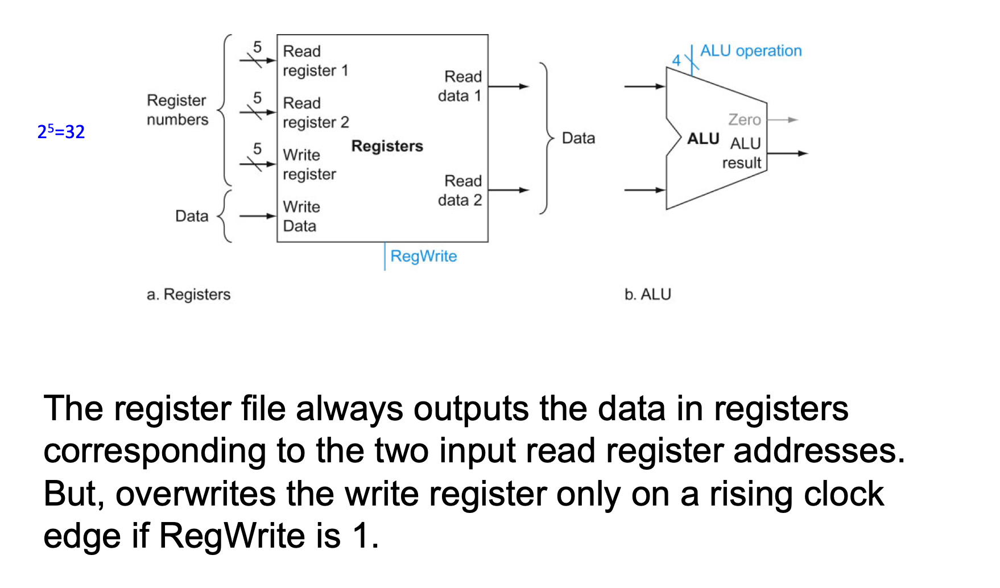
