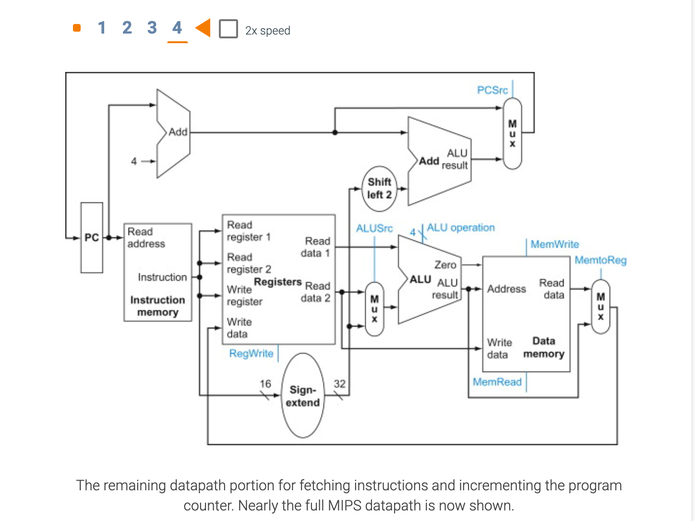

## Building a datapath

- **Datapath element**: A unit used to operate on or hold data within a processor. In the MIPS implementation, the 
  datapath elements include the instruction and data memories, the register file, the ALU, and adders.

- **Program counter (PC)**: The register containing the address of the next instruction in the program to be executed.

---

### This datapath can execute the basic instructions (load-store word, ALU operations, and branches) in a single clock cycle

---

- **Register file**: A state element that consists of a set of registers that can be read and written by supplying a 
  register number to be accessed.

---

- **Sign-extend**: To increase the size of a data item by replicating the high-order sign bit of the original data item 
  in the high-order bits of the larger, destination data item.

---

---

### MIPS Addresses in lw, sw 

- The MIPS instruction that loads a word into a register is the `lw` instruction. The store word instruction is `sw`.
  Each must specify a register and a memory address. A MIPS instruction is 32 bits (always). A MIPS memory address is 
  32 bits (always). How can a load or store instruction specify an address that is the same size as itself?

- An instruction that refers to memory uses a base register and an offset. The base register is a general purpose 
  register that contains a 32-bit address. The offset is a 16-bit signed integer contained in the instruction. The sum 
  of the address in the base register with the (sign-extended) offset forms the memory address.

- At execution time two things happen: (1) an address is calculated by adding the base register `b` with the offset 
  `off`, and (2) data is fetched from memory at that address.

---

- **Branch target address**: The address specified in a branch, which becomes the new program counter (PC) if the 
  branch is taken. In the MIPS architecture the branch target is given by the sum of the offset field of the 
  instruction and the address of the instruction following the branch.

- **Branch taken**: A branch where the branch condition is satisfied and the program counter (PC) becomes the branch 
  target. All unconditional branches are taken branches.

- **Branch not taken or (untaken branch)**: A branch where the branch condition is false and the program counter (PC) 
  becomes the address of the instruction that sequentially follows the branch.

- **Delayed branch**: A type of branch where the instruction immediately following the branch is always executed, 
  independent of whether the branch condition is true or false.

