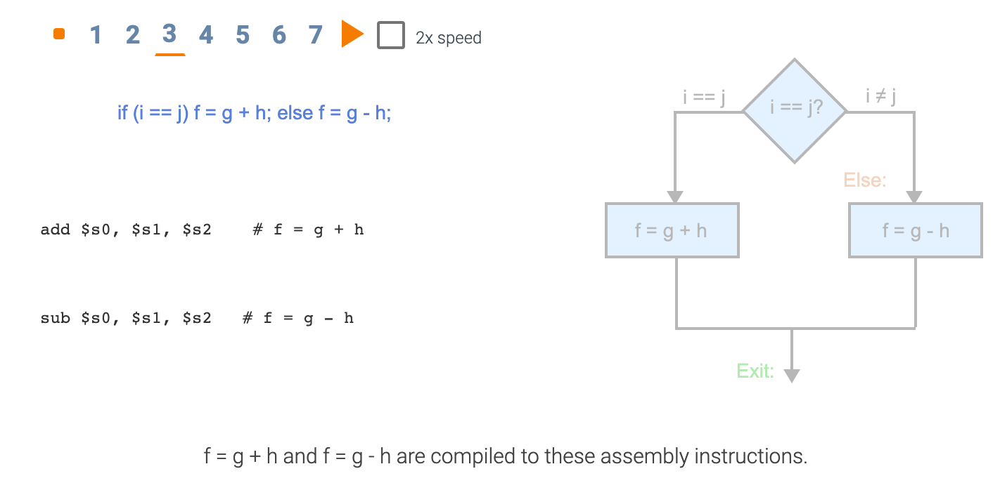
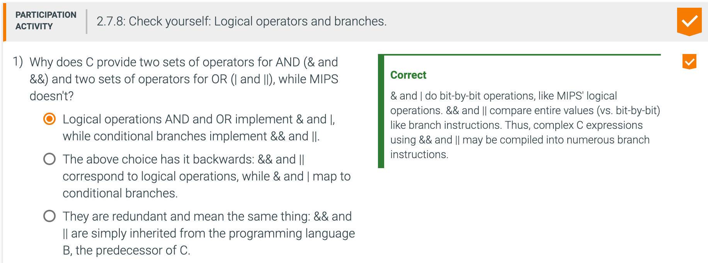

## 2.7 Instructions for making decisions

- **Conditional branch**: An instruction that requires the comparison of two values and that allows 
  for a subsequent transfer of control to a new address in the program based on the outcome of the 
  comparison.

- In contrast, an **unconditional branch** is an instruction that always follows the branch, as in 
  the "j" instruction in the animation below.

---

---

---

---

### Loops

---

---

###  More Conditional Operations

- The test for equality or inequality is probably the most popular test, but sometimes it is useful 
  to see if a variable is less than another variable. For example, a for loop may want to test to 
  see if the index variable is less than 0. Such comparisons are accomplished in MIPS assembly 
  language with an instruction that compares two registers and sets a third register to 1 if the 
  first is less than the second; otherwise, it is set to 0. 
  **The MIPS instruction is called set on less than**, or **slt**. For example, 
  - `slt  $t0, $s3, $s4   # $t0 = 1 if $s3 < $s4`

- means that register `$t0` is set to `1` if the value in register `$s3` is less than the value in 
  register `$s4`; otherwise, register `$t0` is set to `0`.
  Constant operands are popular in comparisons, so there is an immediate version of the set on less 
  than instruction. To test if register `$s2` is less than the constant `10`, we can just write
  - `slti $t0, $s2, 10    # $t0 = 1 if $s2 < 10`

- Note: `slti` expects a register followed by a constant, can not be reverse

---

---

### slti, slt, sltu, sltiu

- Comparison instructions must deal with the dichotomy between signed and unsigned numbers. 
  Sometimes a bit pattern with a 1 in the most significant bit represents a negative number and, of 
  course, is less than any positive number, which must have a 0 in the most significant bit. With 
  unsigned integers, on the other hand, a 1 in the most significant bit represents a number that is 
  larger than any that begins with a 0. (We'll soon take advantage of this dual meaning of the most 
  significant bit to reduce the cost of the array bounds checking.)

- MIPS offers two versions of the set on less than comparison to handle these alternatives. Set on 
  less than **(slt)** and set on less than immediate **(slti)** work with signed integers. Unsigned 
  integers are compared using set on less than unsigned **(sltu)** and set on less than immediate 
  unsigned **(sltiu)**

#### Bounds check shortcut

