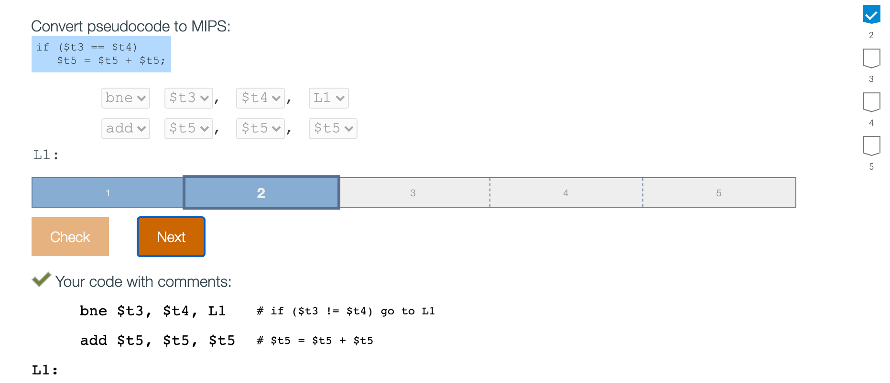

## 2.7 Instructions for making decisions

- **Conditional branch**: An instruction that requires the comparison of two values and that allows 
  for a subsequent transfer of control to a new address in the program based on the outcome of the 
  comparison.

- In contrast, an **unconditional branch** is an instruction that always follows the branch, as in 
  the "j" instruction in the animation below.

---

---

---

---

