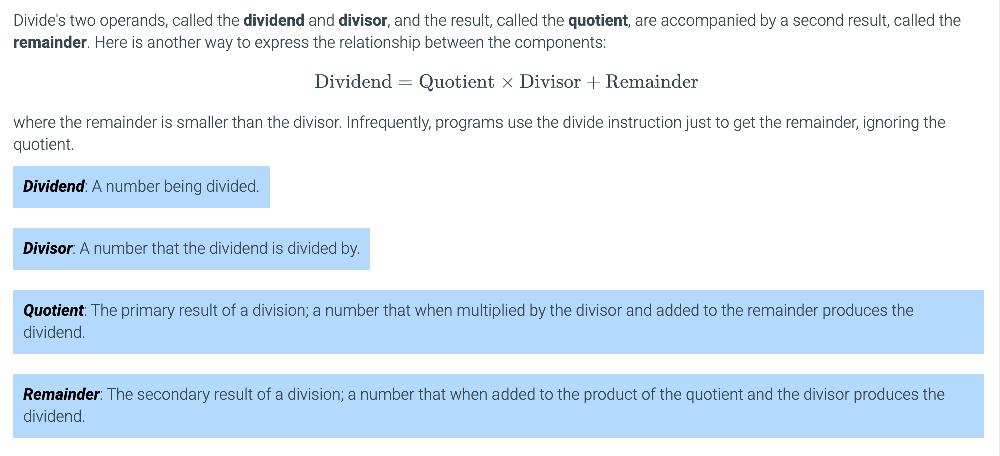
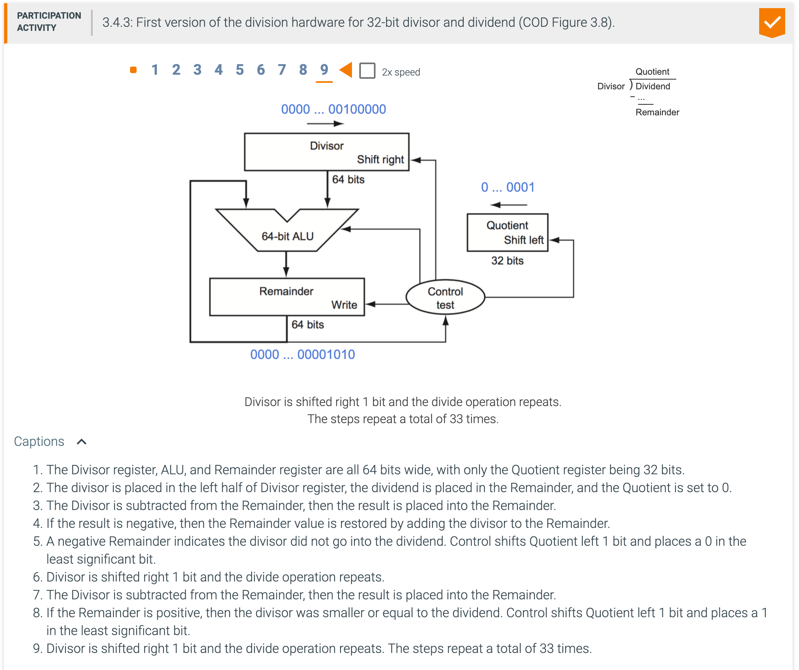
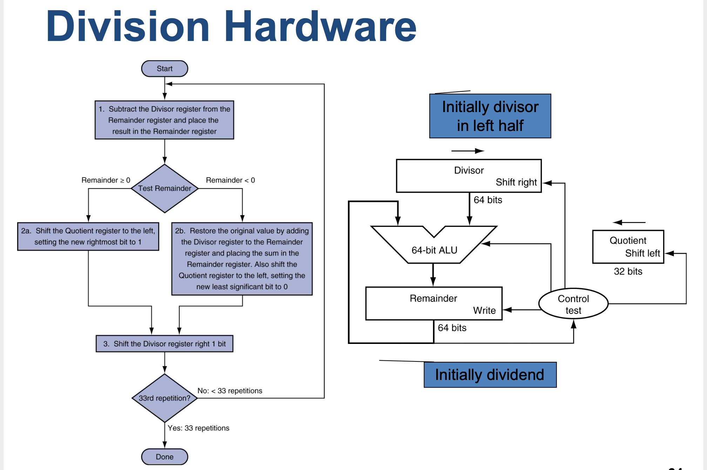
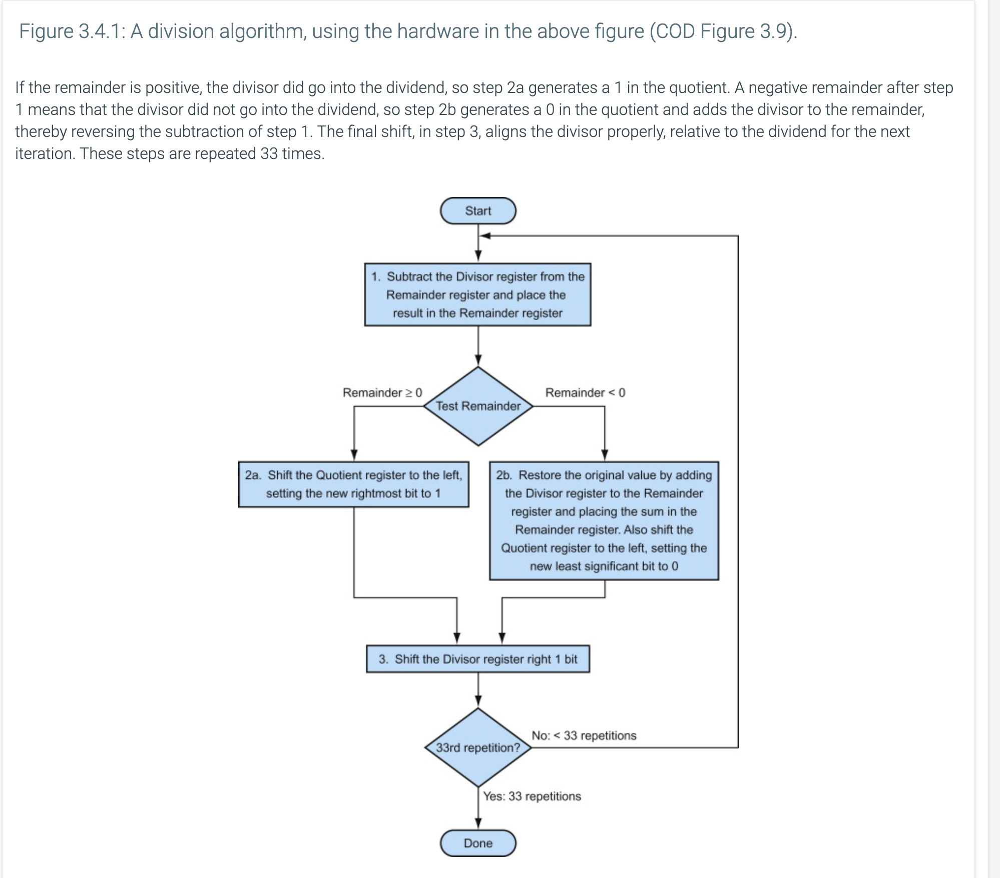
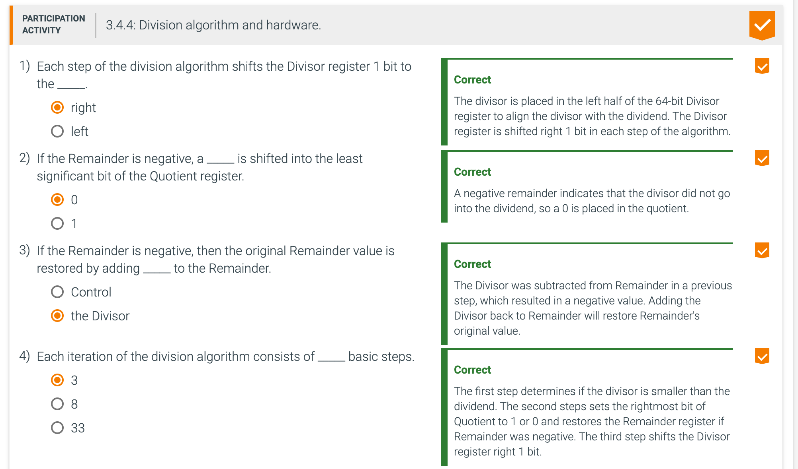
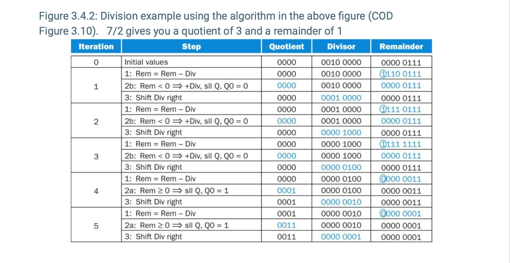

## 3.4 Division

---

###  A divide algorithm.

- Using a 4-bit version of the algorithm to save pages, let's try dividing 7ten by 2ten, or 0000 
  0111two by 0010two.

- Answer:
  - The figure below shows the value of each register for each of the steps, with the quotient being 
    3ten and the remainder 1ten. Notice that the test in step 2 of whether the remainder is positive or 
    negative simply tests whether the sign bit of the Remainder register is a 0 or 1. The surprising 
    requirement of this algorithm is that it takes n + 1 steps to get the proper quotient and remainder.

