## 3.4 Division

---

###  A divide algorithm.

- Using a 4-bit version of the algorithm to save pages, let's try dividing 7ten by 2ten, or 0000 
  0111two by 0010two.

- Answer:
  - The figure below shows the value of each register for each of the steps, with the quotient being 
    3ten and the remainder 1ten. Notice that the test in step 2 of whether the remainder is positive or 
    negative simply tests whether the sign bit of the Remainder register is a 0 or 1. The surprising 
    requirement of this algorithm is that it takes n + 1 steps to get the proper quotient and remainder.

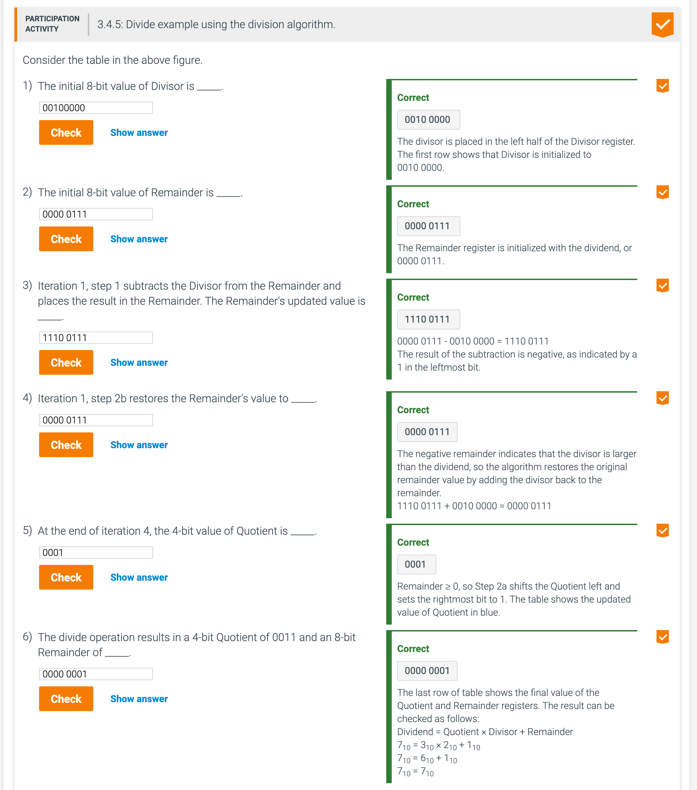

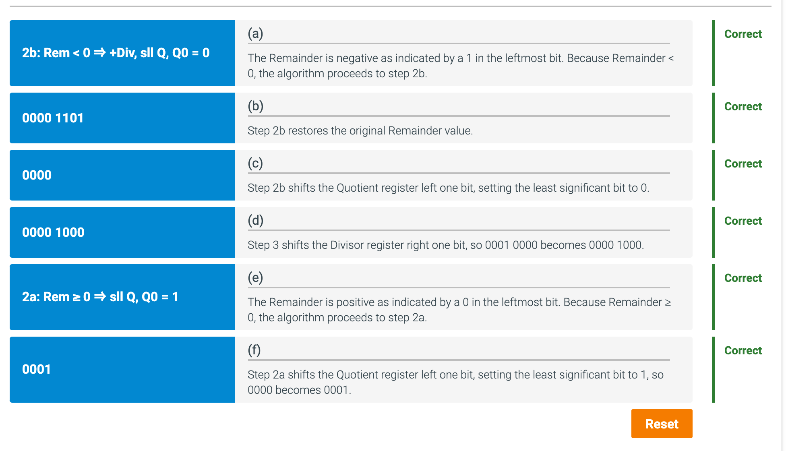

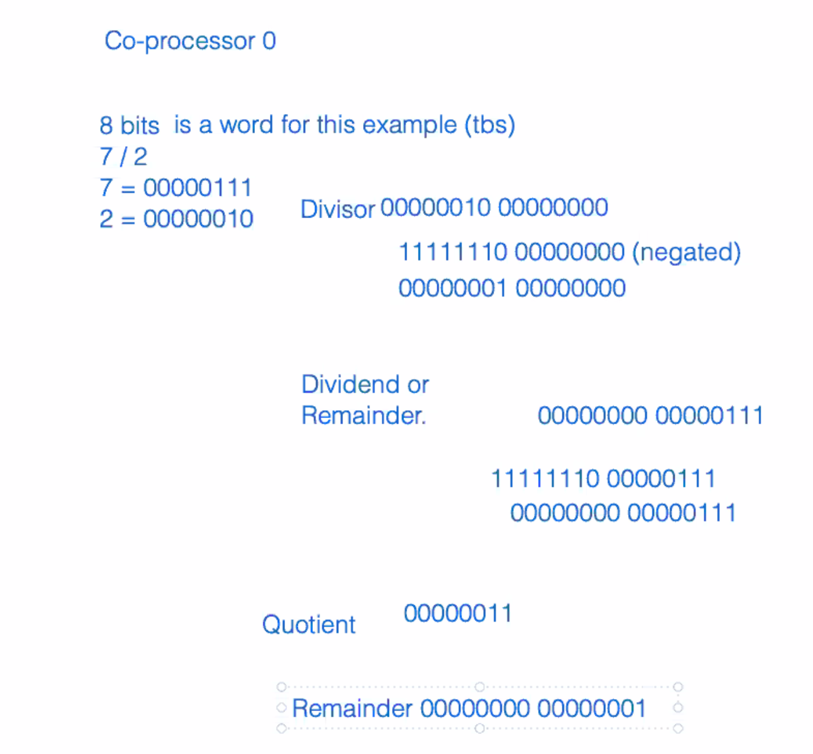

---

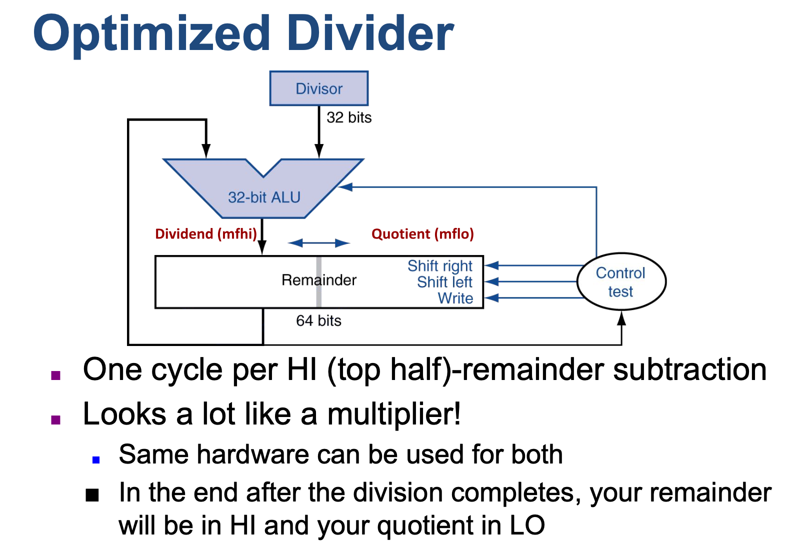

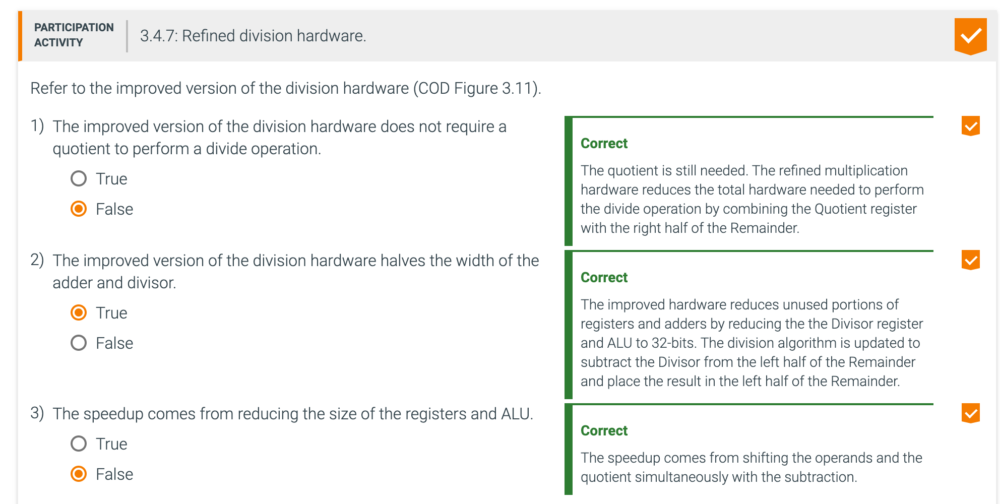

---

### MIPS divide instructions ignore overflow 

- MIPS divide instructions ignore overflow, so software must determine whether the quotient is too 
  large. In addition to overflow, division can also result in an improper calculation: division by 0. 
  Some computers distinguish these two anomalous events. MIPS software must check the divisor to 
  discover division by 0 as well as overflow.

---

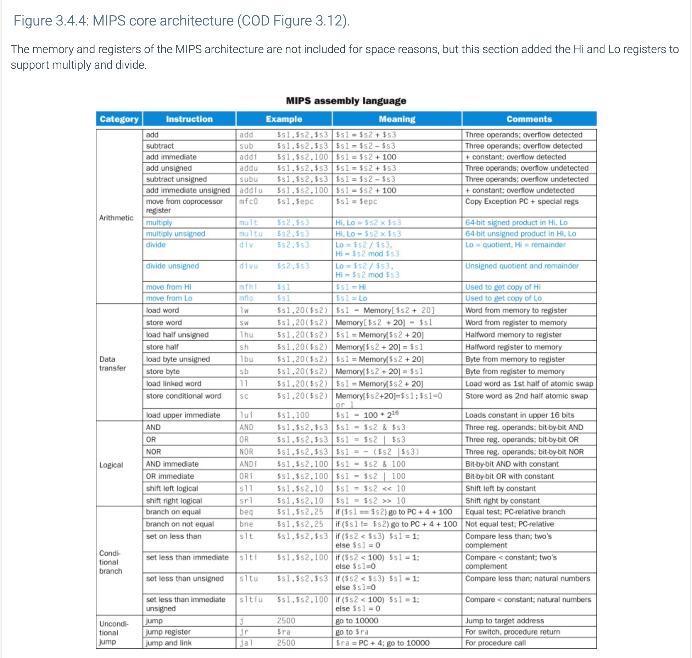

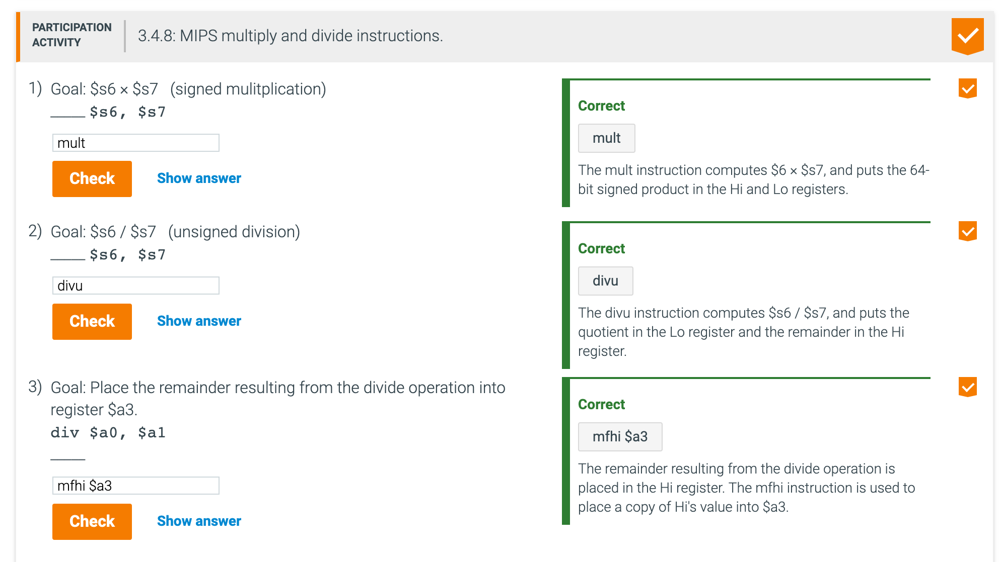

### Divide in MIPS

- The only requirement is a 64-bit register that can shift left or right and a 32-bit ALU that adds or 
  subtracts. Hence, MIPS uses the 32-bit Hi and 32-bit Lo registers for both multiply and divide.

- As we might expect from the algorithm above, `Hi` contains the remainder, and `Lo` contains the 
  quotient after the divide instruction completes.

- To handle both signed integers and unsigned integers, MIPS has two instructions: divide (div) and 
  divide unsigned (divu). The MIPS assembler allows divide instructions to specify three registers, 
  generating the mflo or mfhi instructions to place the desired result into a general-purpose register.

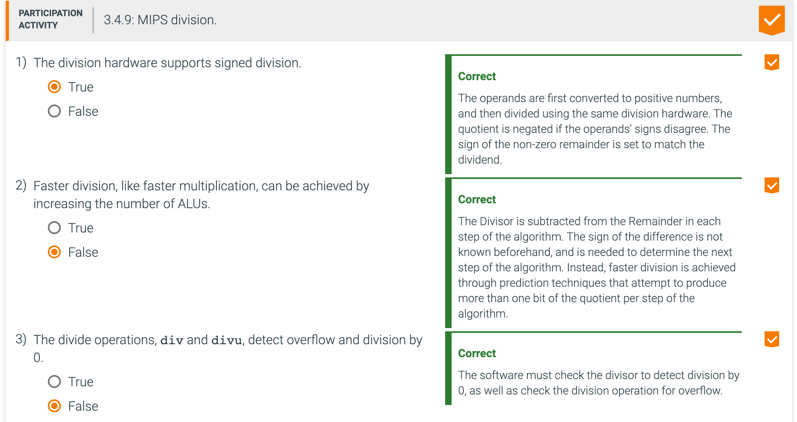

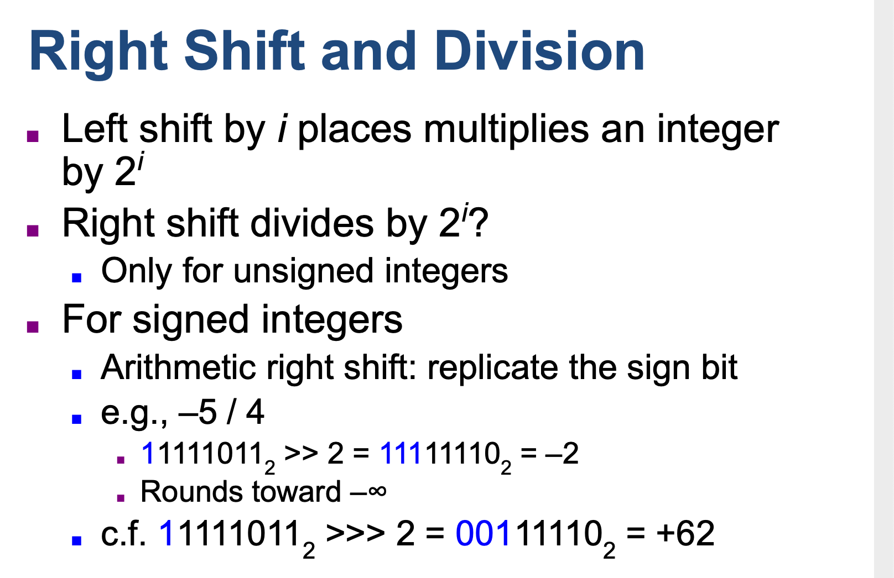

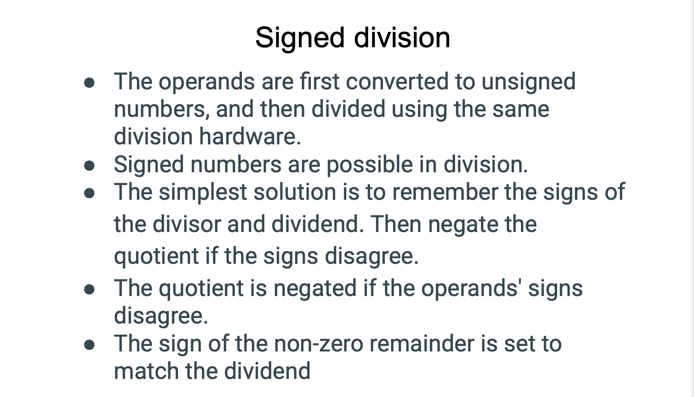

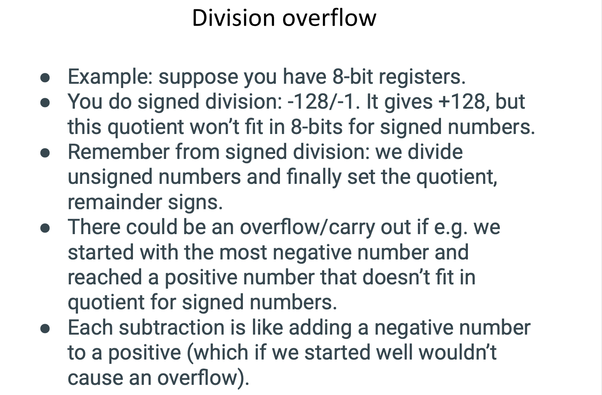

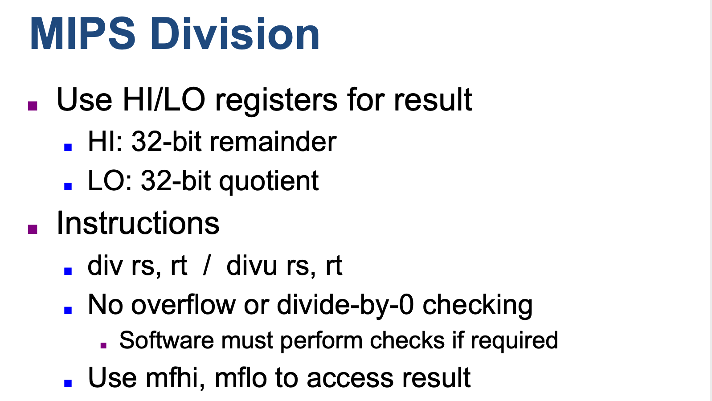

