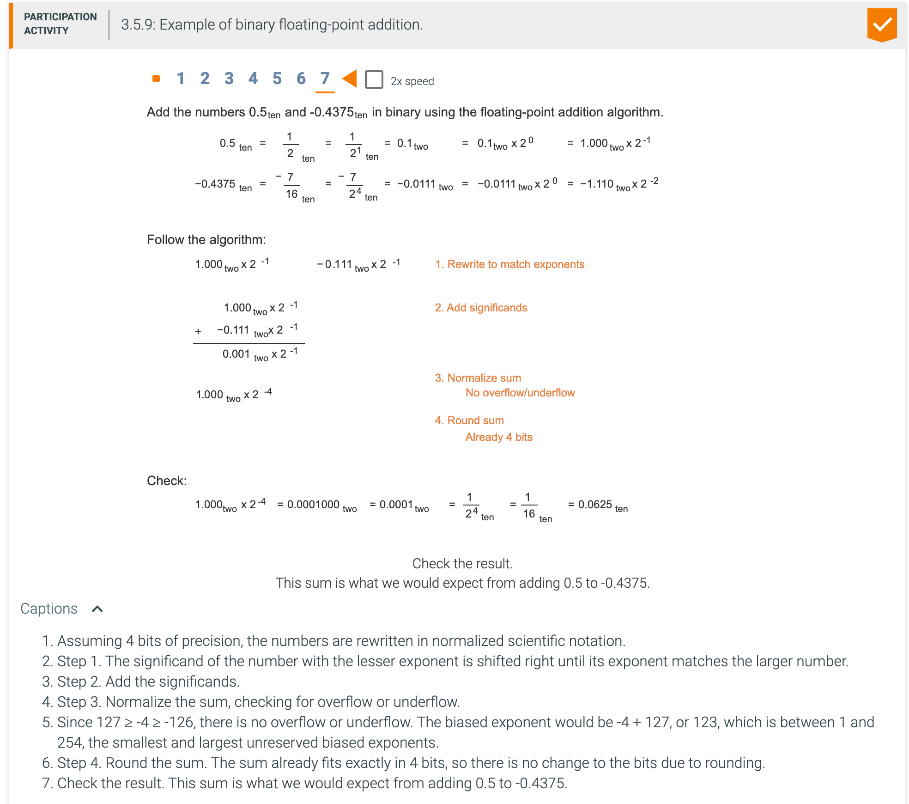
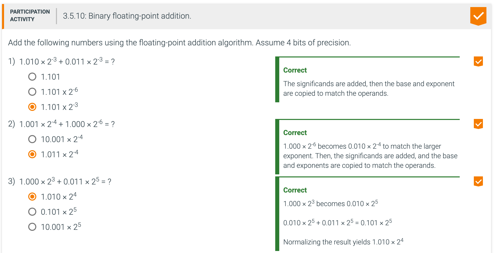
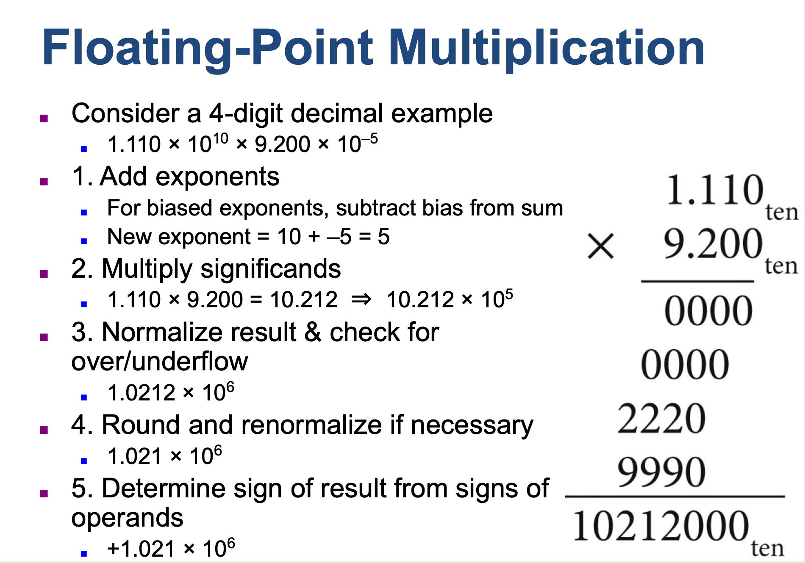

##  Who Cares About FP Accuracy?


---








---

## Floating-point multiplication




---


---

```
3.26 [20] <COD §3.5> Write down the binary bit pattern to represent -1.5625 × 10-1 assuming a format similar to that 
employed by the DEC PDP-8 (the leftmost 12 bits are the exponent stored as a two's complement number, and the rightmost 
24 bits are the fraction stored as a two's complement number). No hidden 1 is used (there is no hidden assumed 1 to the 
left of the decimal point) 1 . Comment on how the range and accuracy of this 36-bit pattern compares to the single and 
double precision IEEE 754 standards.
```


