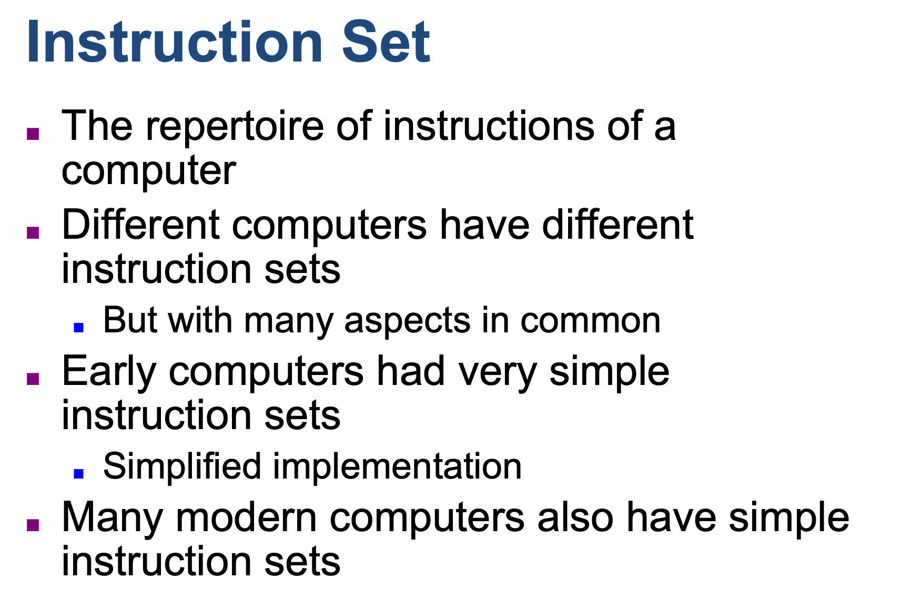
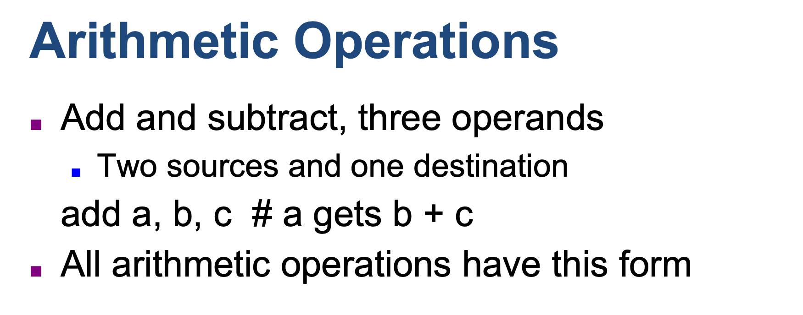
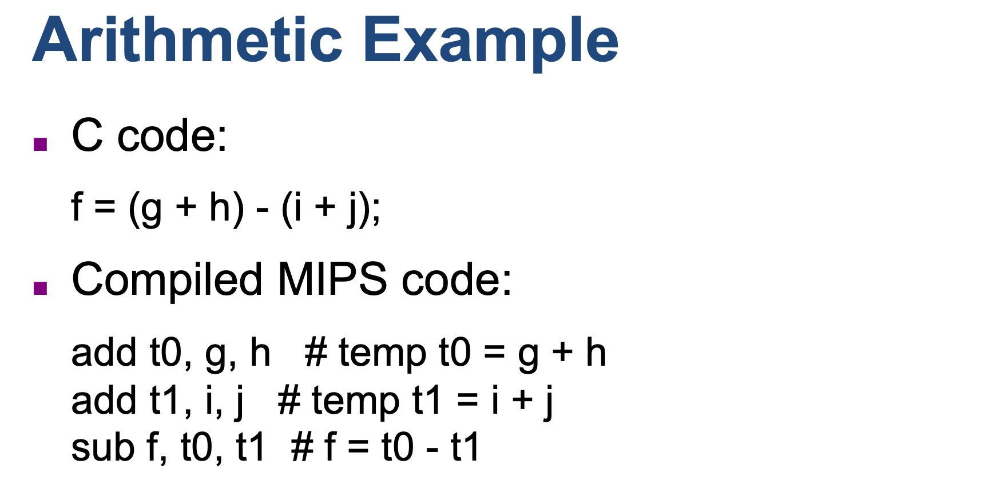
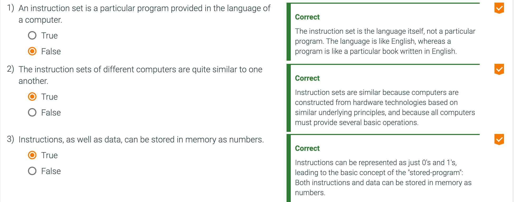

## Instructions: Language of the Computer

- **Instruction set**: The vocabulary of commands understood by a given architecture.

- **Stored-program concept**: The idea that instructions and data of many types can be 
  stored in memory as numbers, leading to the stored-program computer.

