## MSB and LSB

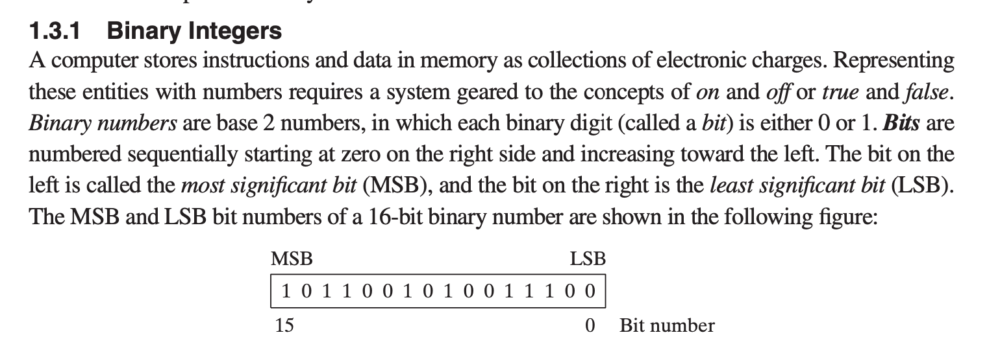

---


## flag

- Which flag is set when the result of a signed arithmetic operation(算术运算) is either too large or 
  too small to fit into the destination?
  - **Overflow** : is set when the result of an signed arithmetic operation is too large to fit in the 
    destination.


- zeor flag
  - the zero flag is quite simple if the result of the operation is a zero the zero flag will 
    be set otherwise it will be clear


## how to convert decimal to binary

- Write down the decimal number.
- Divide the number by 2.
- Write the result underneath.
- Write the remainder on the right hand side. This will be 0 or 1.
- Divide the result of the division by 2 and again write down the remainder.
- Continue dividing and writing down remainders until the result of the division is 0.
- The most significant bit (MSB) is at the bottom of the column of remainders and the least significant 
  bit (LSB) is at the top.
- Read the series of 1s and 0s on the right from the bottom up. This is the binary equivalent of the 
  decimal number.


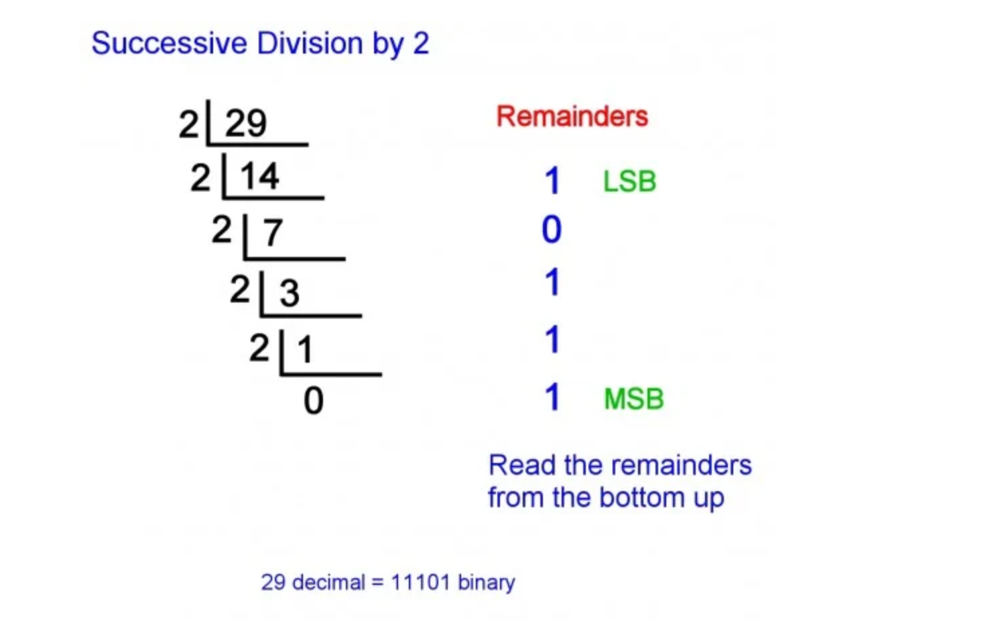


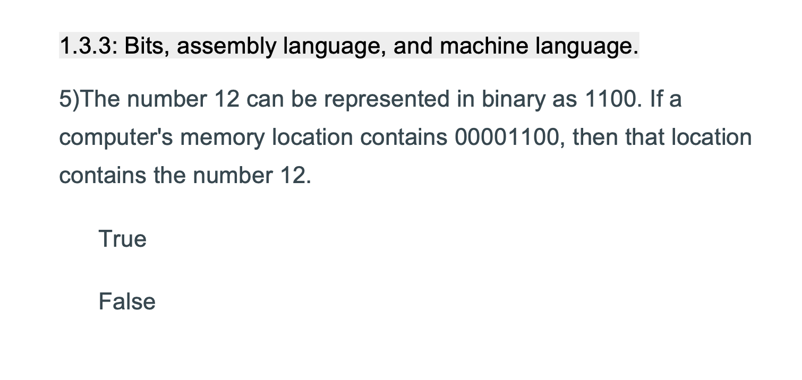

- true

---

## how to convert decimal to Hexadeciaml

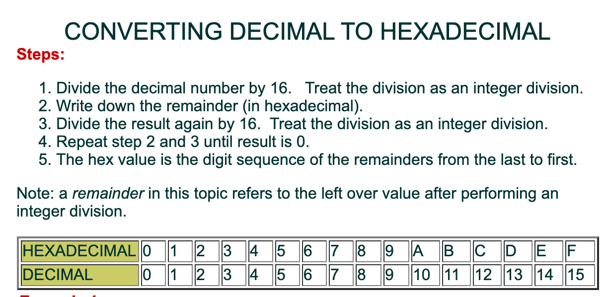

- e.g : Convert the number `1128` DECIMAL to HEXADECIMAL
  - step 1:  1128 / 16       result: 70           remainder(in hexadeciaml) : 8
  - step 2:  70 / 16       result: 4           remainder(in hexadeciaml) : 6
  - step 3:  4 / 16       result: 0           remainder(in hexadeciaml) : 4
  - so the final result: `468`

---

- another e.g.
  
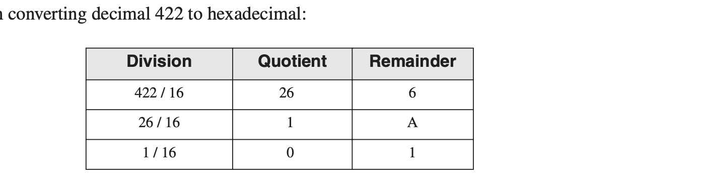

- result: `1A6`

---


## Binary Addition


## Two’s-Complement Representation

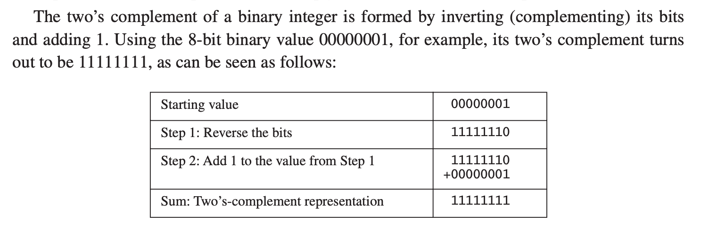


- Converting Signed Binary to Decimal

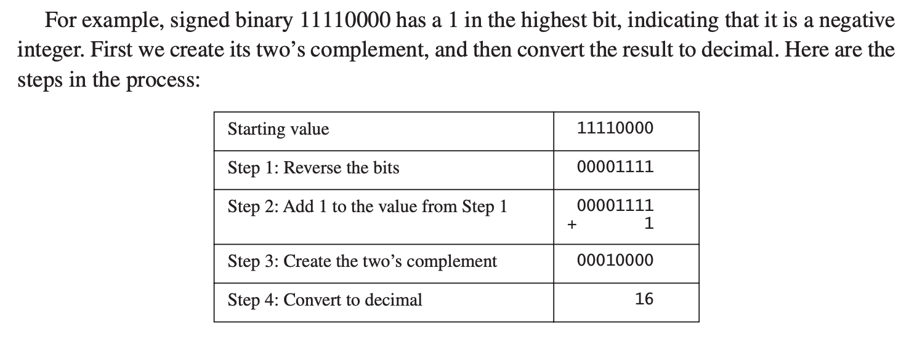

---


## Converting Signed Decimal to Binary

- e.g The binary representation of decimal `−43`
  - The binary representation of unsigned `43` is `00101011`
  - Because the original value was `negative`, we create the two’s complement of `00101011`,
    which is `11010101`. This is the representation of `−43` decimal.


---


#### e.g The sum of 3AB4h and 0429h

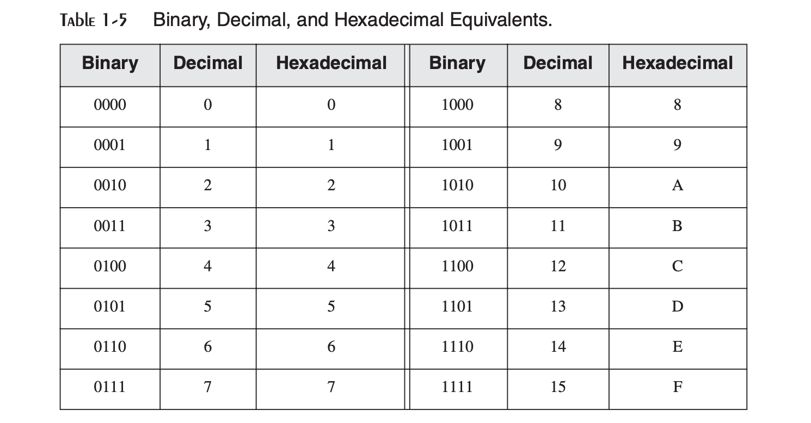


```ruby
    3AB4h
+   0429h
-------------


    0011    1010    1011    0100
+   0000    0100    0010    1001
----------------------------------
    0011    1110    1101    1101


= 3EDDh
```

---


## Boolean Expressions

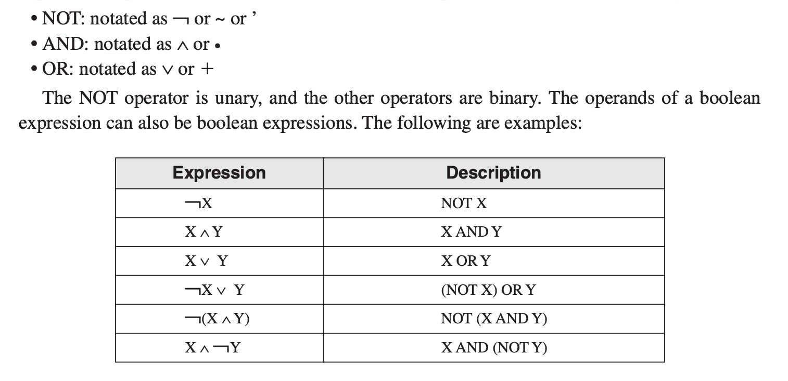


---


## The decimal representation of the signed binary number

- e.g. `10110101`

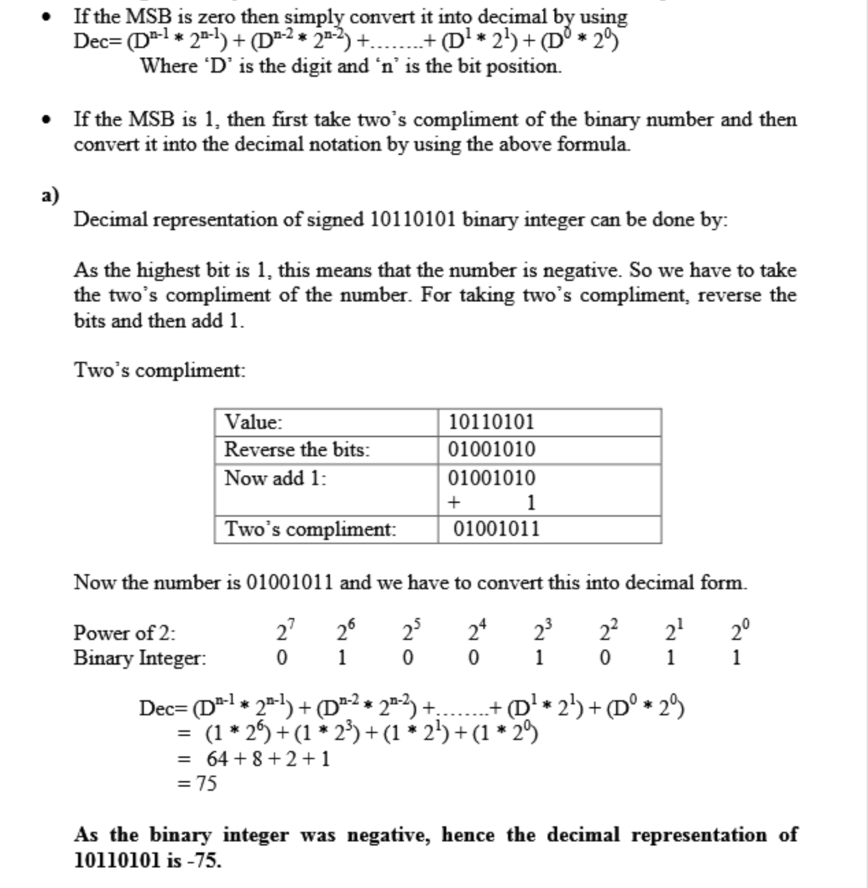


- e.g. `10000000`

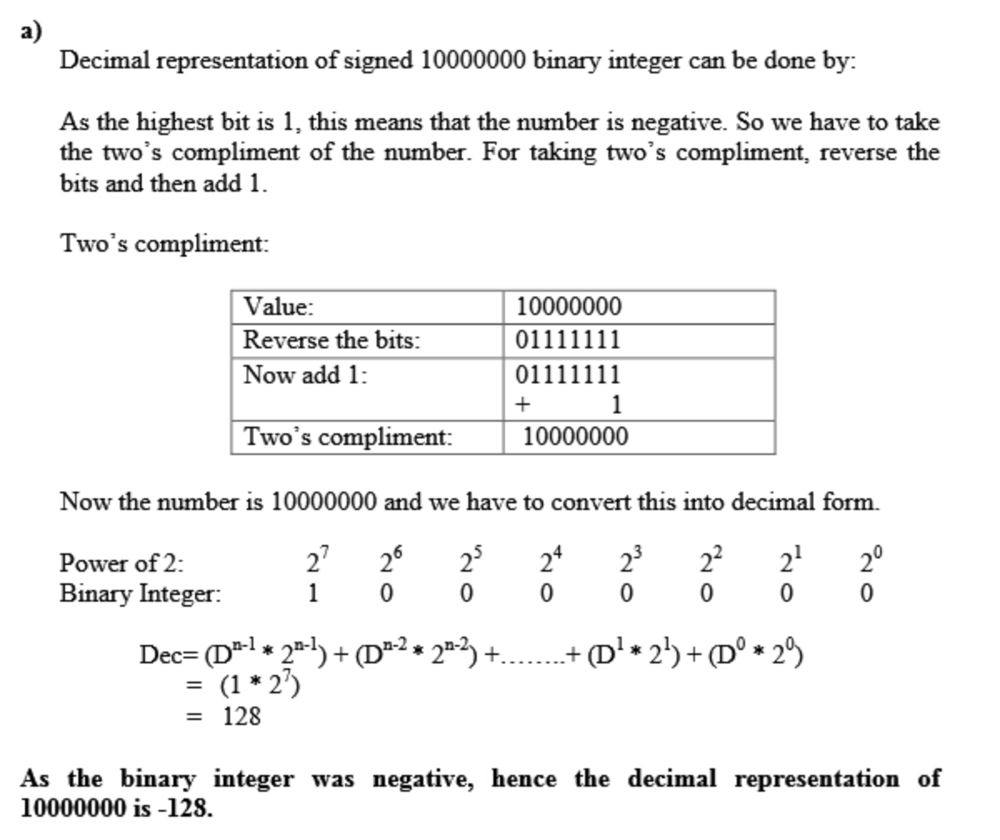

---


