## 3.3 Multiplication

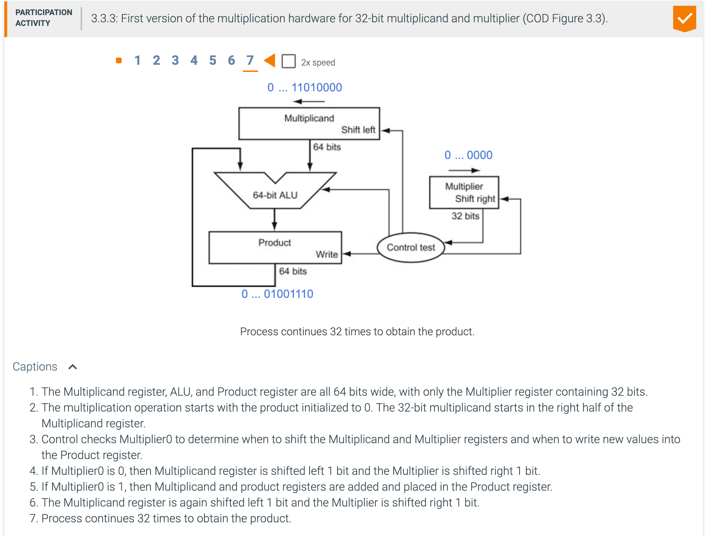

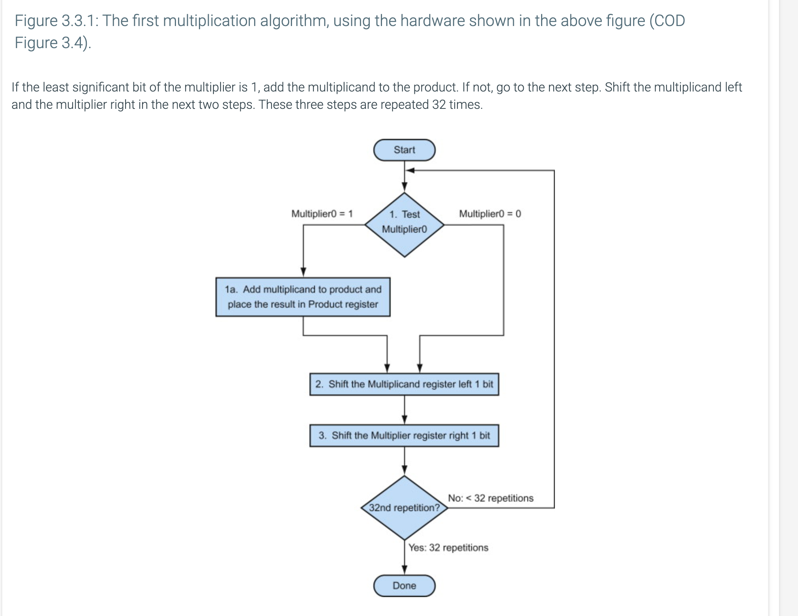

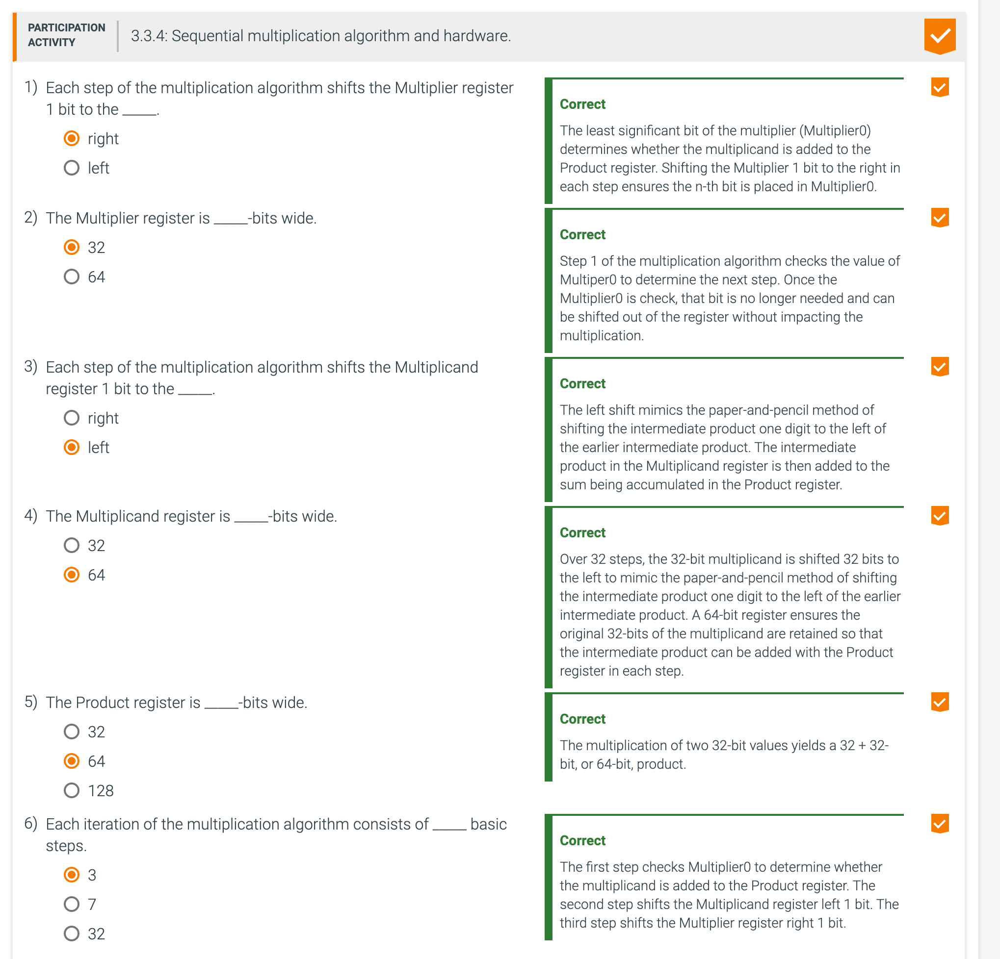

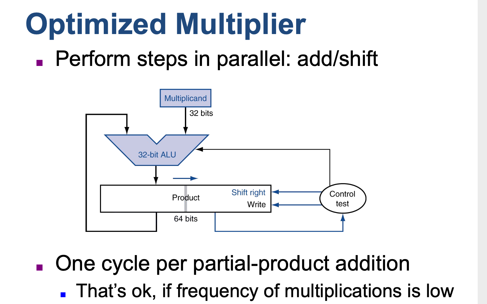

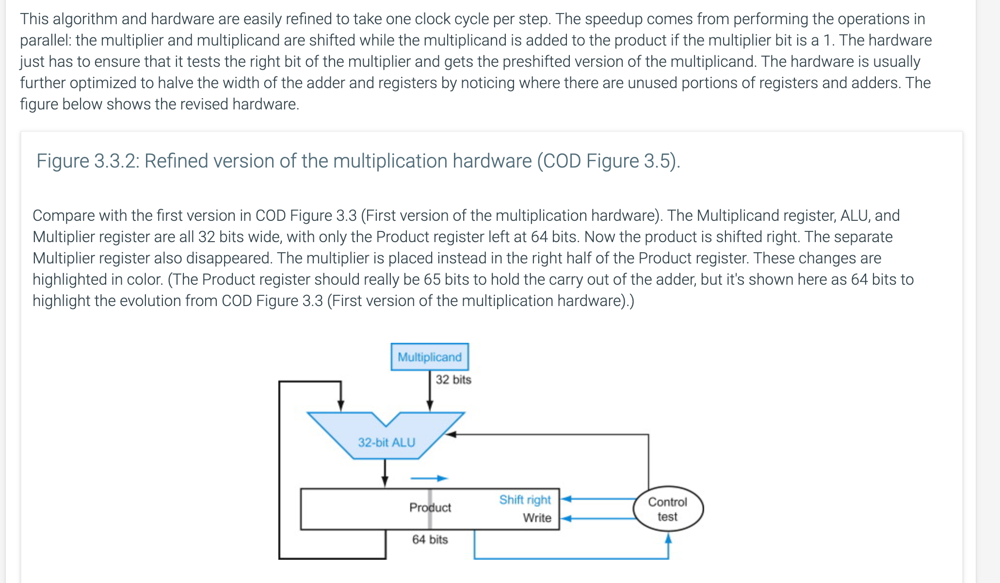

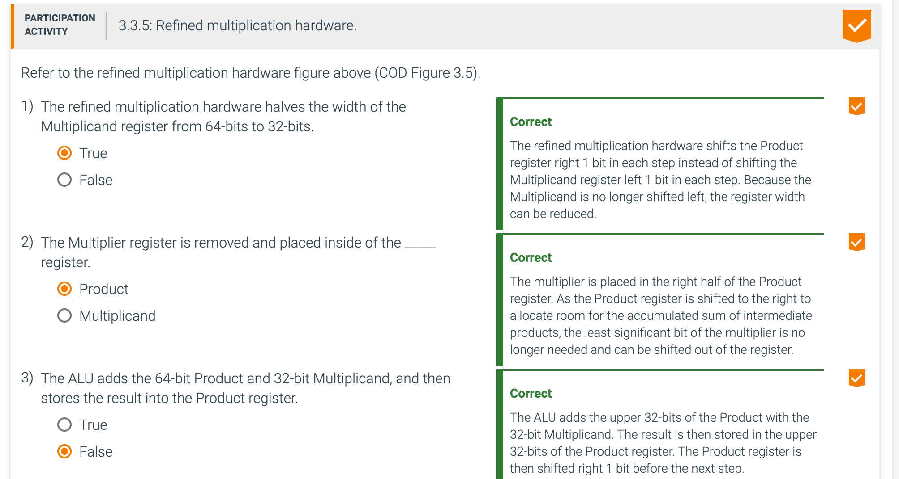

---

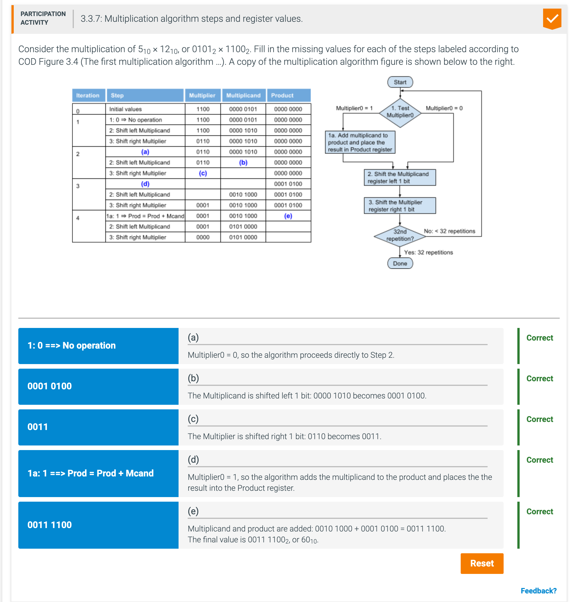

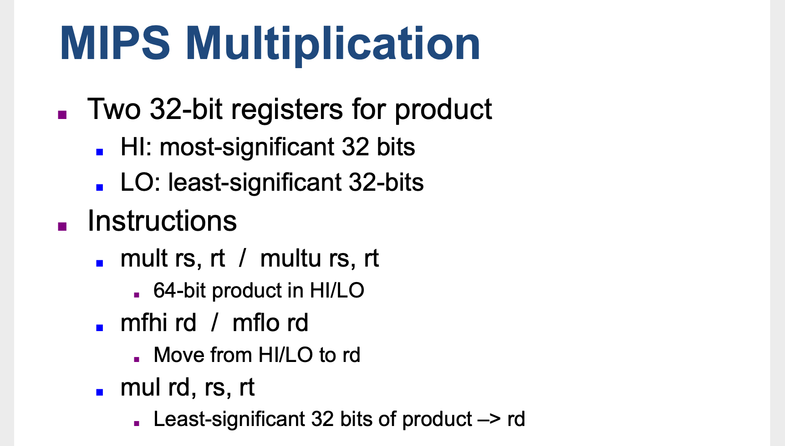

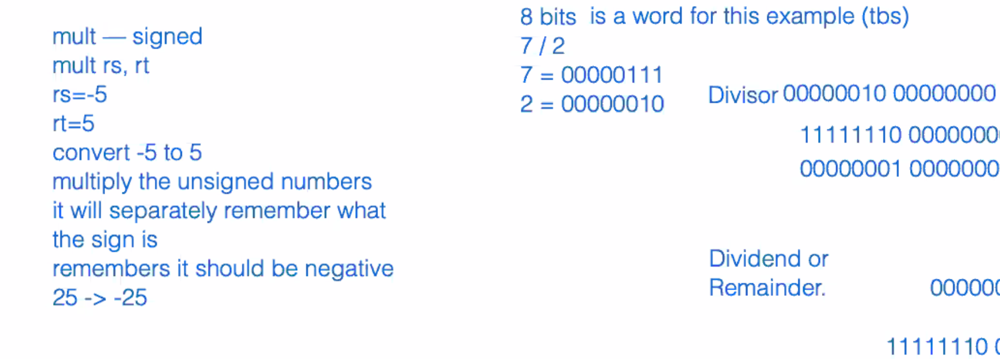

- Summary: Both MIPS multiply instructions ignore overflow, so it is up to the software to check to see 
  if the product is too big to fit in 32 bits. There is no overflow if <u>Hi is 0</u> for **multu** or 
  the replicated sign of Lo for **mult**. The instruction move from **hi (mfhi)** can be used to 
  transfer Hi to a general-purpose register to test for overflow.

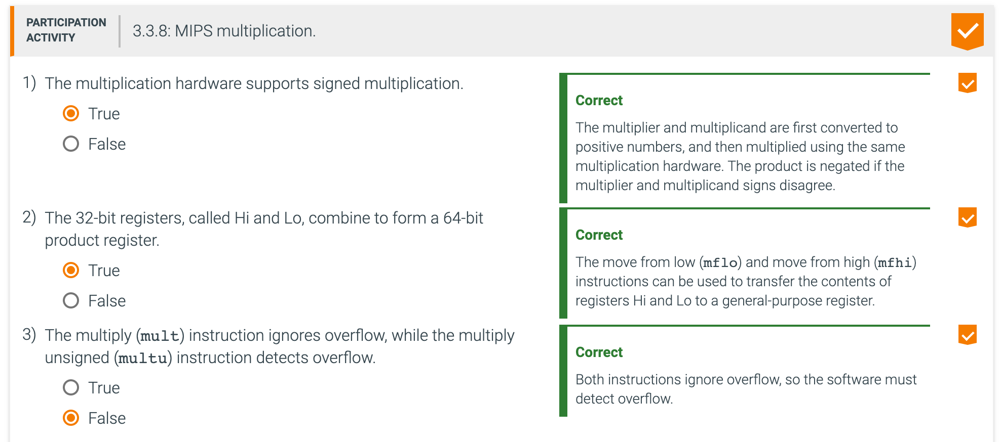

---

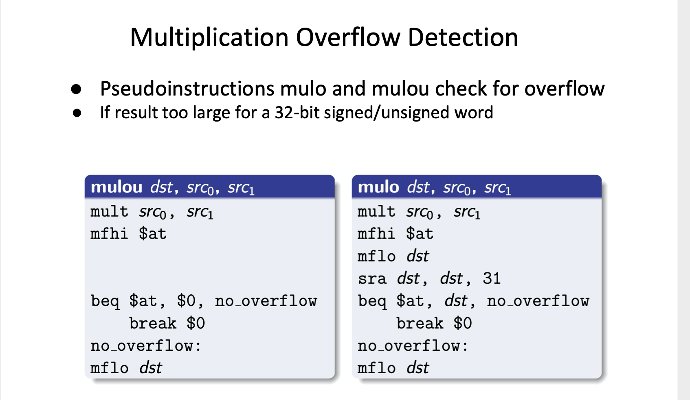

