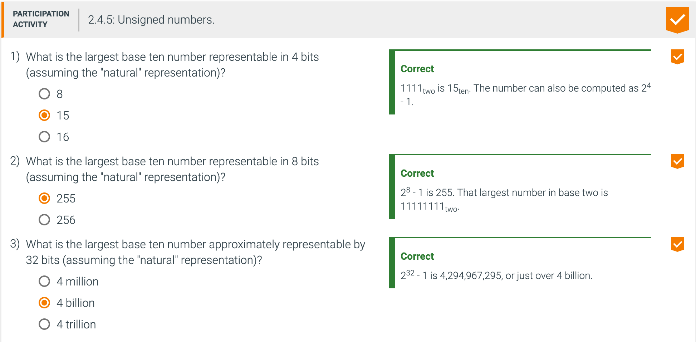

## 2.4 Signed and unsigned numbers

- First, let's quickly review how a computer represents numbers. Humans are taught to think in base 
  10, but numbers may be represented in any base. For example, 123 base 10 = 1111011 base 2.

- Numbers are kept in computer hardware as a series of high and low electronic signals, and so 
  they are considered base 2 numbers. (Just as base 10 numbers are called decimal numbers, base 2 
  numbers are called binary numbers.)

- A single digit of a binary number is thus the "atom" of computing, since all information is 
  composed of binary digits or bits. This fundamental building block can be one of two values, 
  which can be thought of as several alternatives: high or low, on or off, true or false, or 1 or 0.

---

- Note: `2^4 - 1`  ,  `2^8 - 1`  , `2^32 - 1`

---

- **Two's complement**: A signed number representation where a leading 0 indicates a positive number 
  and a leading 1 indicates a negative number. The complement of a value is obtained by 
  complementing each bit (0 → 1 or 1 → 0), and then adding one to the result 

