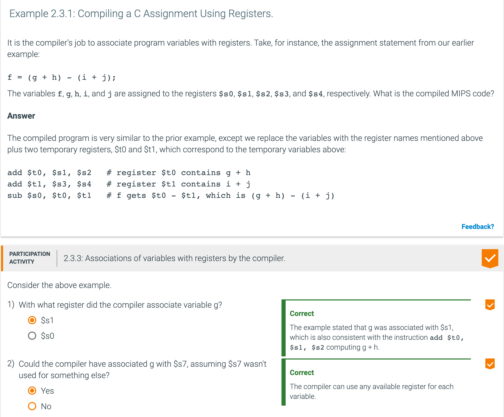

## 2.3 Operands of the computer hardware

- **Word**: The natural unit of access in a computer, usually a group of 32 bits; 
  corresponds to the size of a register in the MIPS architecture.

- `Design Principle 2: Smaller is faster`

- A very large number of registers may increase the clock cycle time simply because it 
  takes electronic signals longer when they must travel farther.

- Although we could simply write instructions using numbers for registers, from 0 to 31, 
  the MIPS convention is to use two-character names following a dollar sign to represent a 
  register. COD Section 2.8 (Supporting Procedures in Computer Hardware) will explain the 
  reasons behind these names. For now, we will use `$s0, $s1, …` for registers that 
  correspond to variables in C and Java programs and `$t0, $t1, …` for temporary registers 
  needed to compile the program into MIPS instructions.

---

- The data transfer instruction that copies data from memory to a register is traditionally 
  called **load**. The format of the load instruction is the name of the operation followed by 
  the register to be loaded, then a constant and register used to access memory. The sum of the 
  constant portion of the instruction and the contents of the second register forms the memory 
  address. The actual MIPS name for this instruction is `lw`, standing for 
  **load word**.

- The animation below illustrates the load instruction. Assume that A is an array of 100 
  words. We'll be making a slight adjustment to the lw instruction, but we'll use the below 
  simplified version for now. In an lw instruction, a **base address** is the starting 
  address of an array in memory (5000 below), a **base register** is a register that holds 
  an array's base address ($s3 below), and an **offset** is a constant value added to a 
  base address to locate a particular array element (8 below).

---

---

###  Hardware/Software Interface

- In addition to associating variables with registers, the compiler allocates data structures like arrays and 
  structures to locations in memory. The compiler can then place the proper starting address into the data 
  transfer instructions.

- Since 8-bit bytes are useful in many programs, virtually all architectures today address individual bytes. 
  Therefore, the address of a word matches the address of one of the 4 bytes within the word, and addresses of 
  sequential words differ by 4.

- In MIPS, words must start at addresses that are multiples of 4. This requirement is called an 
  `alignment restriction 调整限制`, and many architectures have it. 
  - Alignment restriction: A requirement that data be aligned in memory on natural boundaries.

- Computers divide into those that use the address of the leftmost or "big end" byte as the 
  word address (_big endian_) versus those that use the rightmost or "little end" byte (_little endian_).

---

- The instruction complementary to load is traditionally called store; it copies data from a register to 
  memory. The format of a store is similar to that of a load: the name of the operation, followed by the 
  register to be stored, then offset to select the array element, and finally the base register. Once again, 
  the MIPS address is specified in part by a constant and in part by the contents of a register. The actual 
  MIPS name is `sw`, standing for **store word**.

---

