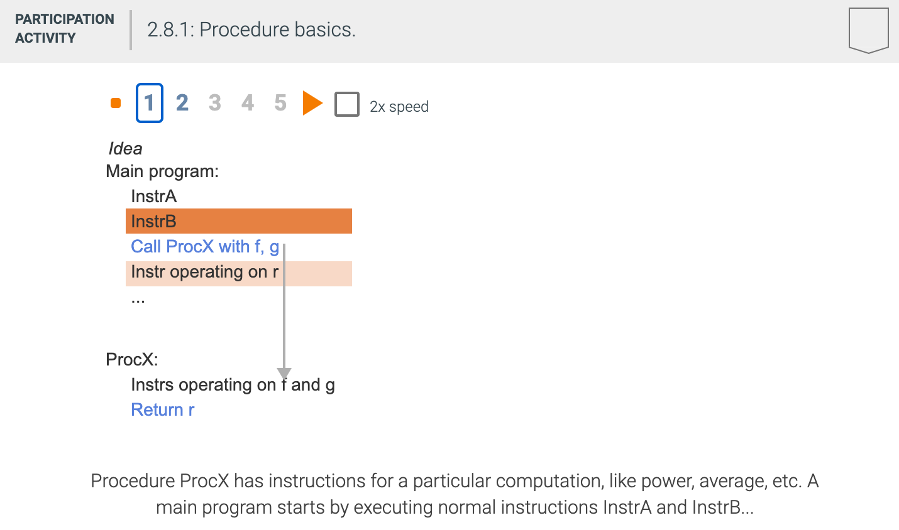
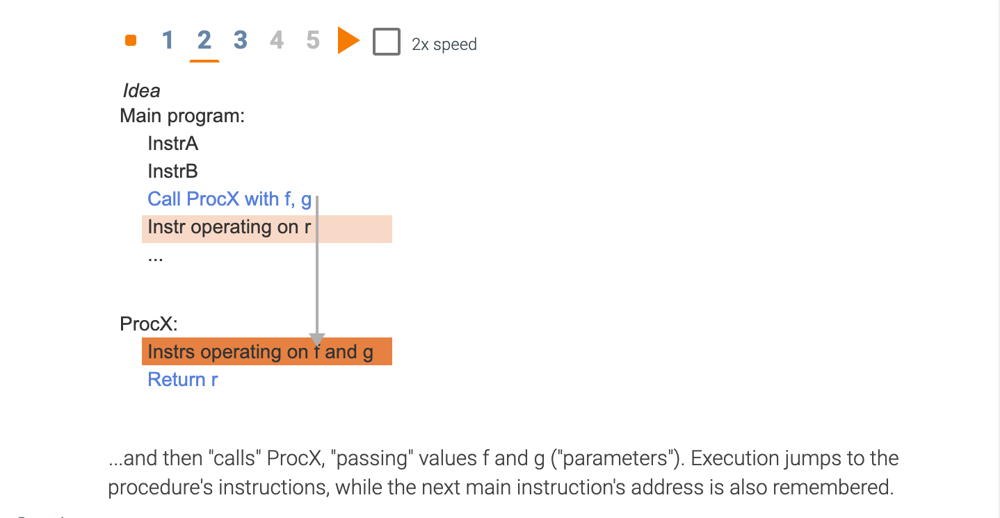
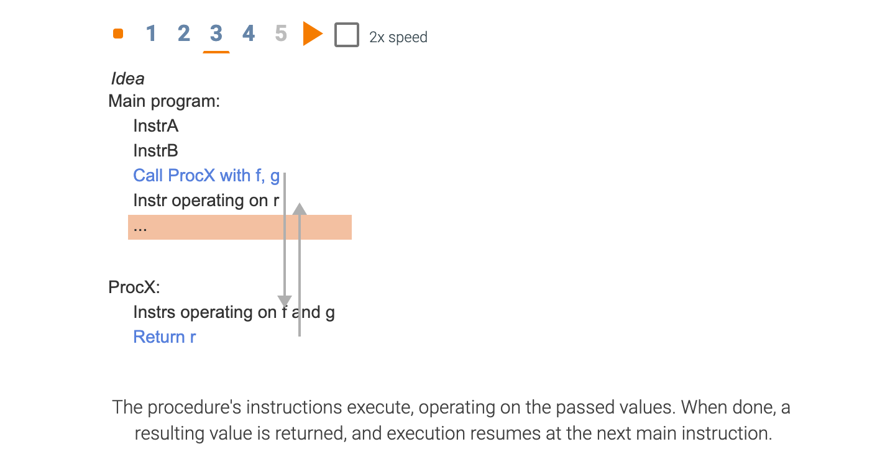
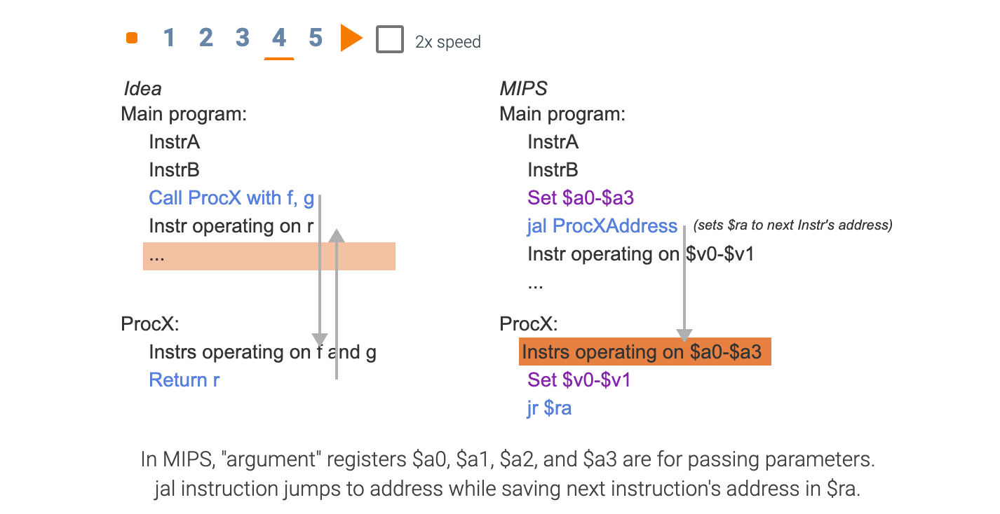
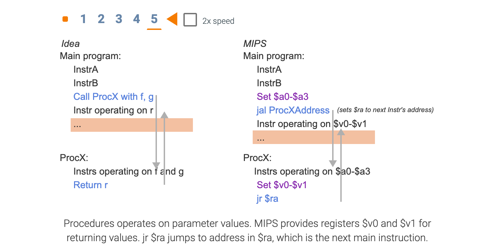

## 2.8 Supporting procedures in computer hardware

- **Procedure**: A stored subroutine that performs a specific task based on the parameters with 
  which it is provided.

- registers are the fastest place to hold data in a computer, so we want to use them as much as 
  possible. MIPS software follows the following convention for procedure calling in allocating its 
  32 registers:
  - **$a0 - $a3**: four argument registers in which to pass parameters
  - **$v0 - $v1**: two value registers in which to return values
  - **$ra**: one return address register to return to the point of origin

- **jump-and-link instruction**: An instruction that jumps to an address and simultaneously saves 
  the address of the following instruction in a register (`$ra` in MIPS).

- **Return address**: A link to the calling site that allows a procedure to return to the proper 
  address; in MIPS it is stored in register `$ra`.

- **Caller**: The program that instigates a procedure and provides the necessary parameter values.

- **Callee**: A procedure that executes a series of stored instructions based on parameters provided 
  by the caller and then returns control to the caller.

- **Program counter (PC)**: The register containing the address of the instruction in the program 
  being executed.

---

