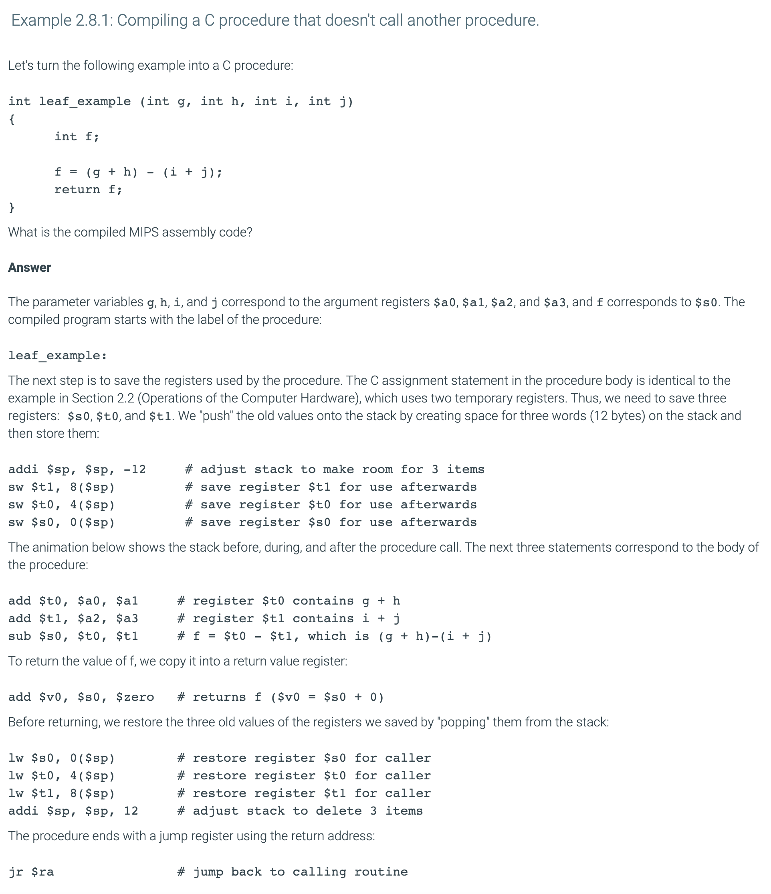
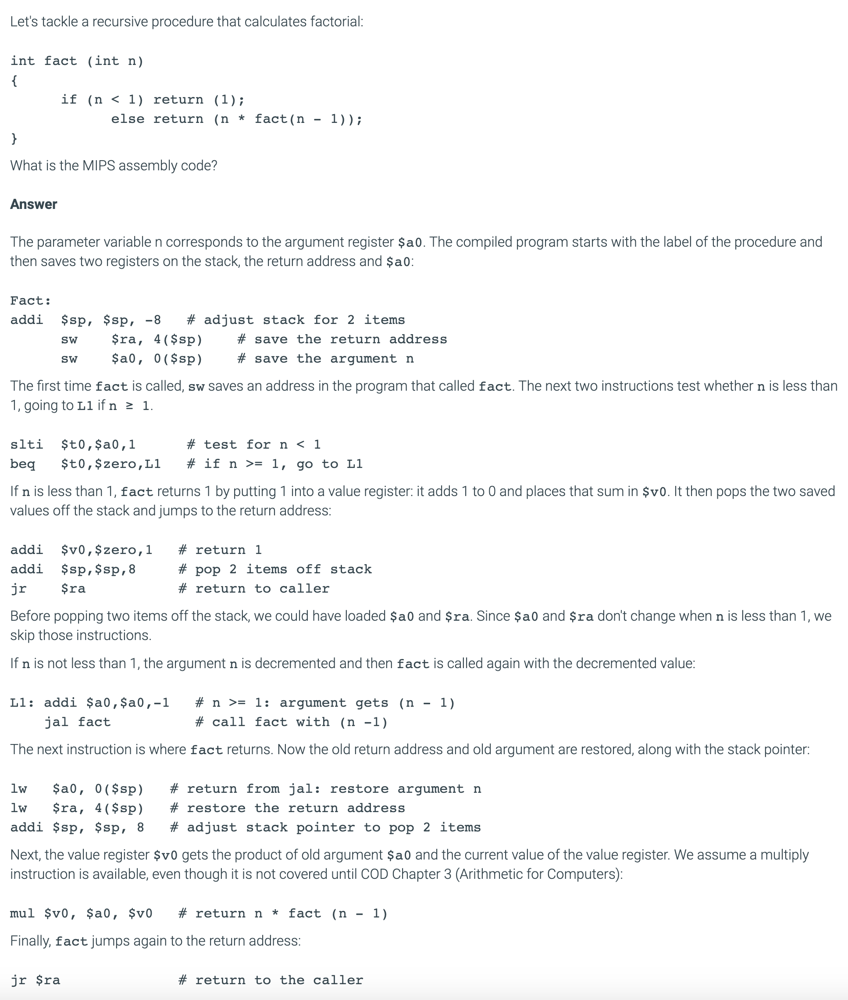

## 2.8 Supporting procedures in computer hardware

- **Procedure**: A stored subroutine that performs a specific task based on the parameters with 
  which it is provided.

- registers are the fastest place to hold data in a computer, so we want to use them as much as 
  possible. MIPS software follows the following convention for procedure calling in allocating its 
  32 registers:
  - `$a0 - $a3`: four argument registers in which to pass parameters
  - `$v0 - $v1`: two value registers in which to return values
  - `$ra`: one return address register to return to the point of origin

- **jump-and-link instruction**: An instruction that jumps to an address and simultaneously saves 
  the address of the following instruction in a register (`$ra` in MIPS).

- **Return address**: A link to the calling site that allows a procedure to return to the proper 
  address; in MIPS it is stored in register `$ra`.

- **Caller**: The program that instigates a procedure and provides the necessary parameter values.

- **Callee**: A procedure that executes a series of stored instructions based on parameters provided 
  by the caller and then returns control to the caller.

- **Program counter (PC)**: The register containing the address of the instruction in the program 
  being executed.

---

---

- Note: `jal` is for calling a procedure, not for returning from a procedure

---

### Using more registers

- Suppose a compiler needs more registers for a procedure than the four argument and two return 
  value registers. Since we must cover our tracks after our mission is complete, any registers 
  needed by the caller must be restored to the values that they contained before the procedure was 
  invoked. 
  假设一个编译器需要一个程序的寄存器多于四个参数和两个返回值寄存器。 由于我们必须在任务完成后掩盖我们的足迹，因此调用者所需
  的所有寄存器都必须恢复为调用过程之前所包含的值。

- The ideal data structure for spilling registers is a stack—a last-in-first-out queue. A stack 
  needs a pointer to the most recently allocated address in the stack to show where the next 
  procedure should place the registers to be spilled or where old register values are found. The 
  stack pointer is adjusted by one word for each register that is saved or restored. MIPS software 
  reserves **register 29** for the stack pointer, giving it the obvious name $sp. Stacks are so 
  popular that they have their own buzzwords for transferring data to and from the stack: placing 
  data onto the stack is called a `push`, and removing data from the stack is called a `pop`.

- **Stack**: A data structure for spilling registers organized as a last-in- first-out queue.

- **Stack pointer**: A value denoting the most recently allocated address in a stack that shows 
  where registers should be spilled or where old register values can be found. In MIPS, it is 
  register `$sp`.

- **Push**: Add element to stack

- **Pop**: Remove element from stack

---

---

### Nested procedures

- Procedures that do not call others are called leaf procedures. Life would be simple if all 
  procedures were leaf procedures, but they aren't. Just as a spy might employ other spies as part 
  of a mission, who in turn might use even more spies, so do procedures invoke other procedures. 
  Moreover, recursive procedures even invoke "clones" of themselves. Just as we need to be careful 
  when using registers in procedures, more care must also be taken when invoking nonleaf procedures.

- For example, suppose that the main program calls procedure A with an argument of 3, by placing the 
  value 3 into register $a0 and then using jal A. Then suppose that procedure A calls procedure B 
  via jal B with an argument of 7, also placed in $a0. Since A hasn't finished its task yet, there 
  is a conflict over the use of register $a0. Similarly, there is a conflict over the return address 
  in register $ra, since it now has the return address for B. Unless we take steps to prevent the 
  problem, this conflict will eliminate procedure A's ability to return to its caller.

- One solution is to push all the other registers that must be preserved onto the stack, just as we 
  did with the saved registers. The caller pushes any argument registers ($a0 - $a3) or temporary 
  registers ($t0 - $t9) that are needed after the call. The callee pushes the return address 
  register $ra and any saved registers ($s0 - $s7) used by the callee. The stack pointer $sp is 
  adjusted to account for the number of registers placed on the stack. Upon the return, the 
  registers are restored from memory and the stack pointer is readjusted.

#### Example 2.8.2: Compiling a recursive C procedure, showing nested procedure linking.

- **Global pointer**: The register that is reserved to point to the static area.

