##  Introduction

---

---

- **Control signal**: A signal used for multiplexor selection or for directing the operation of a functional unit; 
  contrasts with a data signal, which contains information that is operated on by a functional unit.

- **Asserted**: The signal is logically high or true.
- **Deasserted**: The signal is logically low or false.

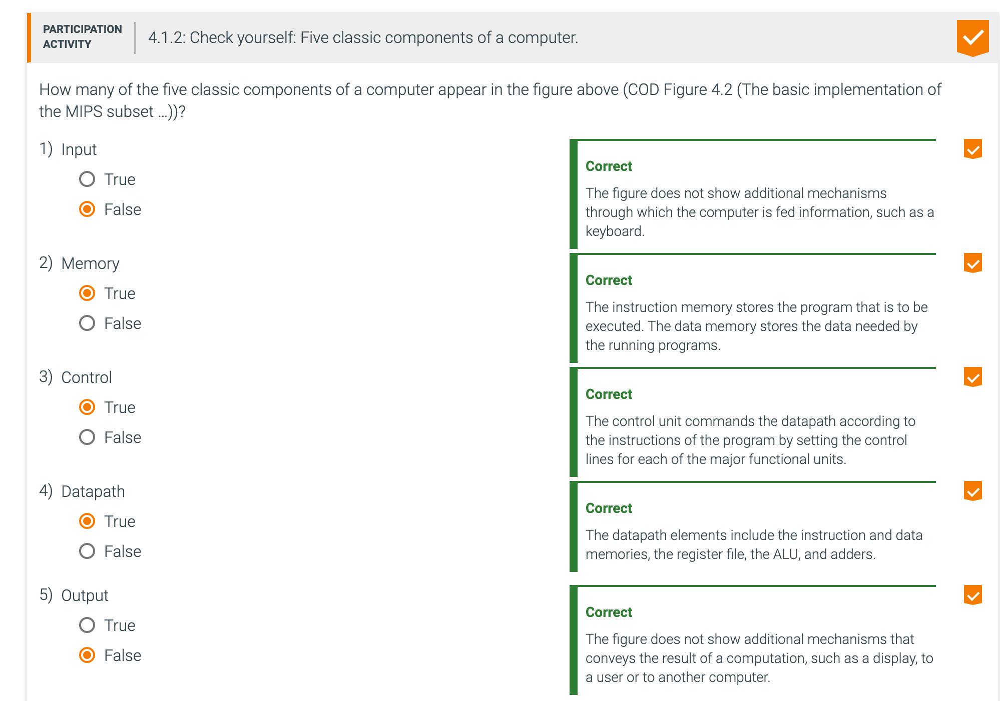

---

## 4.2 Logic design conventions

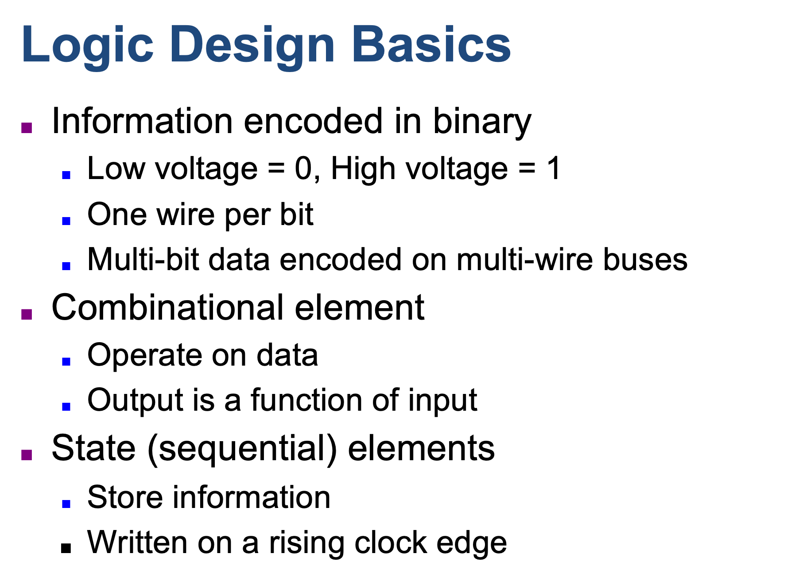

- **Combinational element**: An operational element, such as an AND gate or an ALU.

- Other elements in the design are not combinational, but instead contain state. An element contains state if it has 
  some internal storage. We call these elements state elements because, if we pulled the power plug on the computer, we 
  could restart it accurately by loading the state elements with the values they contained before we pulled the plug. 
  Furthermore, if we saved and restored the state elements, it would be as if the computer had never lost power. Thus, 
  these state elements completely characterize the computer. In COD Figure 4.1 (An abstract view of the implementation 
  of the MIPS …), the instruction and data memories, as well as the registers, are all examples of state elements.

- **State element**: A memory element, such as a register or a memory.

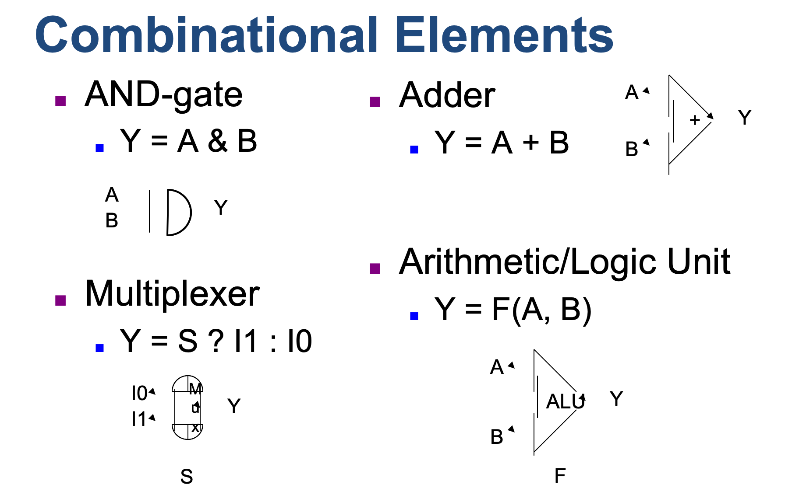

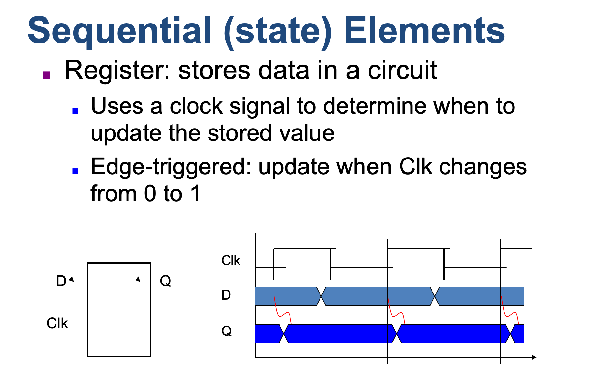

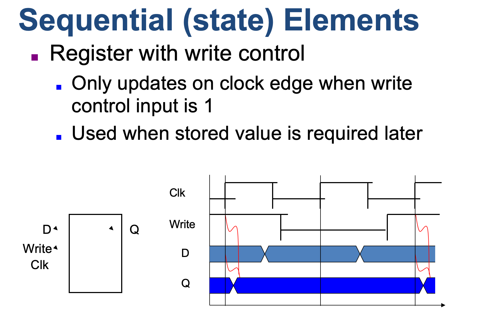

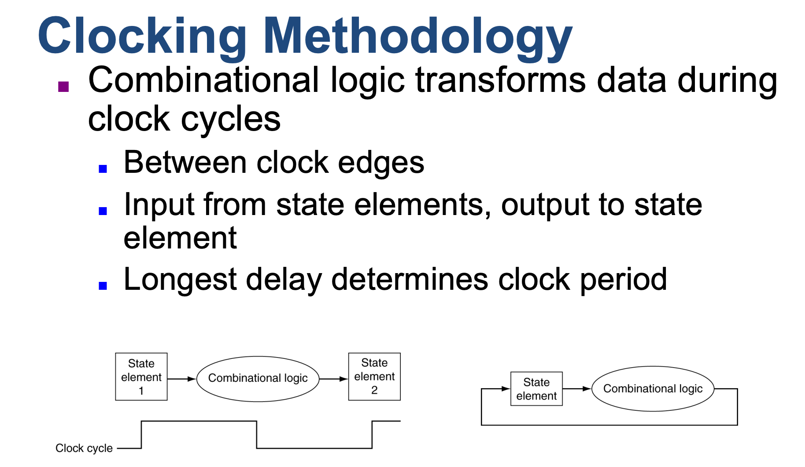

---

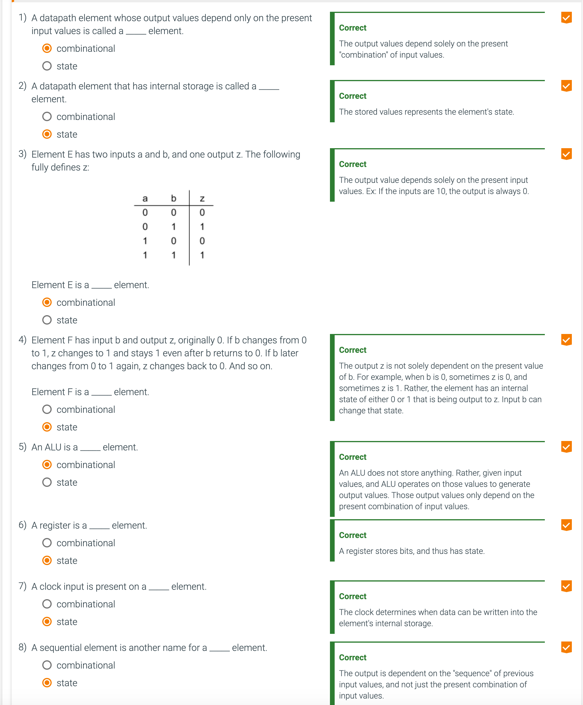

---

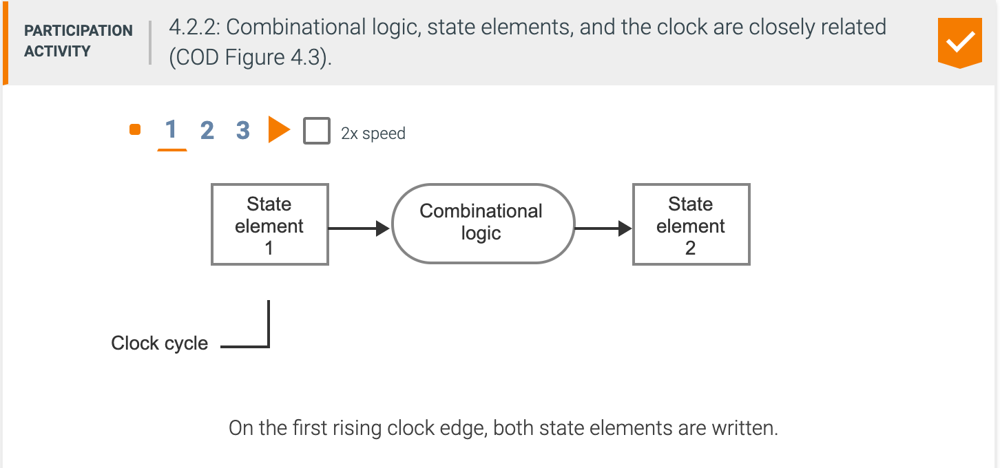

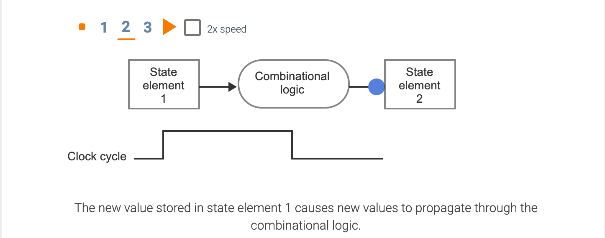

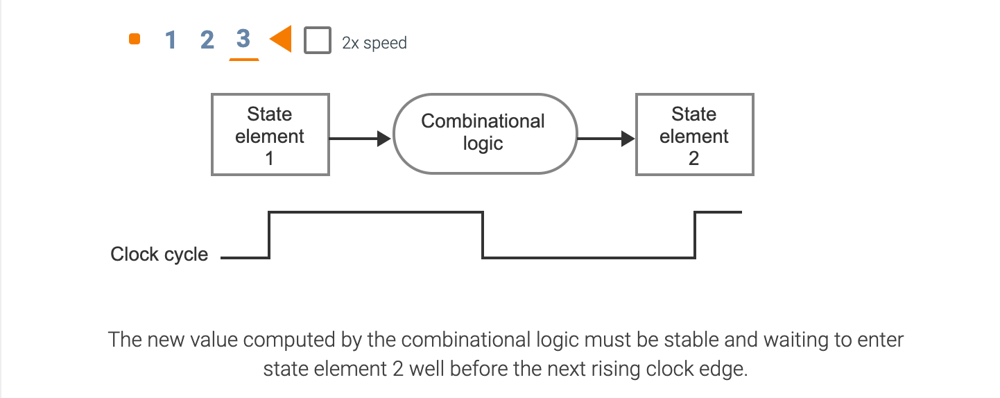

---

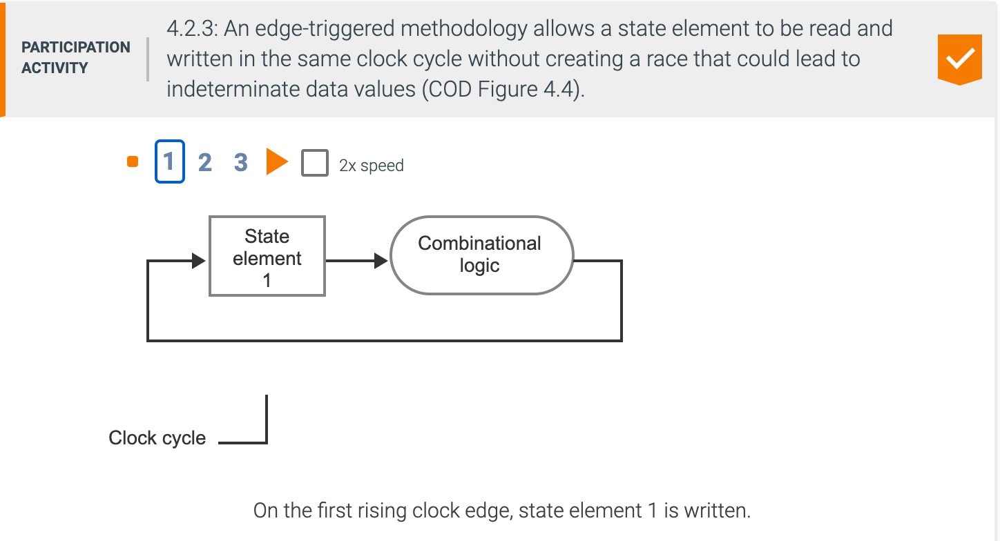

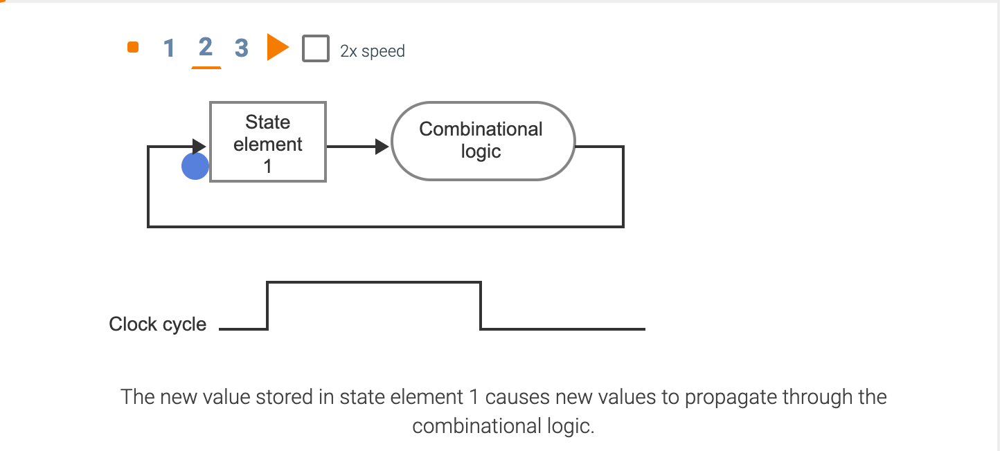

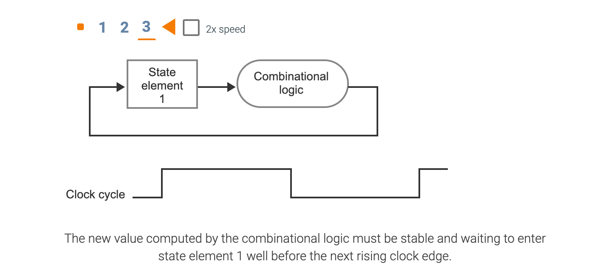

---

