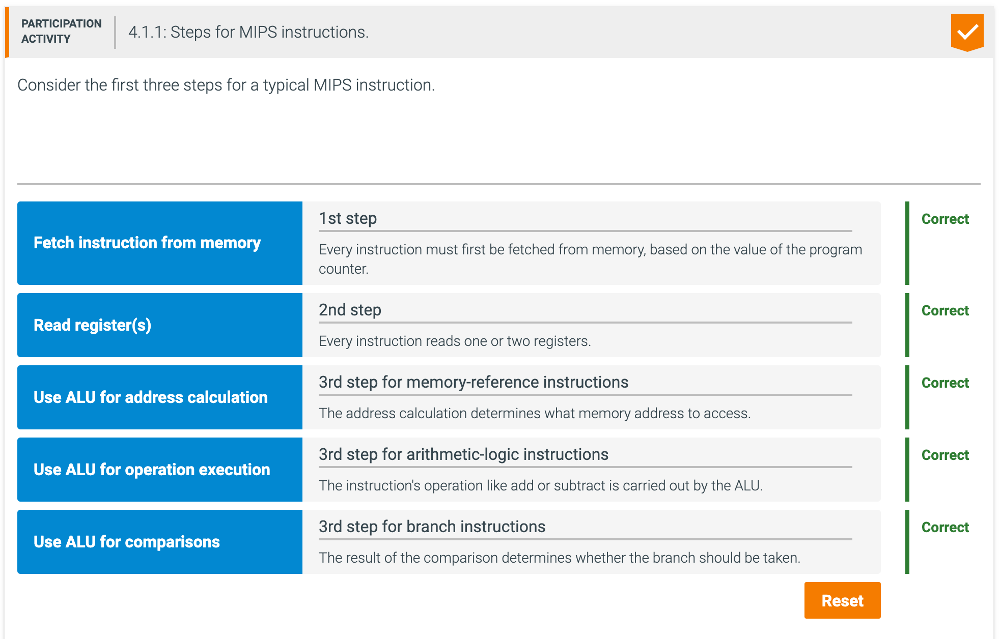
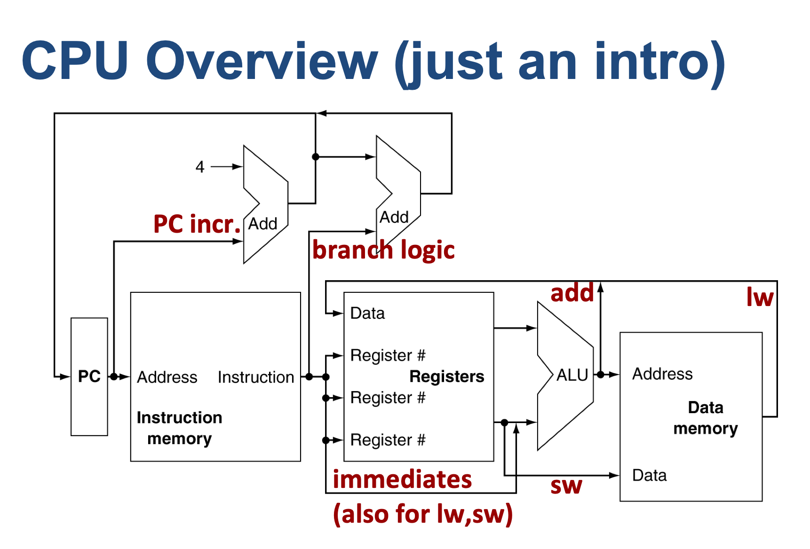
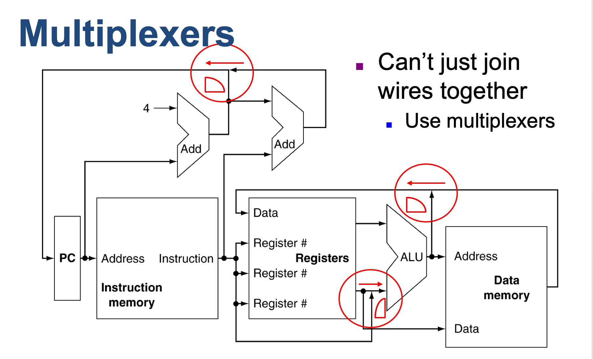

##  Introduction

---

---

- **Control signal**: A signal used for multiplexor selection or for directing the operation of a functional unit; 
  contrasts with a data signal, which contains information that is operated on by a functional unit.

- **Asserted**: The signal is logically high or true.
- **Deasserted**: The signal is logically low or false.

