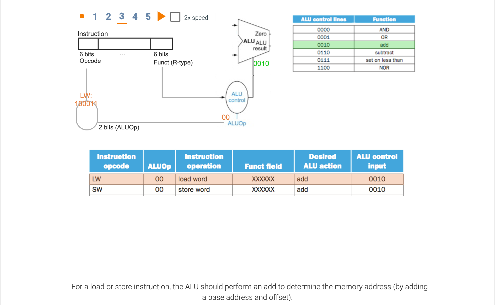

## A simple implementation scheme

- [The CPU and Von Neumann Architecture](https://www.youtube.com/watch?v=SbqXqQ-2ixs)

---

---

- **Opcode**: The field that denotes the operation and format of an instruction

- **Truth table**: From logic, a representation of a logical operation by listing all the values of the inputs and then 
  in each case showing what the resulting outputs should be.

---

---

