# Day4 Class, Object 2

- 只要没有指针指向这个对象 => garbage collection

- Student third = null;   //heap 上内存不分配

## class behavior:

- Static method can (directly) access only static variables/methods

- Non-static method can access both static and non-static variables/methods


## Stack 和 Heap 区别：(Stack/heap 存储数据，不储存代码)

- Local type variables are always on stack

- Whenever an object is created, its content(intstance variable) is always stored 
  in the Heap sapce.

- Memory management in stack is done in LIFO manner; 
  memory management in heap is more complex and requires complex algorithms (GC)

- Stack variable is destroyed after out of its scope;
  heap variable is destroyed by garbage collector.

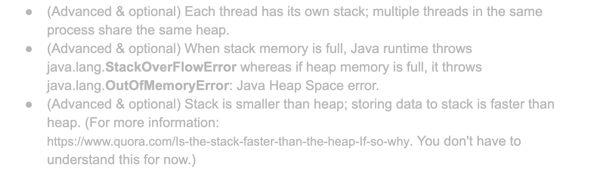

## Debug

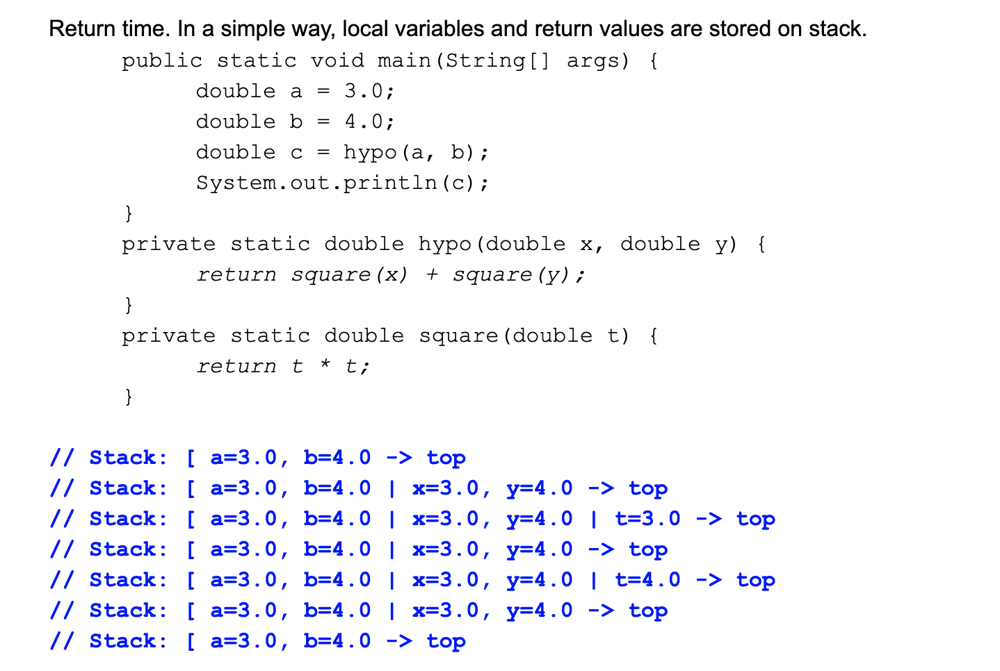

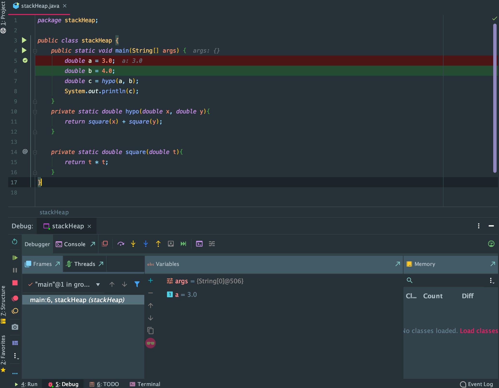

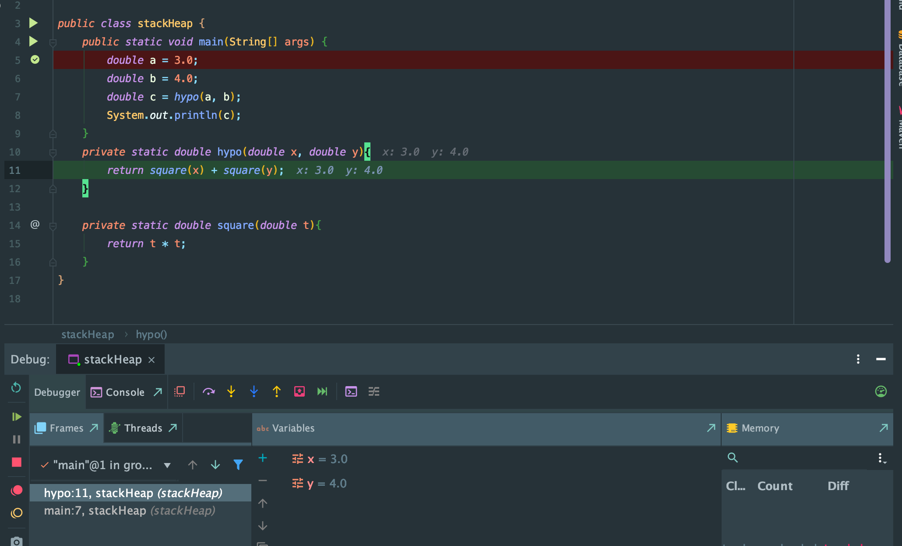

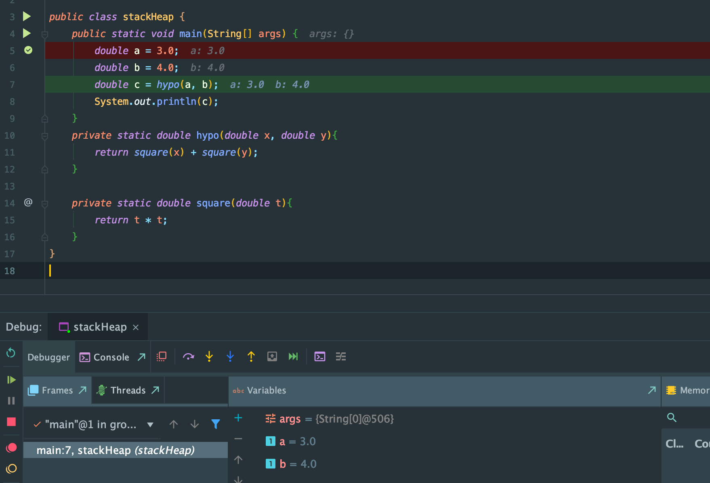


## Java function call is always pass by value(copy).

- primitive type: copy of the value itself
  
- class reference: copy of the object reference


## More example:

```java
class Simple{
    public int value;

    public Simple(int v){
        value = v;
    }
}

public class ChangeTest {
    public static void main(String[] args) {
        int x = 5;
        changeIntValue(x);
        System.out.println(x);

        //problem1
        Simple originalSimple = new Simple(5);
        changeSimpleValue(originalSimple);
        System.out.println(originalSimple.value);

    }

    private static void changeIntValue(int y) {
        y = 10;
    }
    
    private static void changeSimpleValue(Simple simple){
        Simple newSimple = new Simple(10);
        simple = newSimple;
    }
}

/* 
print: 5
       5
 */
```
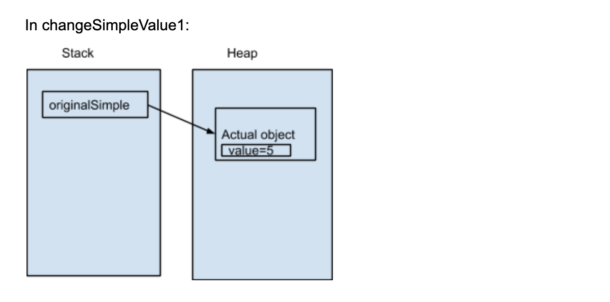
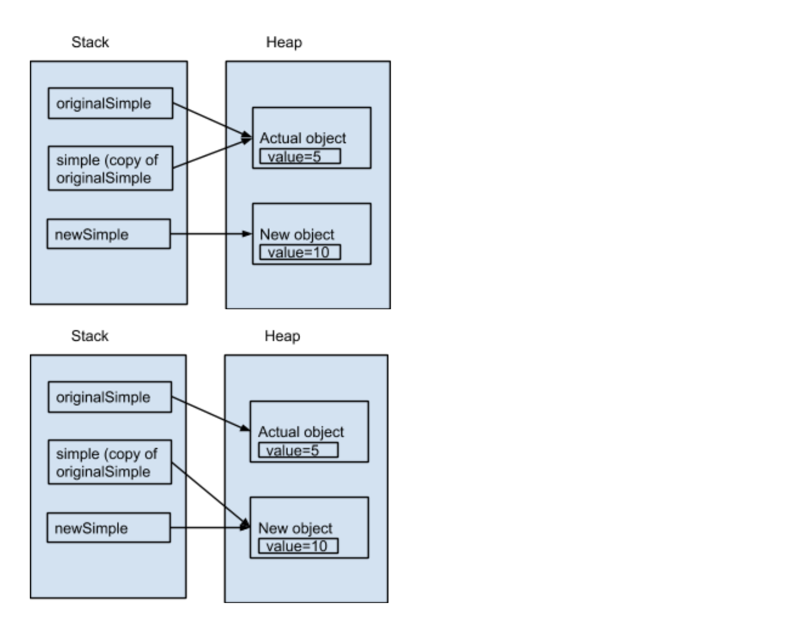


```java
class Simple{
    public int value;

    public Simple(int v){
        value = v;
    }
}

public class ChangeTest {
    public static void main(String[] args) {
        int x = 5;
        changeIntValue(x);
        System.out.println(x);

        //problem 2
        Simple originalSimple2 = new Simple(5);
        changeSimpleValue2(originalSimple2);
        System.out.println(originalSimple2.value);

    }

    private static void changeIntValue(int y) {
        y = 10;
    }

    private static void changeSimpleValue2(Simple simple){
        simple.value = 10;
    }
}

/* 
output: 10
 */
```
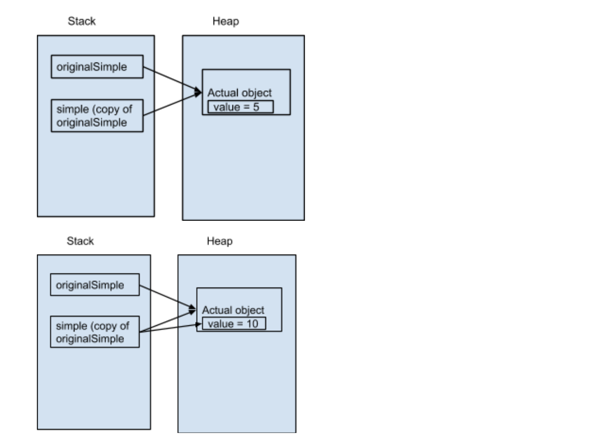


```java
class Simple{
    public int value;

    public Simple(int v){
        value = v;
    }
}

public class ChangeTest {
    public static void main(String[] args) {
        int x = 5;
        changeIntValue(x);
        System.out.println(x);

        //problem3
        Simple originalSimple3 = new Simple(5);
        changeSimpleValue3(originalSimple3);
        System.out.println(originalSimple3.value);

    }

    private static void changeIntValue(int y) {
        y = 10;
    }

    private static Simple changeSimpleValue3(Simple simple){
        Simple newSimple = new Simple(10);
        return newSimple;
    }
}

/* 
output: 5
 */
```
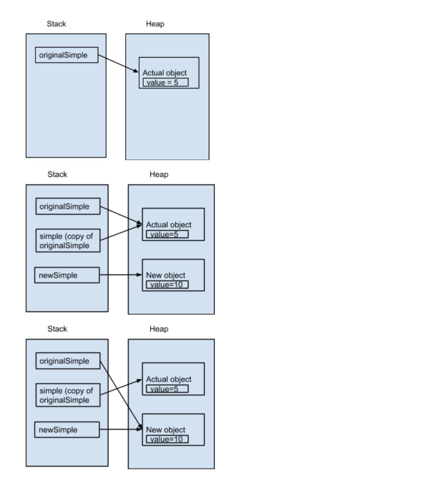

---


## array example:

```java
public class Test {
    public static void main(String[] args) {
        int[] x = {3, 9};
        f(x);
        System.out.println(Arrays.toString(x));
    }

    public static void f(int[] array) {
        array[1] = array[0];
    }
}

/* 
output: {3, 3}
 */
```
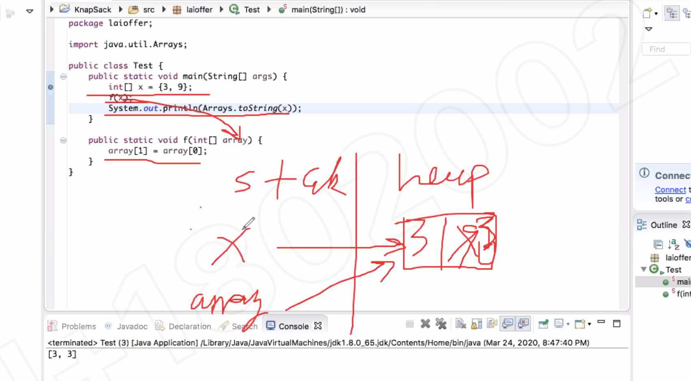


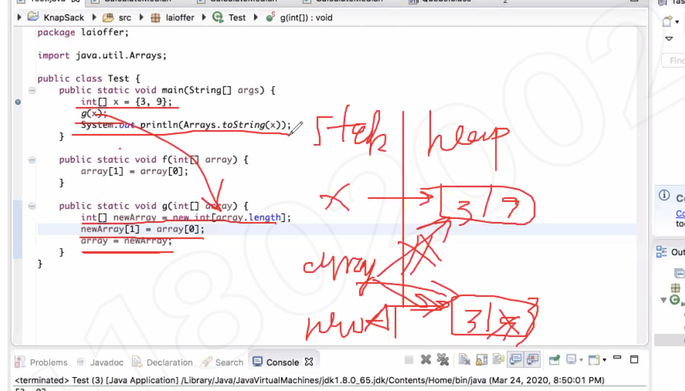
