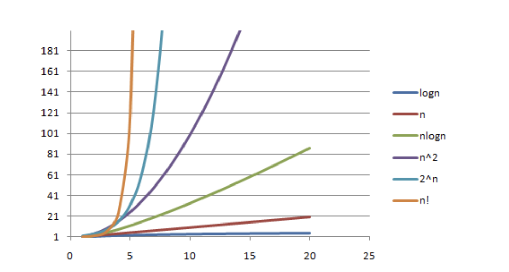

# Day5 Class, Object 3 | ArrayList

## Variables and their scopes

- Local variables must be initialized before use.

- Local variable has the lifetime of their own scope

---

## 2D Array Basics

## Array vs objects

- Arrays are Objects

- the elements in the array still occupy consecutive memory space on the heap
  
- length is field of the array object

- array length cannot be changed after the array object is created(final)

---

## Big O notation: algorithm complexity (time complexity, space complexity)

- time complexity O(n)

    1. increase with input size

    2. Asymptotic complexity

---

