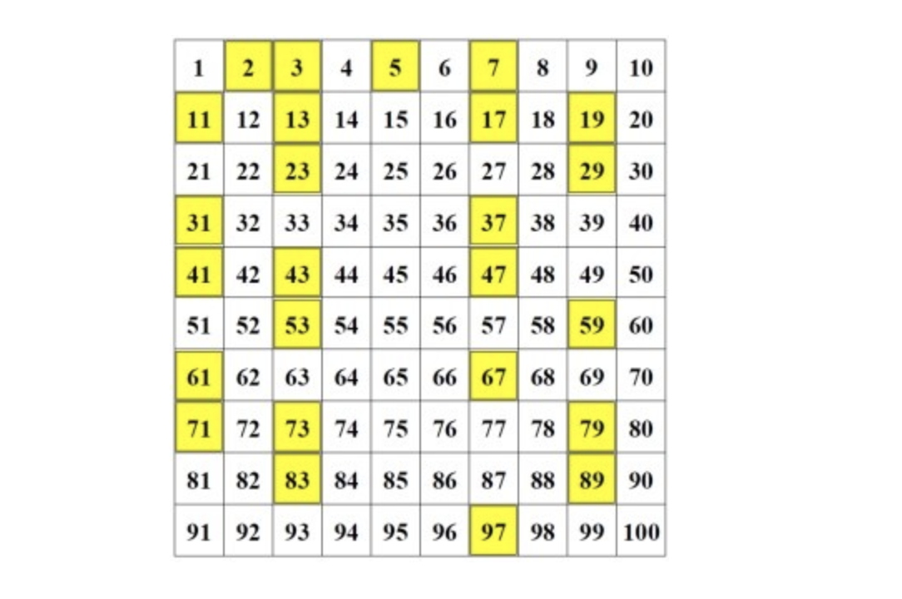

# Goldbach conjecture

- Prime number

- A `prime number (or a prime)` is a natural number greater than 1 
  that cannot be formed by multiplying two smaller natural numbers. 
  A natural number greater than 1 that is not prime is called a composite number. 
  For example:
    5 is prime because the only ways of writing it as a product, 1 × 5 or 5 × 1, 
    involve 5 itself.




## Goldbach Conjecture 哥德巴赫猜想

- The `Goldbach Conjecture` is a yet unproven `conjecture` stating that 
  every even integer greater than two is the sum of two prime numbers. 
  The conjecture has been tested up to 400,000,000,000,000. Goldbach's conjecture is one of the oldest unsolved problems in number theory and in all of mathematics.


```java
public class test {
    public static void main(String[] args) {
        Solution sol = new Solution();
        sol.check(10000);
    }
}

class Solution{
    public void check(int bounded){
        for (int i = 4; i < bounded; i += 2) {
            if (isCounterExample(i)) {
                System.out.println("Congrats! You have won Fields award!!!");
                return;
            }else{
                System.out.println(i + " is not a counter example.");
            }
        }
    }

    private boolean isCounterExample(int n){
        for (int i = 2; i <= n / 2; i++) {
            if(isPrime(i) && isPrime(n - i)){
                return false;
            }
        }
        return true;
    }

    private boolean isPrime(int n){
        if(n<2){
            return false;
        }
        for(int i=2; i*i <= n; i++){
            if(n % i == 0){
                return false;
            }
        }
        return true;
    }
}
```