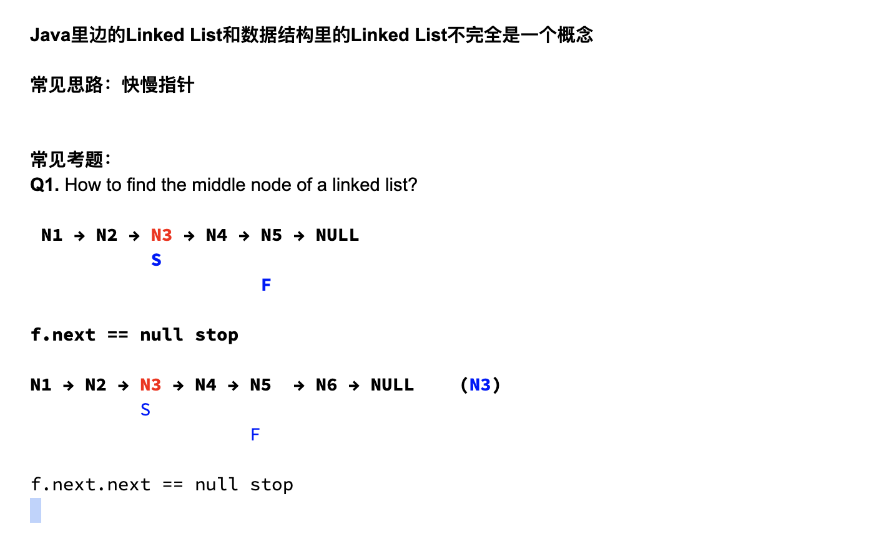

# Day14 LinkedList



```java
556. Find the Middle Node of a LinkedList (with odd number of nodes)

Find the middle node of a given linked list with odd number length.

Assumption: the length > 0

Example: 

L = 1 -> 2 -> 3 -> null, return 2->3
```

```java
/**
 * class ListNode {
 *   public int value;
 *   public ListNode next;
 *   public ListNode(int value) {
 *     this.value = value;
 *     next = null;
 *   }
 * }
 */
public class Solution {
  public ListNode findMiddleNode(ListNode head) {
    // Write your solution here
    if(head == null){
      return null;
    }
    ListNode slow = head, fast = head;
    while(fast.next != null && fast.next.next != null){
      slow = slow.next;
      fast = fast.next.next;
    }
    retrun slow;
  }
}

```

- Analysis:

```java
find middle node (with odd number of nodes)

assume there are 5 nodes

[1] -> [2] -> [3] -> [4] -> [5] -> null

S
F


[1] -> [2] -> [3] -> [4] -> [5] -> null

        S
               F


[1] -> [2] -> [3] -> [4] -> [5] -> null

               S
                             F
```

- coincidentally, `slow` stop at the middle of nodes, `fast` stop at the end, (fast.next != null && fast.next.next != null)


