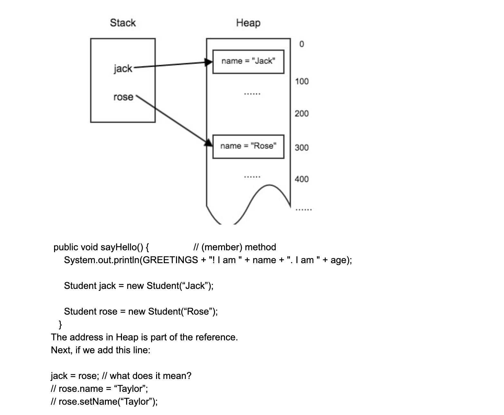
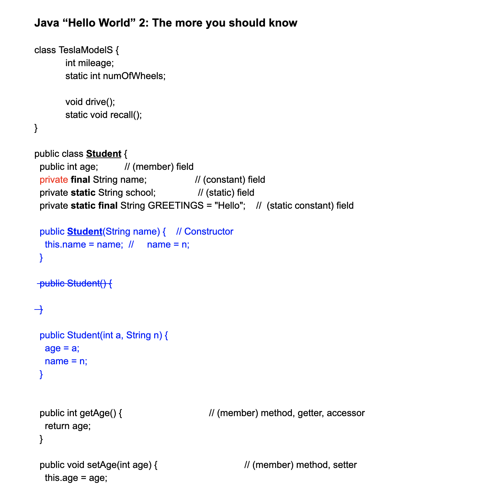
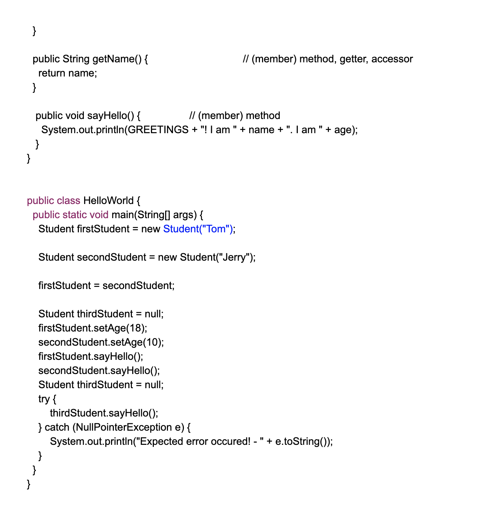
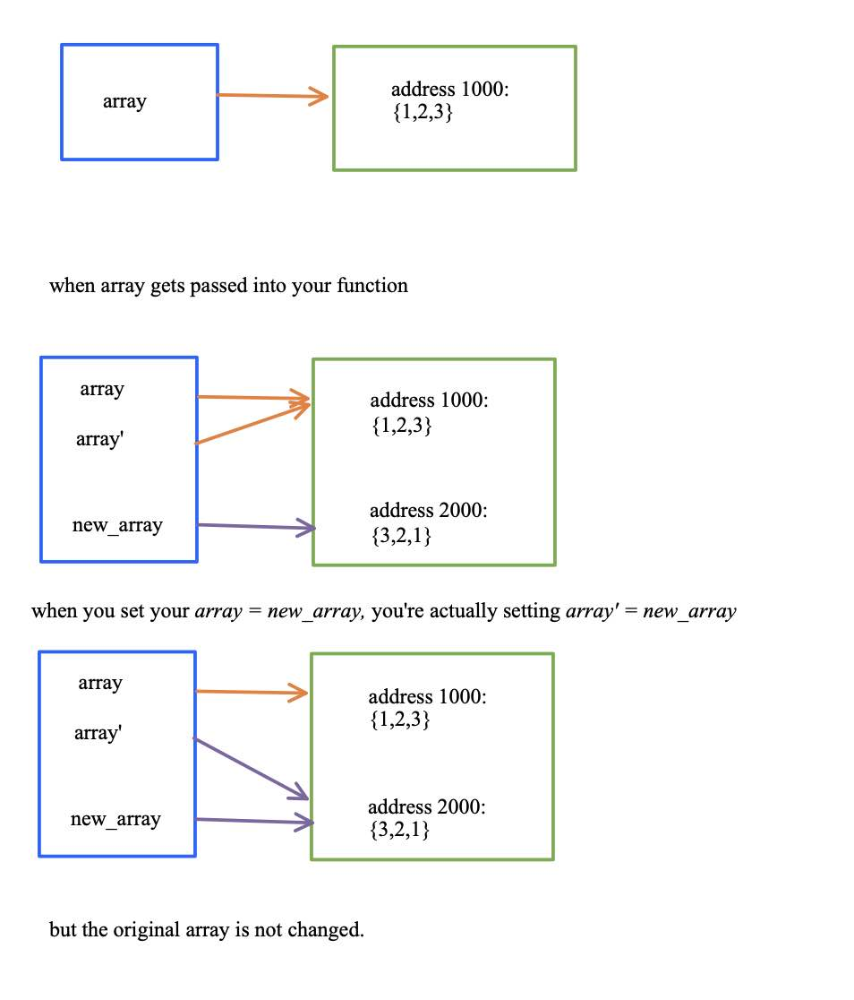

# Day3 Array, Class Objects

## 1D/2D array

## Object-oriented Paradigm

1. class
2. object
3. reference
4. dereference

## memory layout (内存布局)

1. heap, stack


## Array

1. 1D array

- represents mathematical vector

```
 0  1   2   3
[9  16  10  12]

 0     1     2      3      4
[true, true, false, false, true]
```


- Create a 1D array

`int[] arr = new int[10]`;

```java
double[] arr = new double[3];
Object[] arr
ListNode[] nodes
String[]
```

```java
int n = 10;
int[] arr = new int[n];
n = 20;
```

- You must secify the length of the array

**The length cannot be changed after creation** 
- if you want a longer one, create a new one

## Other data structures in Java for handing variant size vector?

- List, ArrayList, LinkedList - They are different to arrays!

(5). Define and initialize an array

```java
int[] arr = new int[4];

int[] arr2 = new int[]{3,5,7,9}
```

- ccalculate the maximum value of an array

```java
public int findMax(int[] array){
    int max = array[0];
    for(int index = 1; index < array.length; index++){
        if(array[index] > max){
            max = array[index];
        }
    }
    return max;
}
```

#### Given an array, and an element to insert, and the position to insert this element,
#### return a new array with the element inserted.

- Solution:

```
1 3 5 7, [4(item), 2(index)]

array = []
```

1 3 **4** 5 7

```
position = 2

1 3 4 5 7
```


```java
public int[] insert(int[] array, int element, int index){
    int[] new_arr = new int[array.length + 1];
    for(int i = 0; i < index; i++){
        new_arr[i] = array[i];
    }
    new_arr[index] = element;
    for(int i = index; i < array.length; i++){
        new_arr[i + 1] = array[i];
    }
    return new_arr;
}
```

- Is it possible to write a version of this method that returns void and 
  changes x in place (i.e., destructively)?

  **No, because arrays have a fixed size, so to add an element, you need to create a new array.**


## Reverse an array

```
[2, 3, 8, 4, 1] -> [1, 4, 8, 3, 2]
       i
       j

[7, 1, 4, 5, 8, 3, 2]
          i
          j
```

```java
int temp = array[i];  //temp = 4
array[i] = array[j]; 
array[j] = temp;
```
---

```java
public int[] reverse(int[] array){
    int i=0; j=array.length -1;
    while(i < j){
        //swap two value
        int temp = array[i];
        array[i] = array[j];
        array[j] = temp;
        i++;
        j++;
    }
    return array;
}
```


## 2D Array

```
0 0 0 
0 0 0 
```

2D array represents mathematical matrix

- Create a 2D array

```java
int [][] arr = new int[2][3];

int m = 4, n = 6;
int[][] matrix = new int[m][n];
```
- You must specify the length of the matrix
- The length cannot be changed after creation - if you want a longer one, create a new one
---

- Get the size of the array

```java
public class MyHelloWorld{
    public static void main(String[] args){
        int m = 4, n = 6;
        int [][] matrix = new int[m][n];
        System.out.println("# of rows: " + matrix.length);
        System.out.println("# of colums: " + matrix[0].length);
    }
}
```


- Set an element
   
```
arr[3][2] = 30;

X  X  X  X
X  X  X  X
X  X  X  X 
X  X  30  X
```


- Get an element

```java
public class MyHelloWorld{
    public static void main(String[] args){
        int m = 4, n = 6;
        int [][] matrix = new int[m][n];
        for(int i=0; i<m; i++){
            for(int j=0; j<n; j++){
                matrix[i][j] = 10 * i + j;
            }
        }
        System.out.println(matrix[2][3]);
    }
}
```
---


- Define and initialize an array

```java
int [][] m = new int[3][4];

3 2 1
3 4 4

int [][] matrix = {{3, 2, 1}, {3, 4, 4}};
int [][] matrix = new int[][]{{3, 2, 1}, {3, 4, 4}};
```


## Quiz

- Calculate the trace of a matrix(the sum of all diagonal elements)

```
1   3   4
3   4   6
3   -2  -1

diag(matrix) = 1 + 4 + (-1) = 4
```

```java
public int trace(int[][] matrix){
    int trace = 0;
    for(int row = 0; row < matrix.length; row++){
        trace += matrix[row][row];
    }
    return trace;
}
```


- calculate the sum of two matrix

```java
public int[][] matrixSum(int[][] mat1, int[][] mat2){
    int[][] result = new int[mat1.length][mat1[0].length];
    //calculate result
    int row = mat1.length;
    int col = mat1[0].length;
    for(itn r=0; r<row; r++){
        for(int c=0; c<col; c++){
            result[r][c] = mat1[r][c] + mat2[r][c];
        }
    }
    return result;
}
```


## Main Function

`public staitc void main(String[] args)`

```
- public: 

    - It means that you can call this method from outside of the class you are currently in.

- Static

- Void

- String args[]

   - These are the arguments of type String that your Java application accepts when you run it.
     Normally we don't use it for interviews.

     $java MyApp arg1 arg2
     $java CountWord mydoc.txt yourdoc.txt

     public class Test{
         public static void main(String[] args){
             System.out.println(args.length);
             for(String s : args){
                 System.out.print(s + " ");
             }
         }
     }
```


## The Object-Oriented Paradigm in Java

Basic concept

    What is the thinking pattern? In Java:

    Everything in the world is an object

        each object has a **type**

        each object is defined by two kinds of information

                state: the "field"s - what things it maintains
                
                behavior: the "method"s - what it can do


class - is like the basics for a house. Using these basic structures, you can build as
many houses  as you like. The "Type" of the objects, example, each house should have doors,
windows, beds... But usually in a class, you don't know exactly how many.


object - each house you build (or instantiate, in OO lingo) is an object, also known as an 
Instance. Each instance contains its own states, example, each of the house builts has its
different number of doors, windows, beds...


reference - each house also has an address, of course. If you want to tell someone where the
house is, you give them a card with the address written on it. The card is the object's
reference.

reference 是 Object的名片，通过ref找到obj

If you want to visit the house, you look at the address written on the card. This is called
dereferencing.

Objects in real life: a list, a queue, an array, a program, a linked list node, etc, ...

## Working with Objects

- The `new` keyword: create an object

`Student firstStudent = new Student("Tom");`

//Student student = new Student();

There are actually three important operations happened in this statement

Declaration: associate a variable name with an object type.

`Student firstStudent;`


`firstStudent = new Student(...);`

- Create an object in the memory and return its reference to firstStudent

Initialization: The new operator is followed by a call to a constructor, which initializes the new
object.


## Object memory layout

- Memory spaces in a Java program: Stack and heap

Stack: In computer science, a call stack is a stack data structure that stores information
about the active subroutines of a computer program(stack frame). This kind of stack is also
known as an execution stack, program stack, control stack, run-time stack, or machine stack,
and is often shortened to just "the stack"


**stack variable has the lifetime of the function scope.**

```java
public void sayHello(){ //(member) method
    int i = 5;
    //System.out.println(GREETINGS + "! I am " + name + ". I am " + age);
    Student jack = new Student("Jack");
    Student rose = new Student("Rose");
    jack = rose;
    rose.name = "Jack";
}
```

Heap : Java objects reside in an area called the heap. The heap is created when the JVM starts
up and may increase or decrease in size while the application runs.

```java
public class Test{
    public static void main(String[] args){
        f();
    }
    public static void f(){
        int y = 8;
        A a = new A();
    }
}

class A{
    int x = 7;
}
```




- jack will be pointed to the same object where rose referenced.
        
        - There is no copy of object itself.
  
        - Only the reference value of rose is copied and assigned to jack.









