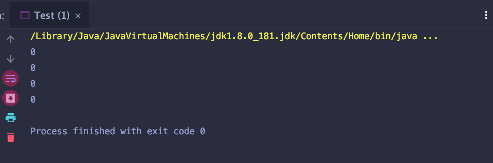

# 2D array initialization

## 还未初始化的 2D Array in Java 默认为0.


```java
public class Test {
    public static void main(String[] args) {
        int[][] a = new int[4][4];

        System.out.println(a[0][0]);
        System.out.println(a[0][1]);
        System.out.println(a[0][2]);
        System.out.println(a[0][3]);
    }
}
```

