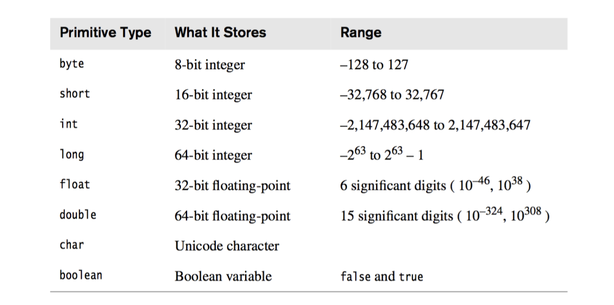
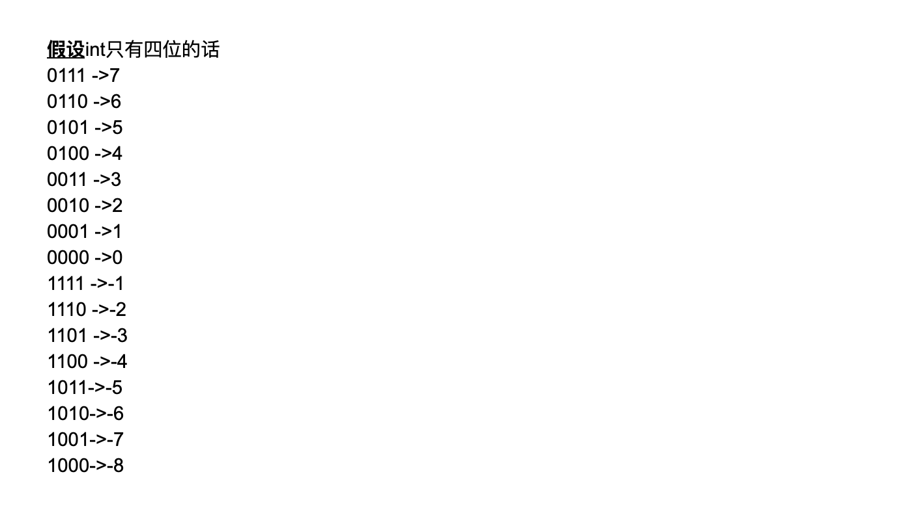
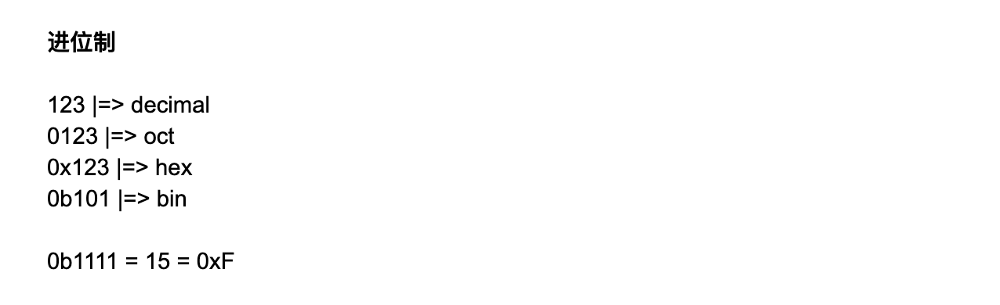
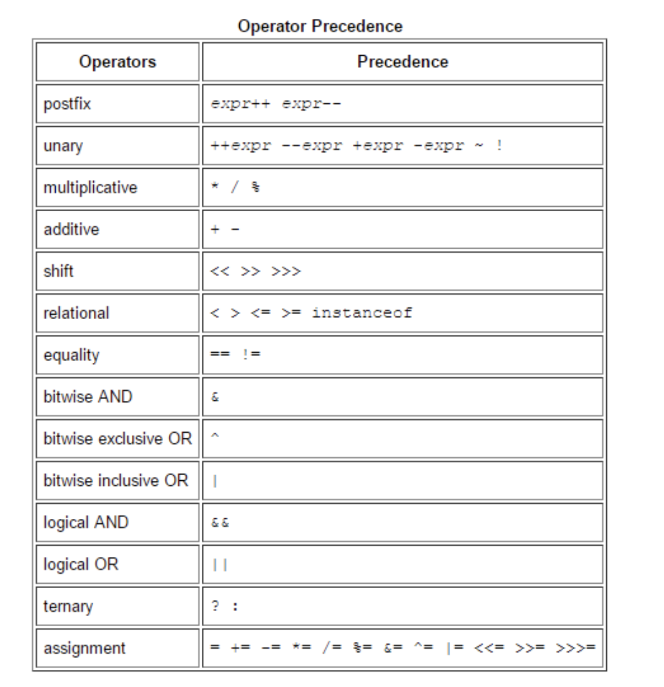
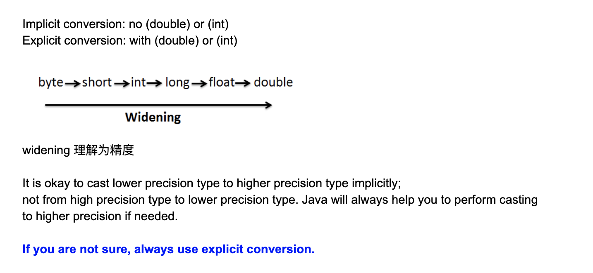
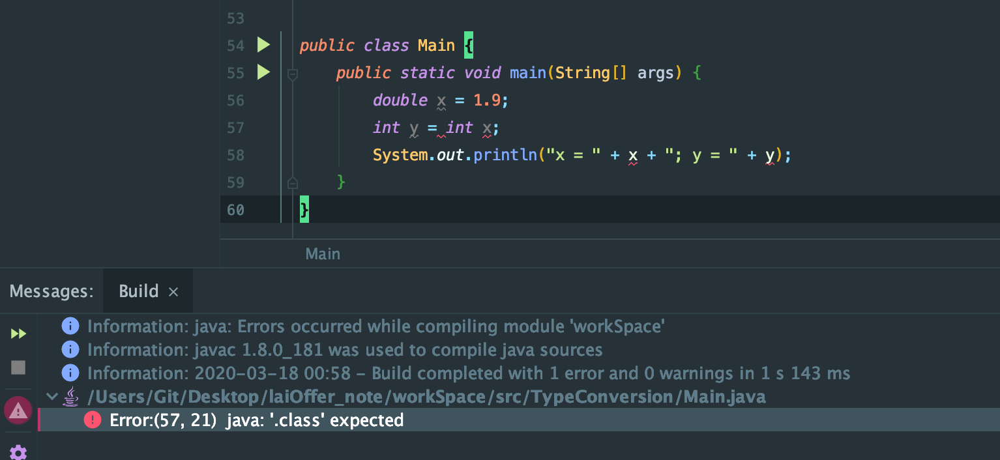
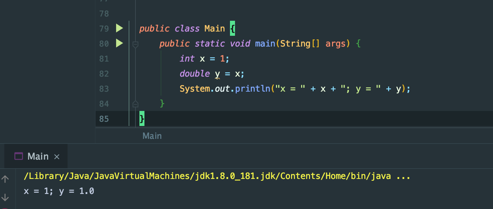

# Day1 Primitive Types and Basic Operations

- 计算机(binary)     Java(十进制)

1. bit: 0/1
2. Byte: 8 bits

- Java 有且只有8种数据类型； 除了这8种以外，其他都是class的reference




byte:
0111,1111

1 + 2 + 4 + ... + 2^6

可以这么算 1 + 1 + 2 + 4 + ... + 2^6 - 1 = 127  (2^7 -1)

---

## 2's complement

取反 -> +1

```
-1                                  -2
0000 0001   +1                     0000 0010
1111 1110   补                     1111 1101 
1111 1111   补满                    1111 1110     补1
```


- 负数多一位  -8


## Primitive Type
- Byte 可以表示年龄
- int => 2 billion(十亿),  代表世界人口就不够了
- float => (10^-46, 10^38)   Note: 10^-46 是一个无限接近0的正数


- boolean false and true : 1 byte 是最小的单位

```java
char a = 'ab'; //error, compile error (编译错误)

int x = 0b111; //0b, tell java this is a binary

int x = 0x17;  //ox, 16进制

String x = 7 + 1 + "abc";   // "8abc"
```


---


## Operators and Precedence


- example:

```java
int x = 7;
int y = 7;
int z = x++;
int w = ++y;
print(x);  //8 
print(y);  //8
print(z);  //7
print(w);  //8
```


## Type Conversion

- The types can be converted between each other. 
- Type conversion in a computer program is sometimes called a `cast`



1. it is ok to cast lower precision type to higher precision type `implicitly`

```java
public class Main {
    public static void main(String[] args) {
        int x = 1;
        double y = x;
        System.out.println("x = " + x + "; y = " + y);
    }
}

//x = 1; y = 1.0
```


### 从左到右； 精度增高 [Note: 结果=> 往精度高地走]
### 再不知道如何确定精度等级时候，最好的办法是： 用`( )`


```java
public class Main {
    public static void main(String[] args) {
        double x = 1.9;
        int y = (int)x;
        System.out.println("x = " + x + "; y = " + y);
    }
}
// x = 1.9; y = 1
```


- 如果高精度走向低精度，不用cast, => compile error







