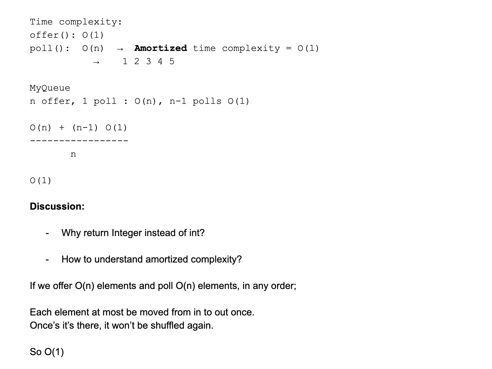
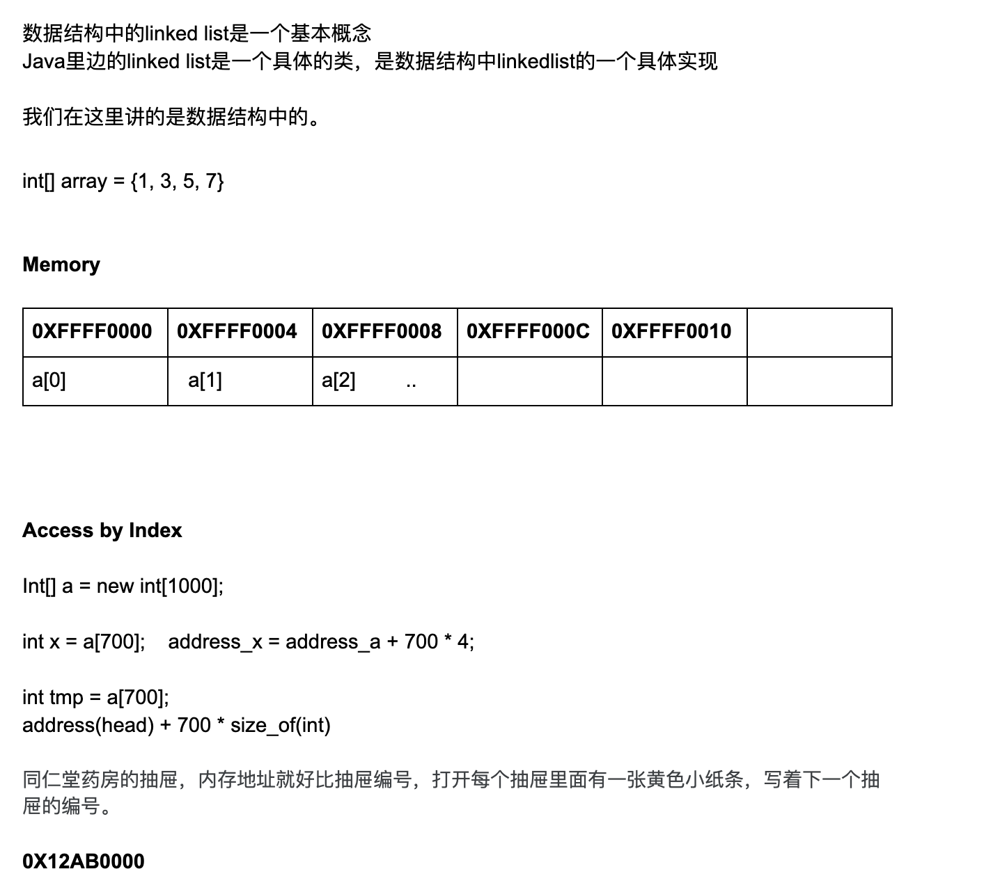
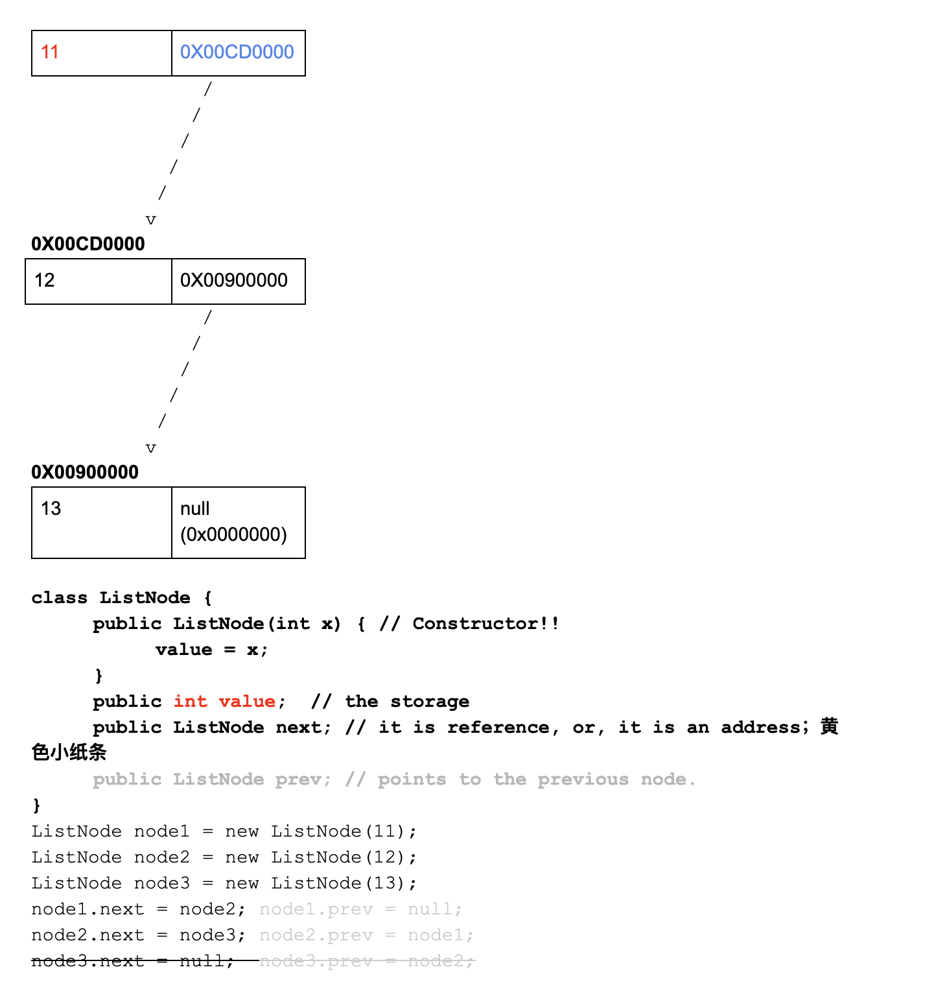
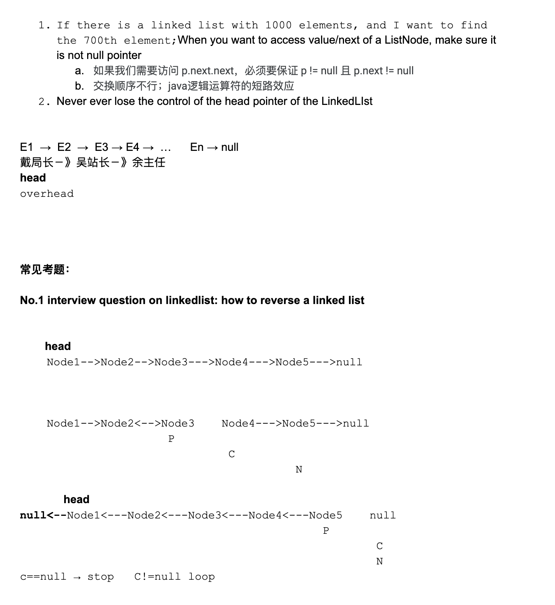
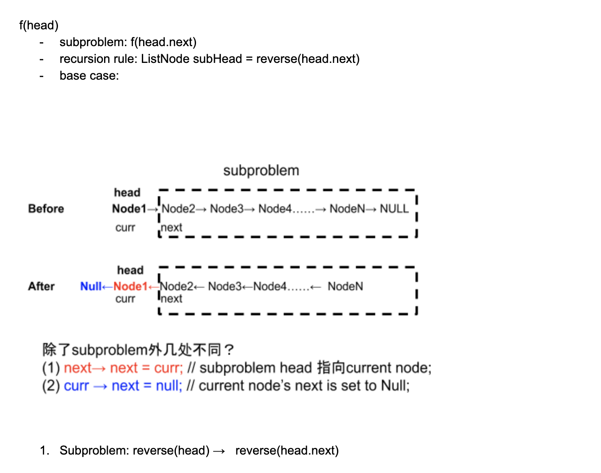
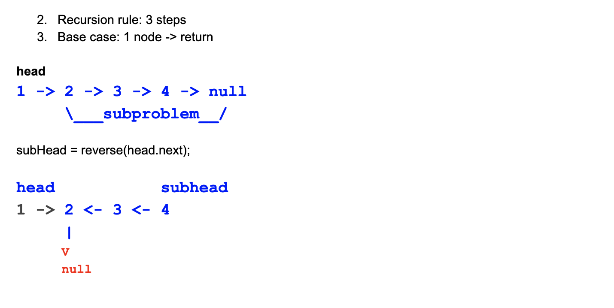

# Day13 Queue & LinkedList

### Popular interview questions:

- Question 1: How could we implement a queue by using two stacks?

```java
offer(3)    offer(2)    poll()  offer(1)    peek()  offer(6)    poll()  poll()
                          3                    2                   2        1
```

- Assuming two stacks: In-stack and Out-stack

```java
array: [1, 2, 3]

In-stack : [1, 2, 3]

Out-stack: [3, 2, 1]

```

- java codes

- https://novemberfall.github.io/Algorithm-FullStack/ch4/queueByTwoStack.html

---

### Time complexity



---


## Linked List




- key points




### LinkedList reverse iteratively

- https://novemberfall.github.io/Algorithm-FullStack/ch3/ListReverse1.html

- Time Complexity: O(n)
- Space Complexity: O(1)

### LinkedList reverse recursively




- https://novemberfall.github.io/Algorithm-FullStack/ch3/ListReverse.html


