# Day12 Sorting Quick & Rainbow

1. 随机选一个学生 比她矮的站右边 高的站左边

2. 左边和右边的用同样方法排序

- sort in place

- sorts O(n lgn) in average case

- sorts O(n^2) in worst case

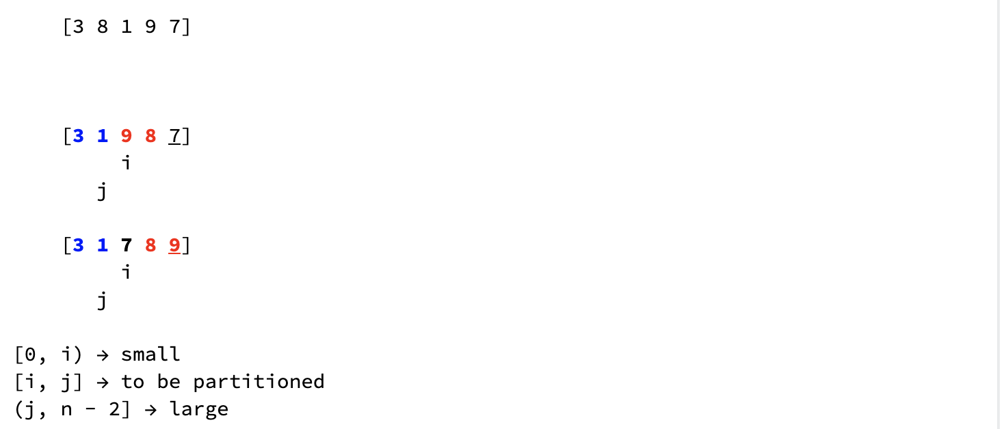
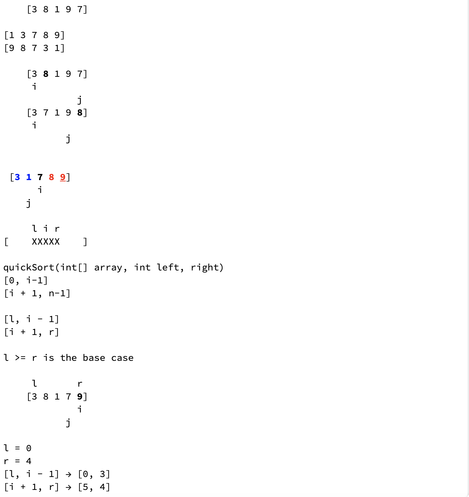

### Divide:

- Partition the array into two subarrays around a pivot x such that 
  elements in lower subarray <= x <= elements in upper subarray

### Conquer:

- Recursively sort the two subarrays

- Combine: The subarrays are sorted in place - no work in needed to combine them.

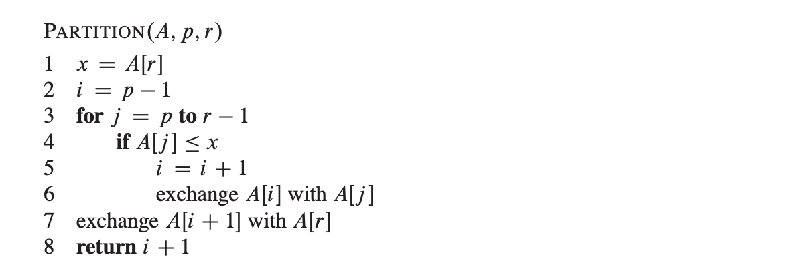
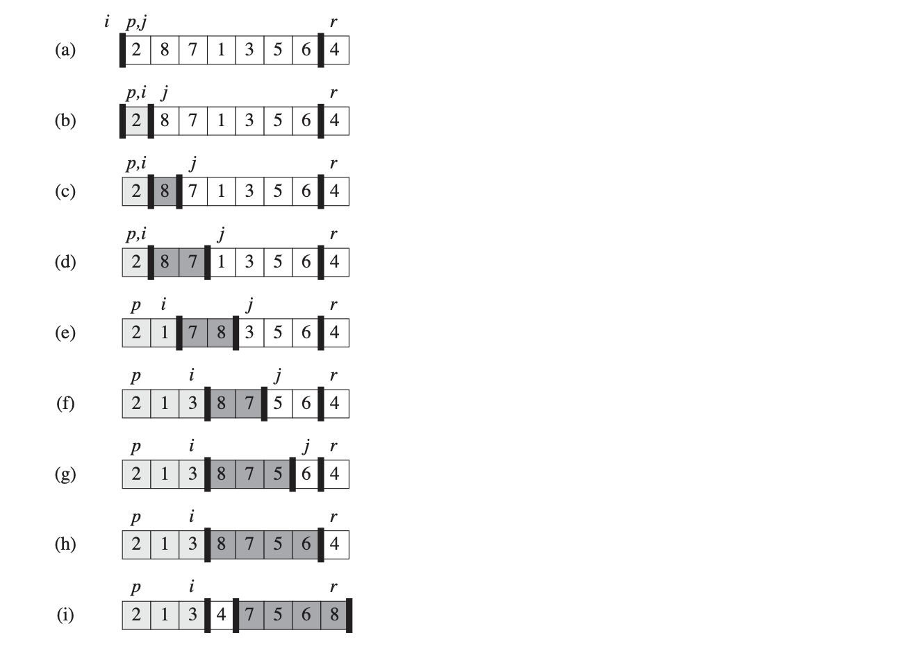


```java
[1   9   8   3   5]
 i               (piovt)          [1 < 5]
             j                    // 1 < 5,  i++, 

[1   9   8   3   5]
     i                        // 9 > 5  ,  j--
             j                //exchange(9, 3)

[1   3   8   9   5]
     i                        // 3 < 5,  i++, 
         j

[1   3   8   9   5]
         i                        // 8 > 5
         j

[1   3   8   9   5]
         i                        // 8 > 5, j--
     j                            // exchage(8, 5)

[1   3   5   9   8]
   <-j   i->


Analysis:

[0, i) -> small
[i, j] -> to be partitioned
(j, n-2] -> large
```
---


1. how to pick the pivot?

2. how to do recursion

3. what is the base case?


- 1st Question: what is the final position of 5? 5 is randomly selected(5 is called pivot).

- principle: iterate over the whole array, and put all numbers smaller than 5 to the
  left, then put 5 following (all numbers large than 5 are already on 5's right-hand).

- implementation details: first put 5 to the right-most postion (swap(5, 3)). 

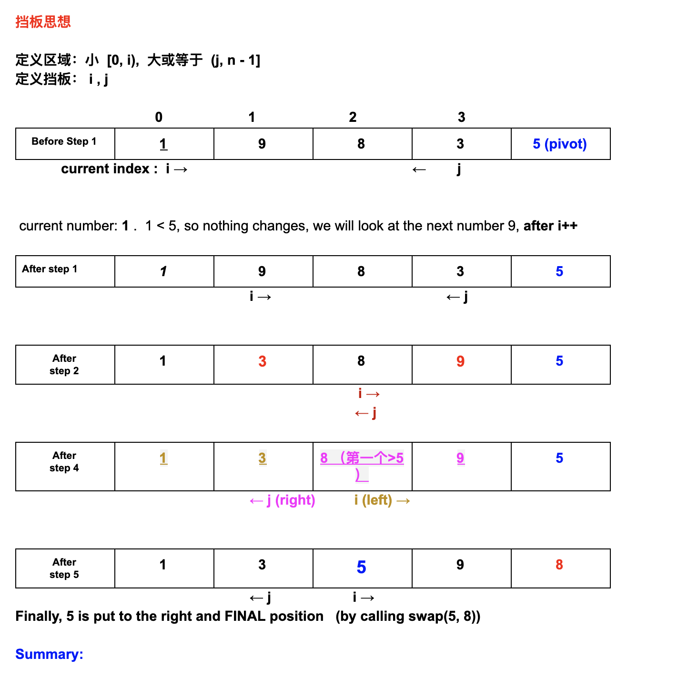
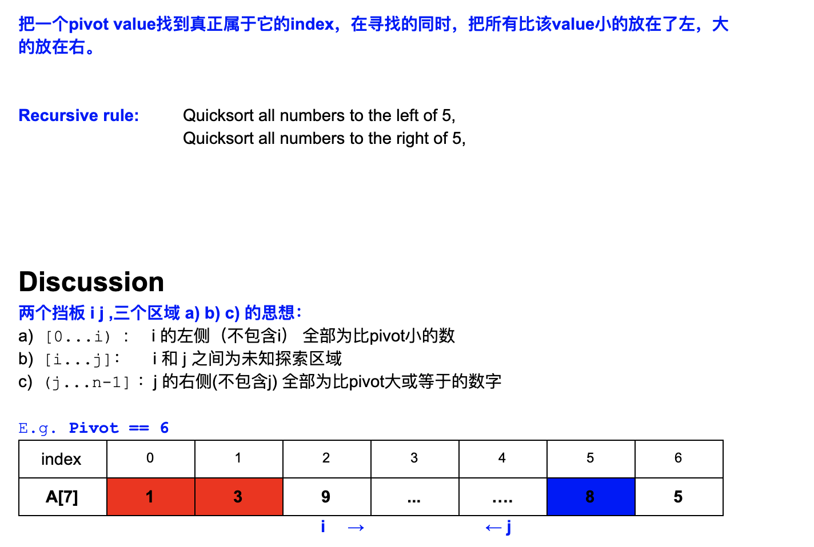

- Further explanation on codes comment

```java
public class Solution {
  Random rand = new Random();

  public int[] quickSort(int[] array) {
    // Write your solution here
    if(array == null || array.length == 1){
      return array;
    }
    QuickSort(array, 0, array.length - 1);
    return array;
  }

  public void QuickSort(int[] array, int left, int right){
    if(left >= right){
      return;
    }
    int pivotPos = partition(array, left, right);
    QuickSort(array, left, pivotPos - 1);
    QuickSort(array, pivotPos + 1, right);
  }

  private int partition(int[] array, int left, int right){
    int pivotIndex = left + rand.nextInt(right - left + 1);
    //Returns a pseudorandom, uniformly distributed int value between 0 (inclusive) and the specified value (exclusive), Ex: nextInt(10), generate 0-9
    swap(array, pivotIndex, right);
    int leftBound = left;
    int rightBound = right - 1; //right - 2
    while(leftBound <= rightBound){ //terminal condition: leftBound > rightBound
      if(array[leftBound] < array[right]){
        leftBound++;
      }else if(array[rightBound] >= array[right]){
        rightBound--;
      }else{
        swap(array, leftBound, rightBound);
      }
    }
    swap(array, leftBound, right);
    return leftBound;
  }

  public void swap(int[] array, int left, int right){
    int temp = array[left];
    array[left] = array[right];
    array[right] = temp;
  }
}
```

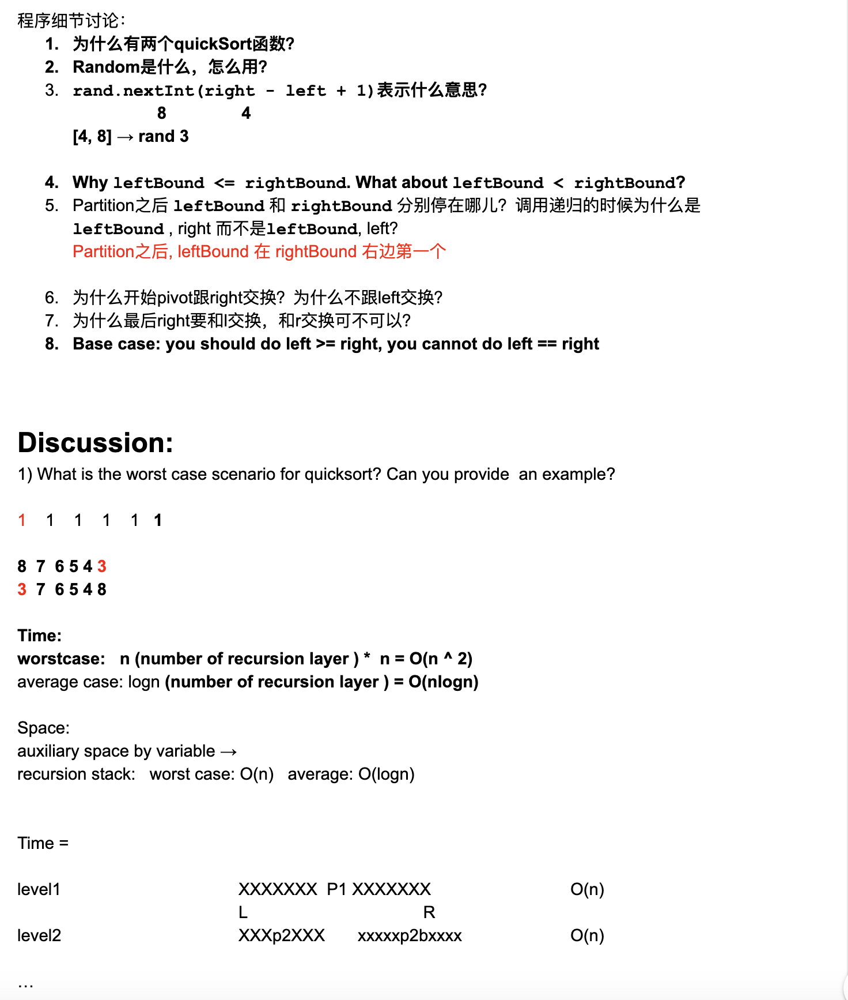
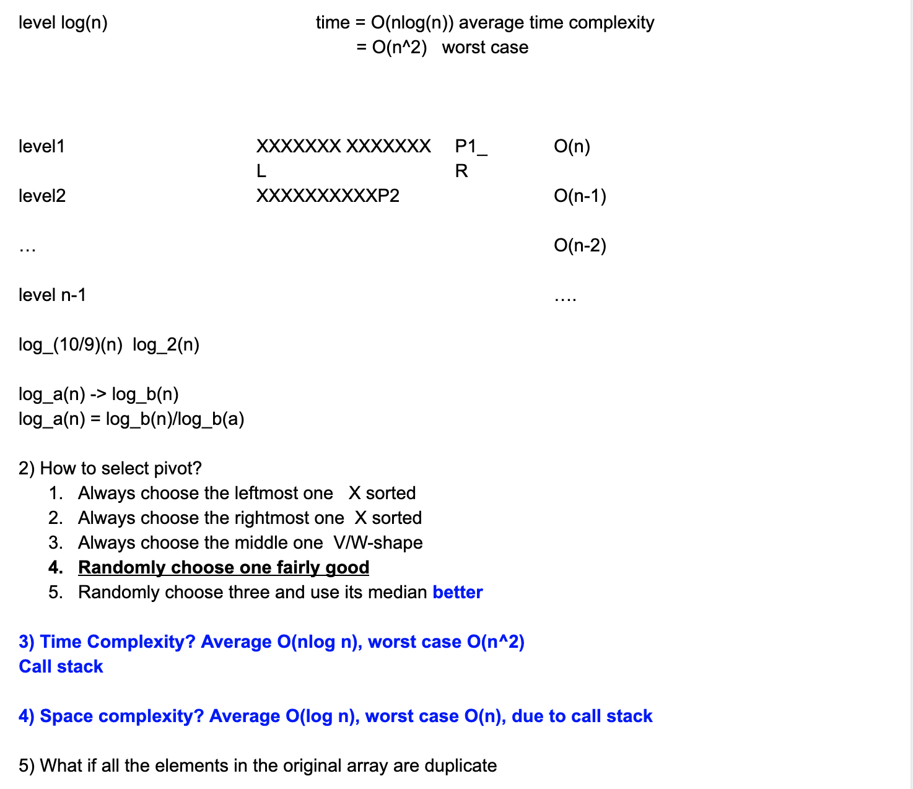


---

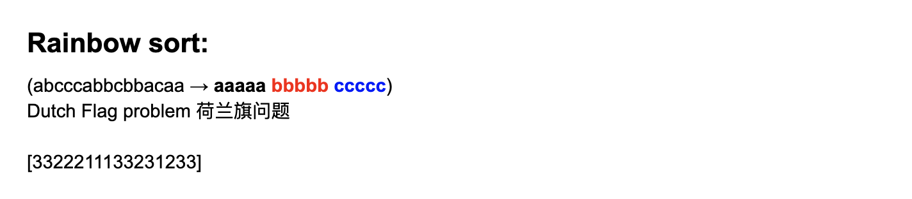
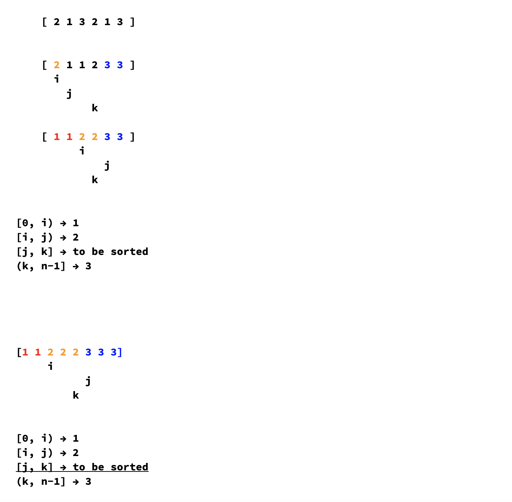

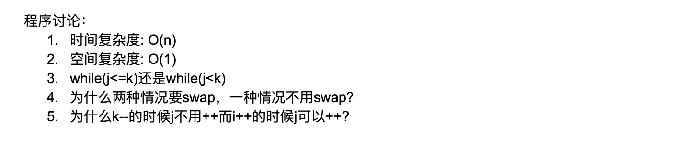


