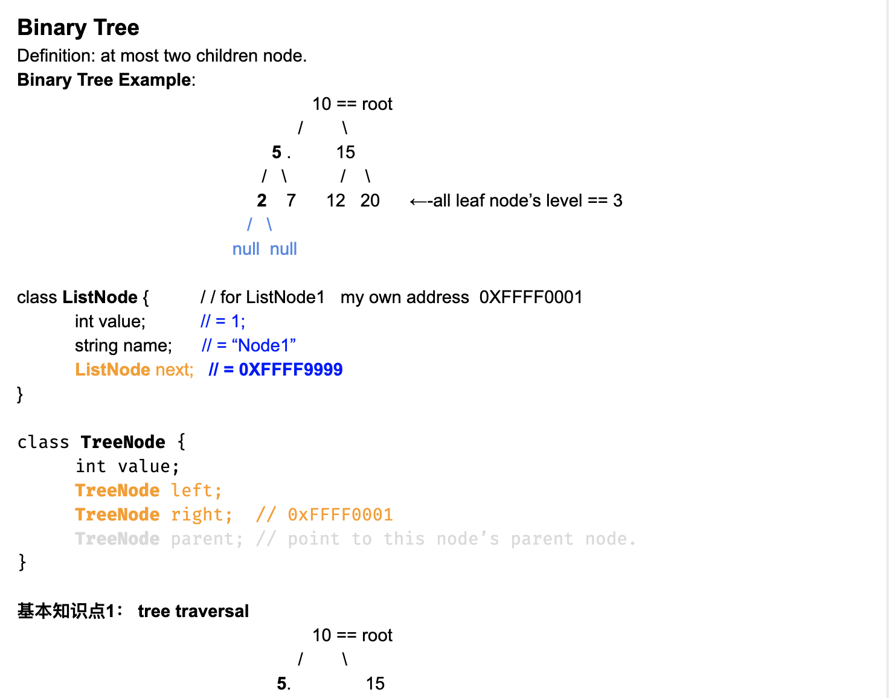
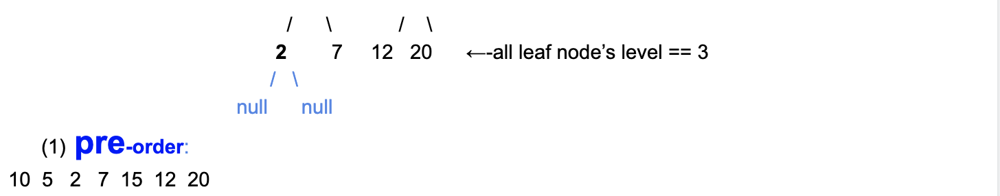
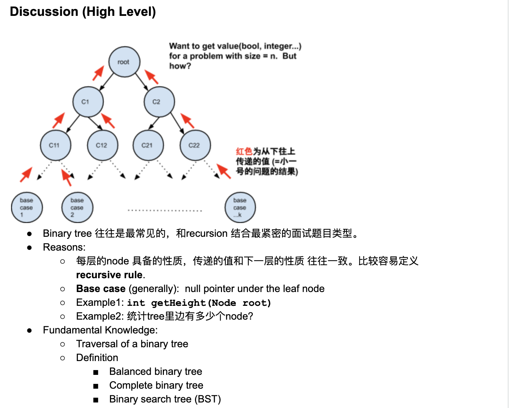
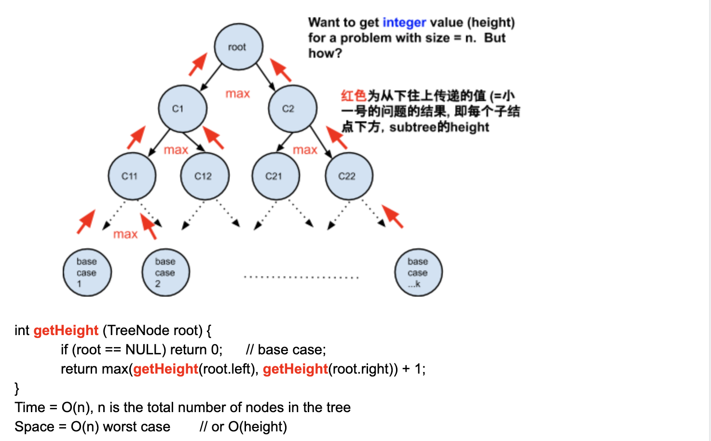

# Class5 Binary Tree & Binary Search Tree

### Binary Tree




Implementation with recursion:

- pre-order: 我把我自己放在最前来打印 / 更改value... 然后再左再右

```java
/**
 * public class TreeNode {
 *   public int key;
 *   public TreeNode left;
 *   public TreeNode right;
 *   public TreeNode(int key) {
 *     this.key = key;
 *   }
 * }
 */
public class Solution {
  public List<Integer> preOrder(TreeNode root) {
    // Write your solution here
    List<Integer> list = new ArrayList<>();

    preOrderHelper(list, root);
    return list;
  }

  private void preOrderHelper(List<Integer> list, TreeNode root){
    if(root == null){
      return;
    }

    list.add(root.key);
    preOrderHelper(list, root.left);
    preOrderHelper(list, root.right);
  }
}
```

- Pre-order : 可以在任何一个node画 PLR (p: print L: left R: right)

---

(2). In-order

2 5 7 10 12 15 20

```java
public class Solution {
  public List<Integer> inOrder(TreeNode root) {
    // Write your solution here
    List<Integer> list = new ArrayList<>();

    inOrderHelper(list, root);
    return list;
  }

  private void inOrderHelper(List<Integer> list, TreeNode root){
    if(root == null){
      return;
    }
    inOrderHelper(list, root.left);
    list.add(root.key);
    inOrderHelper(list, root.right);
  }
}
```

- In-order : 可以在任何一个node画 LPR (L: left p: print  R: right)

---

(3). Post-order

```java
public class Solution {
  public List<Integer> postOrder(TreeNode root) {
    // Write your solution here
    List<Integer> list = new ArrayList<>();
    
    postOrderHelper(list, root);
    return list;
  }

  private void postOrderHelper(List<Integer> list, TreeNode root){
    if(root == null){
      return;
    }
    postOrderHelper(list, root.left);
    postOrderHelper(list, root.right);
    list.add(root.key);
    
  }
}
```

- Post-order : 可以在任何一个node画 LRP (L: left R: right  P: print)

---


## 基本概念

- Balanced binary tree: is commonly defined as a binary tree in which the height of 
  the left and right subtrees of every node differ by 1 or less

```java
            10 == root
           /   \
          5     15
        / \     /  \
       2  null null null      <- all leaf node's level == 3
      / \
    null null  
```

- Conclusion 1: if a tree has n number of nodes, and it is **balanced**, 
  then the height(level) of the tree = 
  $$O(log_2n)$$

- Caveat: if a tree has n number of nodes, but we don't know if it is
  **balanced**, then the height(levle) of the tree = O(n)

    - Complete **binary tree**: is a binary tree in which every level, except
      possibly the last, is completely filled, and all nodes are as far as possible
      在一棵完全二叉树的每一层，除最后一层外，其余各层都是填满的，并且最后一层的节点尽可能的靠左排列

        
                       10 == root
                     /    \
                    5       15
                   / \     /  \
                  2   12  20  null      
                 / \
              null null  

- Conclusion 2: **If a tree is a complete tree, then it must be a balanced tree**

    - Binary **Search** Tree: for every sigle node in the tree, the values in its 
      left subtree are all smaller than its value, and the values in its right subtree
      are all larger than its value.

                       10 == root
                     /    \
                    5       15 = cur
                   / \     /  \
                  2   7  12    20     


- Conclusion 3:
  **If we print the value of the nodes in BST in in-order sequence, then it must from an ascending order.**

  What if there are duplicate values? E.g. 10, 10, 5, 5, 5, 15, 2, 7, 12, 20

                      (10,2) == root
                     /      \
                   (5,3)   (15,1) = cur
                   / \     /   \
                  2   7   12    20    


```java
class TreeNode{
    int value;
    int counter;
    TreeNode left;
    TreeNode right;
}
```





---

- $$4^{log_2N} = 2^{2 * log_2(N)} = (2^ {log_2(N)})^2 = N^2$$


### Pre-order Traversal Of Binary Tree (iterative)

- [BST-PreOrder Iterative](https://novemberfall.github.io/LeetCode-Algorithm/m2/bstPre-order.html)


### In-order Traversal Of Binary Tree (iterative)

- [BST-inOrder Iterative]()


### Binary Search Tree

- 经典例题： How to determine a binary tree is a BST?

- Primitive way but very bad in terms of sapce consumption

1. **inorder traverse the tree and store all numbers in an arrayList**
2. iterate over the array to determine, whether `A[i] < A[i + 1]`
   

- Our way:

```ruby
                              10(min=-inf, max =+inf)     == root

                            /                 \

            5(min=-inf,max=10)  AND             15

          /         \                           /    \   

2(min=-inf,max=5)     X(min=5,max=10)          12     20
```


