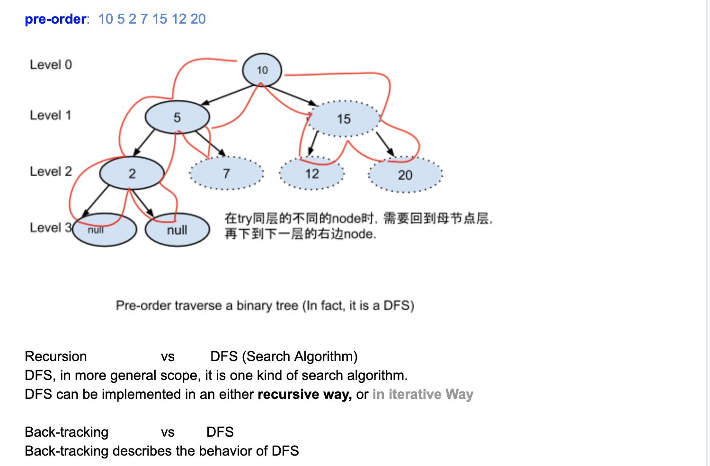
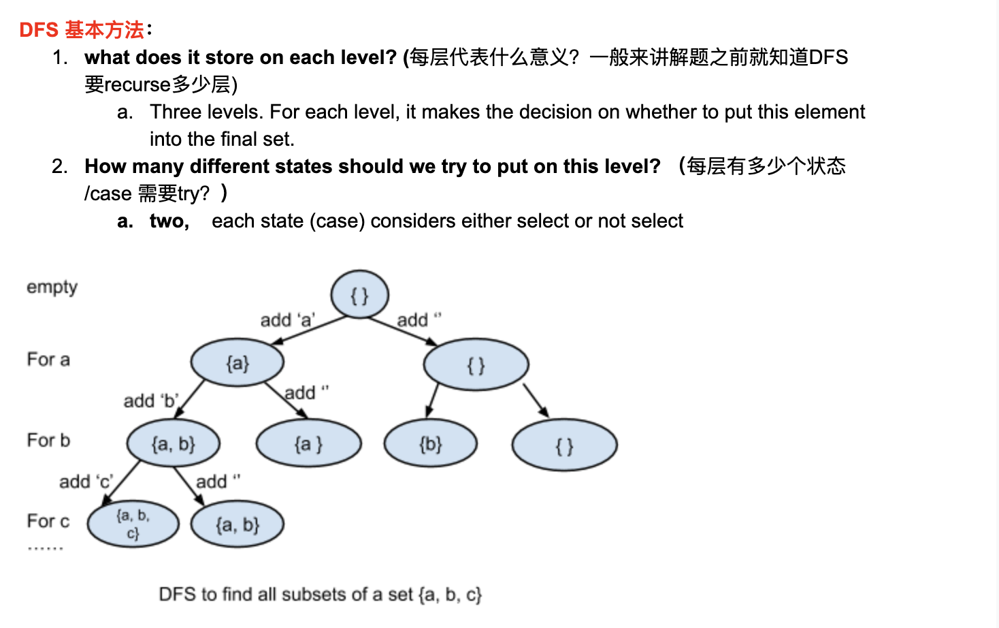
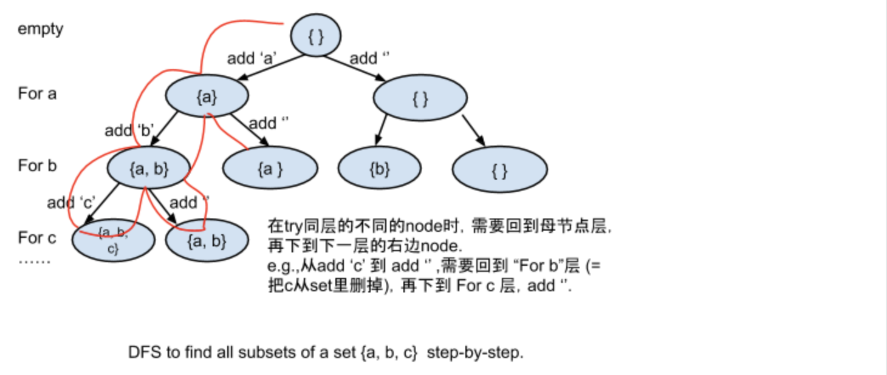

# Class7 Graph Search Algorithms 2 - DFS

- class6 we talked about two kinds of BFS:
    - Breadth First Search（广度优先） - 分层打印，同层关系
    - Best First Search(最优优先)  -- shorted path, min/max k elements

- First let's recall the pre-order traverse the binary tree code


```ruby
        10  == root
      /    \
     5       15
   /  \      /  \
  2    7    12   20     <- all leaf node's level == 3
 / \
null null  
```


```java
public void printTreePreOrder(Node root){
    if(root == null){ //base case
        return;
    }
    System.out.println(root.val);

    printTreePreOrder(root.left); //case1: try left first
    //break point  
    //在return 完 printTreePreOrder(root.left)，  才会往下执行
    //冯·诺依曼体系 计算机，状态先a -> 然后变成b
    printTreePreOrder(root.mid);
    printTreePreOrder(root.right); //case2: try right then

}

```




Recursion       vs      DFS(Search Algorithm)

DFS, in more general scope, it is one kind of search alogrithm

DFS, can be implemented in an either recursive way, or in iterative Way


Back-tracking       vs      DFS

Back-tracking(就是DFS的小名) describes the behavior of DFS

---


Depth-First Search (DFS)
  - Recall "using pre-order to traverse a tree"
  - 实现方法： easy to use recursion
  - 常见考题:
    - DFS 例题1: print all subsets of a set
    - DFS 例题2: print all valid permutations of () () ()
      - ()()()    ((()))  (())() 
    - DFS 例题3: e.g., 凑硬币金额99 cents
      - 有一分， 5分， 10分，25分coin, 给定一个数钱99cent, 有多少种组成方式，
        并打印出所有的可能组合？
      - DFS 一类的题目（too many to list all -> 强化练习课）
        1. Given an input string = "127222458", output all valid ip_address
          - 4 levels
        2. Permutation of a string (with/without duplicate letters)
          - str.length levles
        3. Permutation of all subsequence of a sorted string(= allow set
           to have duplicate elements)
        4. Permutation of factors of a number
          - levels?
        5. 如何生成一个随机的maze 

---

DFS 基本方法：
1. How many levels in the recursion tree? What does it store on each level?
   (每层代表什么意义？ 一般来讲解题之前就知道DFS要recurse多少层)
2. How many different states should we try to put on each level?
   (每层有多少个状态/case 需要try?)

DFS经典例题1 **Print** all subsets of a set S = {'a', 'b', 'c'}

```ruby
My anaysis:

a   b   c

0 : 不取
1 ： 取

000
001
010
011
100
...

111

2 X 2 X 2 = 8 type of subset in total
```




- 注意这张图是 recursive tree, not input tree
- for a layer, 在空集 前提条件下， 选择 add a, 或者不加. 
- for b layer, 在{a}的前提条件下，选择 add b, 或者不加; 右边在空集情况下，选择加b， 或者不加


```java
void findSubset(char[] input, int index, StringBuilder solutionPrefix){
    //char[] input   char array['a', 'b', 'c']
    //index , represent the layer
    //solutionPrefix代表粉色路径, path prefix
    if(index == input.length){
        System.out.println(solutionPrefix);
        return;
    }

    //Case 1: add input[index] to the solution prefix
    solutionPrefix.append(input[index]);            // 吃
    findSubset(input, index + 1, solutionPrefix); //Breaking points...
    solutionPrefix.deleteCharAt(solutionPrefix.length() - 1);  // 🤮

    //Case 2: do not add input[index] to the solution prefix.
    findSubset(input, index + 1, solutionPrefix);
}

/* 
注意： 吃 和 🤮 配对出现， 
 */
```



- Time = $$O(2^n)$$
- Extra space = $$O(n)$$

